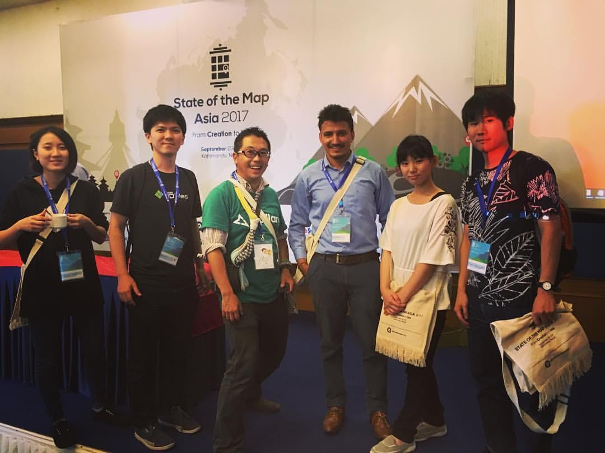

### Furuhashi Lab. was born in 2017

青山学院大学 地球社会共生学部 古橋研究室は 2017年に正式にスタートしました。ここでは研究室が目指す「一億総伊能化」を軸に、現在取り組んでいる活動や研究室の様子などを情報発信してまいります。

併せて Facebookや Twitter、GitHubなどの SNSでも積極的に情報発信しておりますので、そちらも御覧ください。
