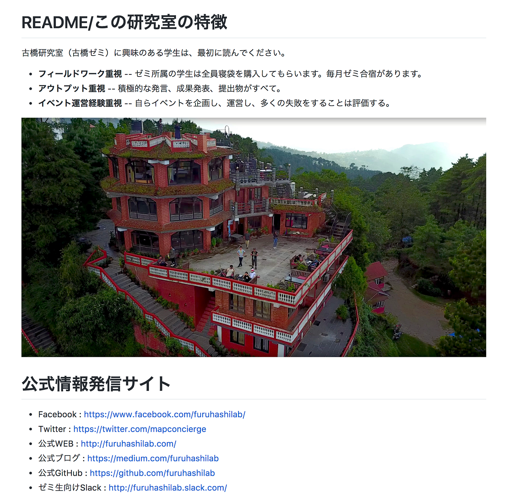

### 古橋研究室 公式サイト等あれこれ

いろいろと整理しながら、公式アカウントを学生と共通に管理できる仕組みを作っています。とりあえず現状報告として。

### 公式情報発信サイト

- Facebook : [https://www.facebook.com/furuhashilab/](https://www.facebook.com/furuhashilab/)

- Twitter : [https://twitter.com/mapconcierge](https://twitter.com/mapconcierge)

- 公式WEB : [http://furuhashilab.com/](http://furuhashilab.com/)

- 公式ブログ : [https://medium.com/furuhashilab](https://medium.com/furuhashilab)

- 公式GitHub : [https://github.com/furuhashilab](https://github.com/furuhashilab)

- ゼミ生向けSlack : [http://furuhashilab.slack.com/](http://furuhashilab.slack.com/)
