### 青学グラフィックレコーディング奮闘記

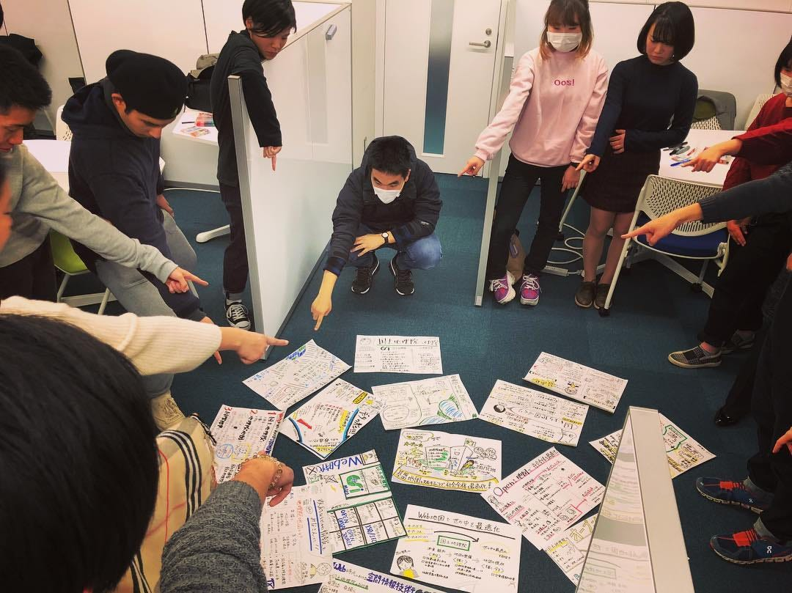

_[グラレコアドベントカレンダーが１日空いている](https://adventar.org/calendars/2550)ことを教えていただき、青山学院大学で取り組んでいるグラレコ授業の様子についてまとめてみました。_

我々、青山学院大学の地球社会共生学部は途上国・新興国で活躍できる人材育成を軸に、4つの専門性を伸ばすクラスター制度によって、外国語と専門的な知識・スキルを持った学生を育てています。

我々の研究室は4つのクラスターのうちの「メディア・空間情報クラスター」として『世界中の情報格差をなくす』ことを目標に “情報” とは何か、”伝える” とは何かを日々学生たちに考えさせながら授業を組み立てています。

学部のベースは社会学であるため文系的思考を持つ学生が多く、今まで情報の構造化や可視化の訓練をしたことのない状態から、限られた時間を設定して、普段から情報を分析し、本質的な要素だけを抽出する訓練を行う必要があると考えて今年度から研究室の学生(3年生)全員にグラフィックレコーディングを必須とする授業を展開してみました。

**# 意識したこと**

- **筋トレのように繰り返し訓練する(目標7回以上)**

- **なるべく多く失敗を経験させる**

- **仲間の作品から良い要素を真似させる**

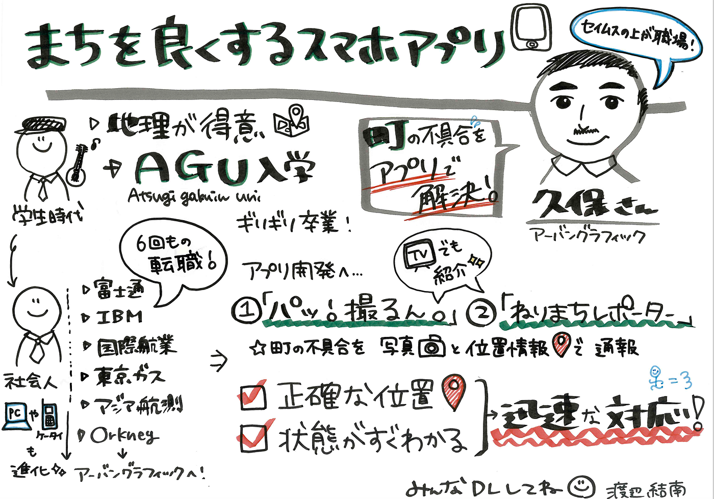

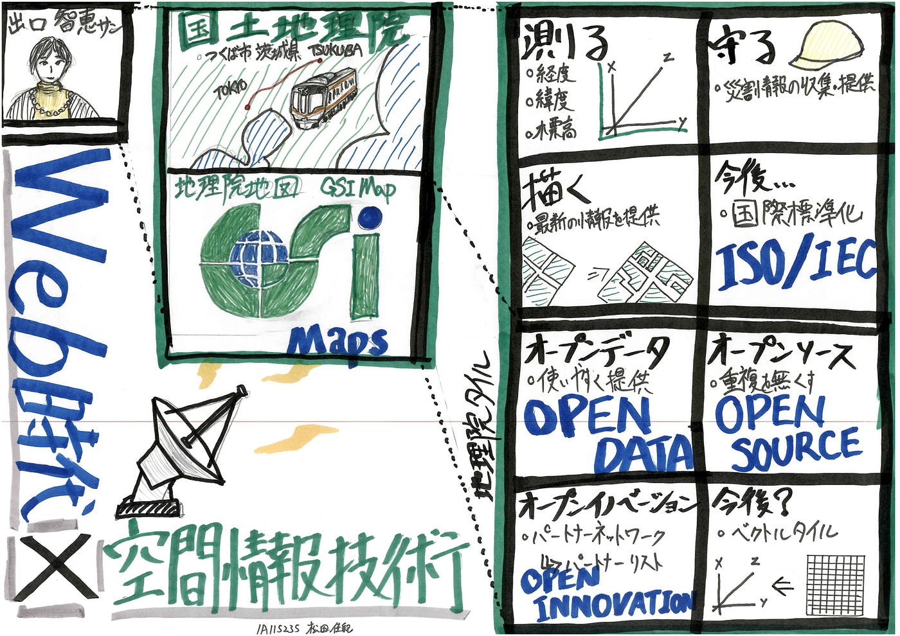

そして具体的に行ったことは、**1)最初の週にグラフィックレコーディングのプロにそのノウハウを伝授いただきつつ**、**2)毎回約60分のゲスト講演内容をグラレコにまとめる**。**3)講演と質疑応答を含めて90分以内にグラレコ完成させる**。**4)連続するもうひとコマ(90分)で、作成したグラレコを共有しグループディスカッションと全体ディスカッションを行い、登壇者や講師陣からコメントをもらう**。**5)用紙のサイズは毎回A3サイズ、最初の3回はテンプレートを使用し、4回目からはフリースタイル**と、とにかく描いては共有し、それぞれの工夫したところ苦労したところを学生同士で語らせました。

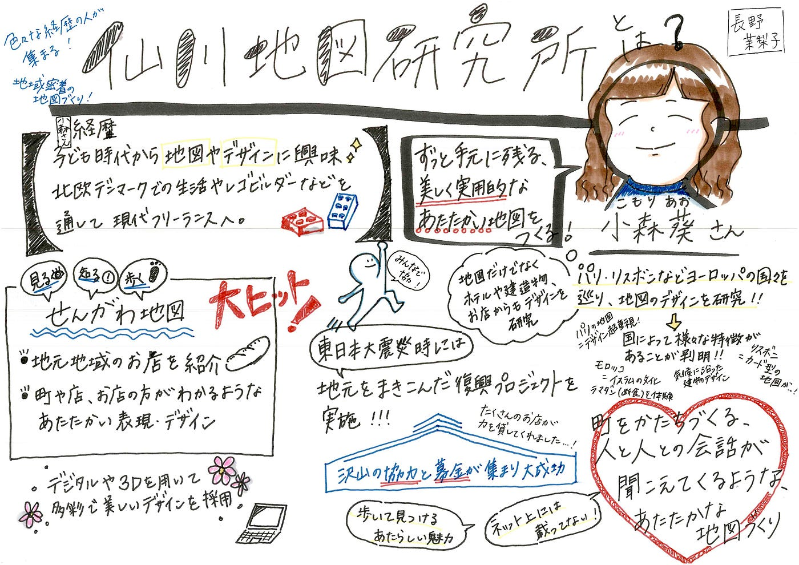

実際にやってみると色々な手法が編み出されました。グラレコのプロの方々から見ればあるあるな手法なのかもしれませんが、自分たちで発見する喜びもまた記憶に留める効果が出てきました。

**# 編み出されたメソッド**

- **後光メソッド: **登壇者の似顔絵の頭の後ろにその人の個人属性などをマインドマップ風にタグ付け表現

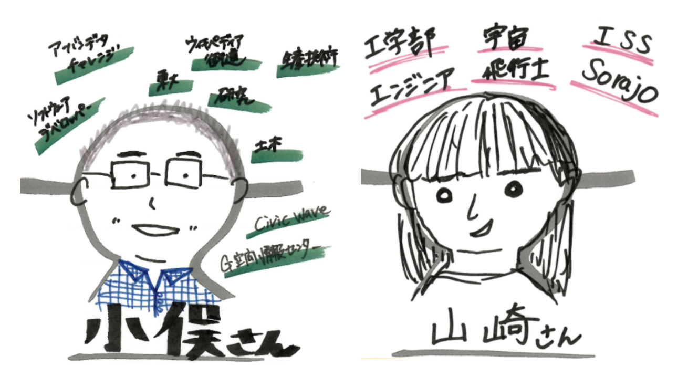

- **チェックボックスメソッド: **箇条書きのシンボルをチェックボックスにし、チェックの色を変えて目立たせる

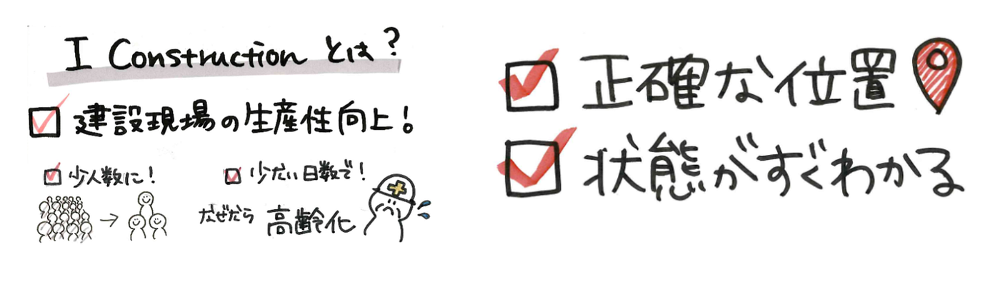

- **細ペン詳細メソッド: **情報量の多い話は、その概要を大きく描き、近接させる形で詳細を細ペンで記述しコントラストを強調させる

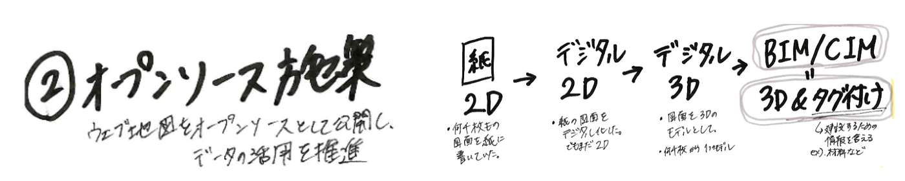

- **今後メソッド: **話の最後に登場する「今後」はとても重要な要素なので、そのスペースをあらかじめ確保しておき目立つように配置する

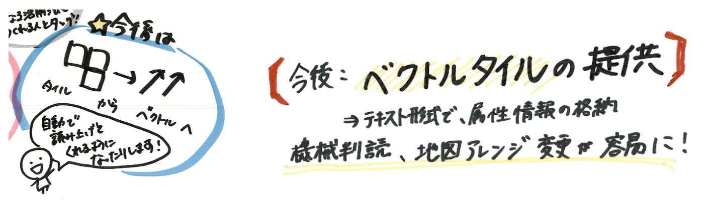

- **ステッカーメソッド: **登壇者から稀に配布されるステッカーをグラレコの中に取り入れてしまう。但し全員がやると面白くないので注意が必要。

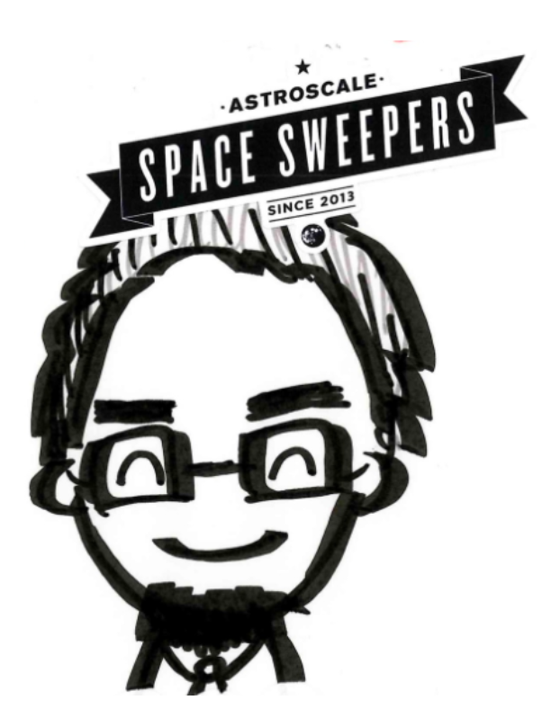

このように、試行錯誤の中からグラフィックレコーディングを授業に取り入れるチャレンジを試みてみた結果、次のような効果・メリットが見えてきました。

**# 効果・メリット**

- **学生たちの授業に対する姿勢が変わりました。寝る暇なんてありませんので、とにかくみんな必死です。**

- **質問力が上がりました。説明された要素の内容確認や、正式名称の確認など、自分のメモが正しいのか確認する癖もつきました。**

- **常に図化することで、講義内容の咀嚼と構造化、時系列での整理のチカラが明らかに向上しました。**

- **複数人でグラレコすることでより客観的な記述ができるようになりました。よく見るグラレコは1講演に1グラレコの組み合わせですが、どうしても情報の解釈と取捨選択の過程で講演内容の一部が削ぎ落とされてしまうことも多く、客観性の担保がグラレコの課題のように感じていましたが複数人で同時にグラレコすることで、それらを並べて見るとお互いが補完することで講演内容が客観的に捉えられるようになりました。**

- **登壇者が聴講者の理解度チェックしやすくなりました。講演終了後にグラレコが提出されるため、その場で登壇者が閲覧し、自分の伝えたかったことが本当に伝わっているのか、すぐに確認できます。これは皆さん喜ばれました。**

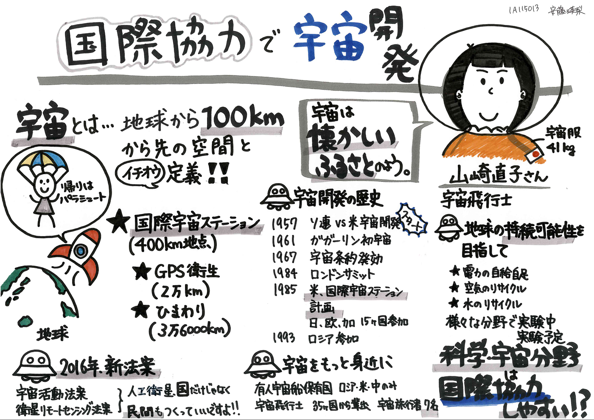

今回の授業で作成したグラレコは全て以下のリポジトリで公開しております。

[gsc-aoyama/geomedia4gsc
geomedia4gsc - 空間情報特殊講義（関さん担当）用 公開リポジトリgithub.com](https://github.com/gsc-aoyama/geomedia4gsc)

今後の課題は、このスタイルの授業を現在の20–30人規模からスケールできるかの検討と、結局はどれだけ多くグラレコを体験できる機会を作ることができるかにかかっていると感じています。

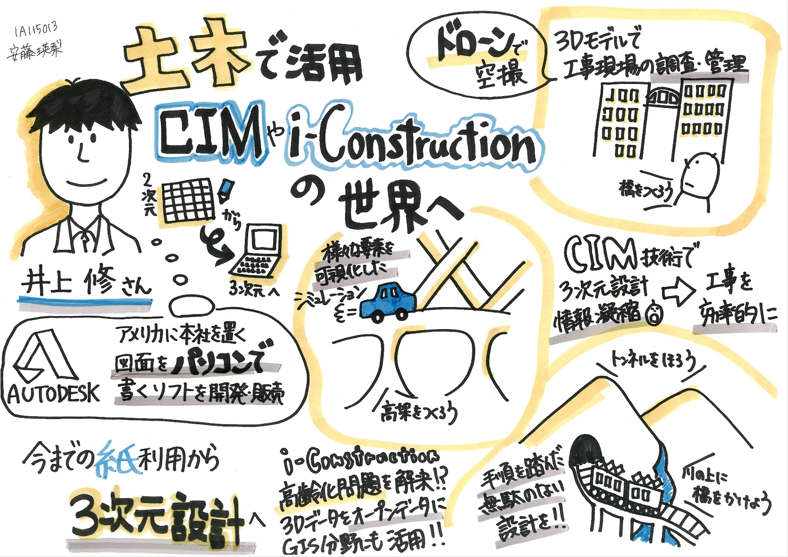

まだまだ理想型には程遠いながらも、現状のグラレコ授業スタイルと感じていることをまとめまてみました。

ご指導いただいた和田あずみさん、関先生、瀬戸先生、登壇いただいたみなさまに感謝しつつ、来年もハードだけれど楽しい授業づくりに力を入れていきます！

青山学院大学 地球社会共生学部 教授 [古橋大地](https://www.facebook.com/mapconcierge)
