### GWゼミ合宿@森の中

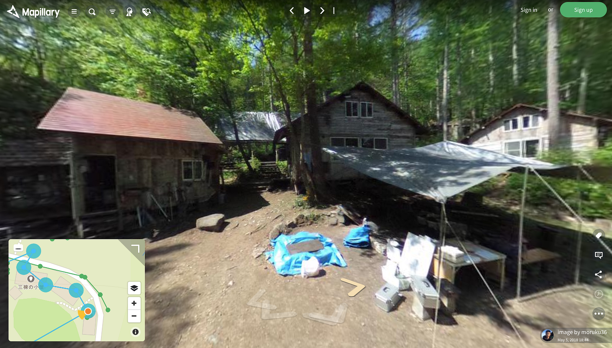

一発目の投稿、今回はゼミ合宿ネタ(森でのキャンプネタ)を公開します。現代的な暮らしから一気にサバイバルな環境で、獣道を野生の五感で散策してきました。

### GWゼミ合宿＠森のくらしの郷(2泊3日)

＠長野県大町市、信濃大町駅から西西北に直線距離約6キロ

**## やったこと**

- 山探検と川遊び

- 山菜採り

- ストリートビュー作成

- 焚き火をつかって料理

- ツリーハウスで遊ぶ

- フローラルウォーター作り

- ドローンで空撮

- 山神様にあいさつ

**## まなんだこと**

- テント貼りの復習

- ランプの使い方

- 薪割り

- 火起こし

- 山菜について

- フローラルウォーターの作り方

- 簡易湯たんぽの作り方

- 森にくらす動物の形跡

- ツリーハウスを作るお約束

- 森のお約束！！

#### **今回学んだ山菜についてはGithubにまとめました。**

#### [山菜の種類]([https://github.com/AyameO/wild_vegetable](https://github.com/AyameO/wild_vegetable))

- Mapillaryにアップしたストリートビュー
[https://www.mapillary.com/app/?lat=36.50871666666666&lng=137.79750833333333&z=15.311223416932101&pKey=OT35OO5LUKOeSQYa-uS6UA&x=0.2864641891581725&y=0.4808209467836078&zoom=0&focus=photo&menu=false](https://www.mapillary.com/app/?lat=36.50871666666666&lng=137.79750833333333&z=15.311223416932101&pKey=OT35OO5LUKOeSQYa-uS6UA&x=0.2864641891581725&y=0.4808209467836078&zoom=0&focus=photo&menu=false)

- local wiki -森とくらしの郷
[https://ja.localwiki.org/morikura/](https://ja.localwiki.org/morikura/)

- 卒業作品進歩状況もGithubに掲載していく。
[https://github.com/AyameO/GraduationWork](https://github.com/AyameO/GraduationWork)

#### **## ゼミ合宿写真集**

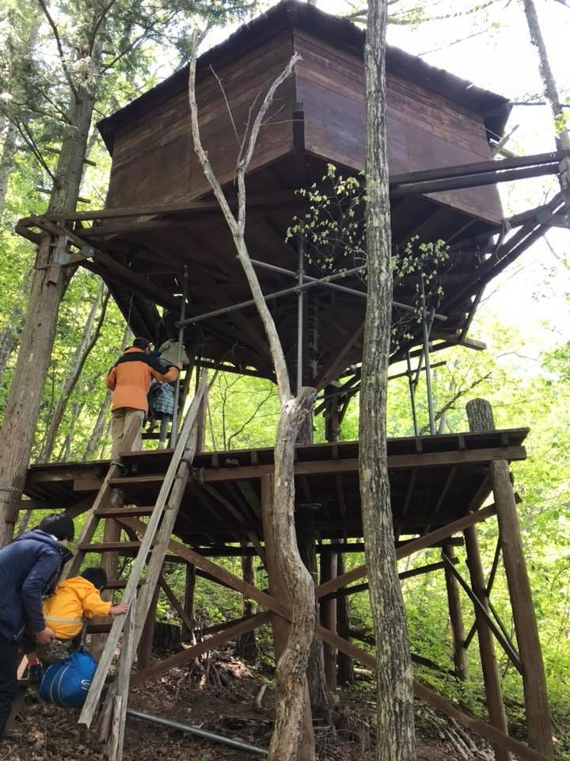

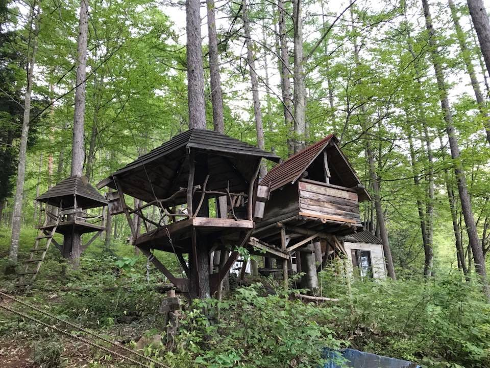

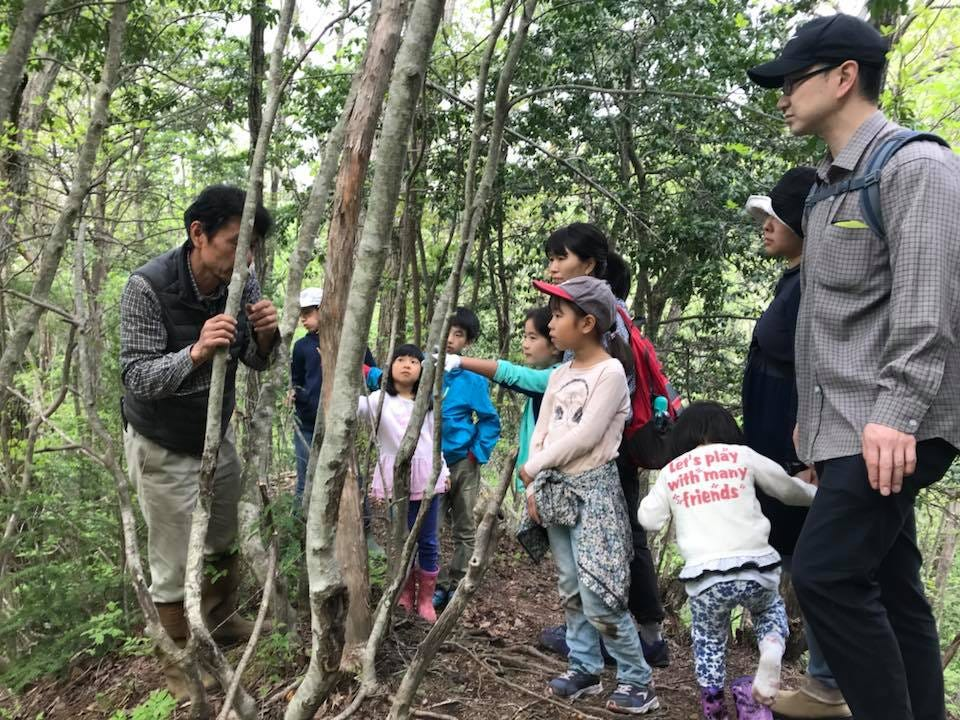

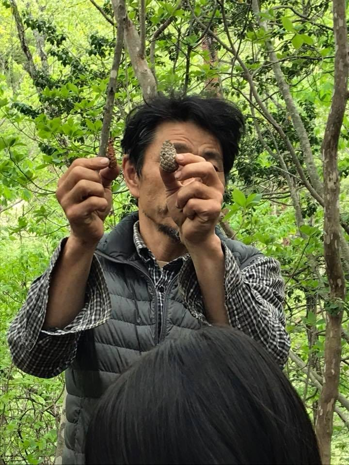

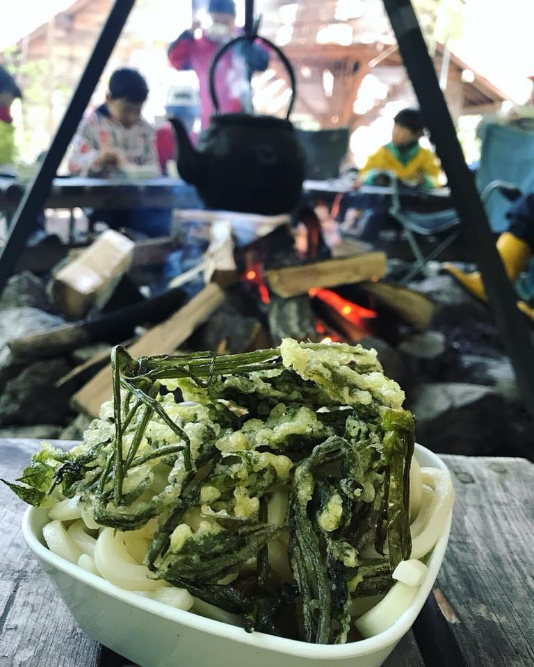

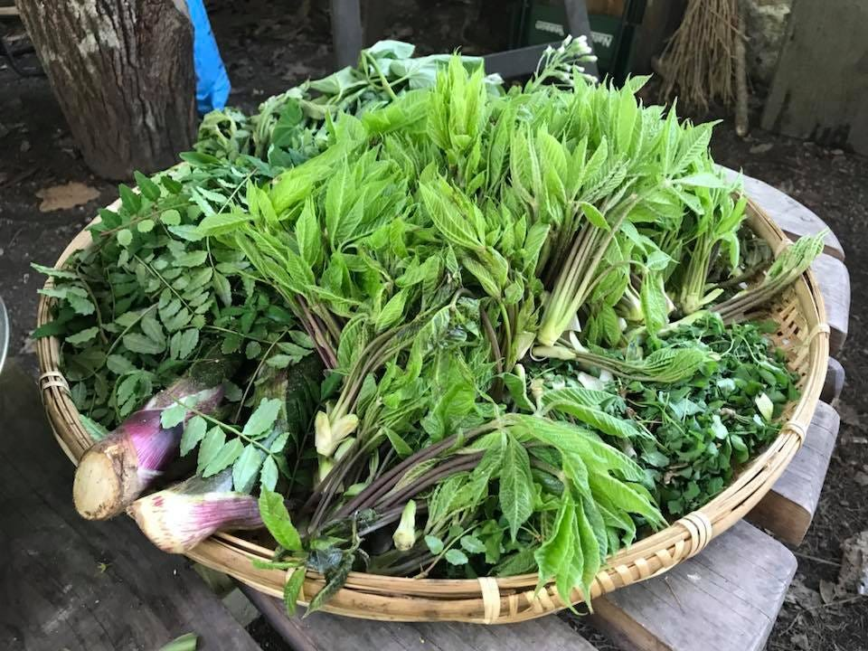

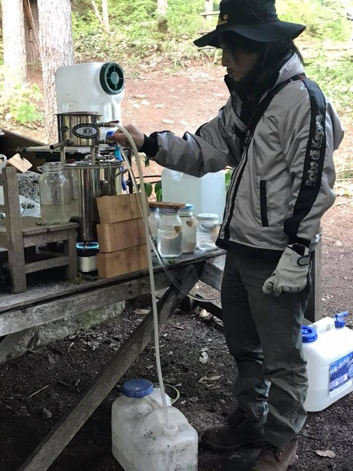

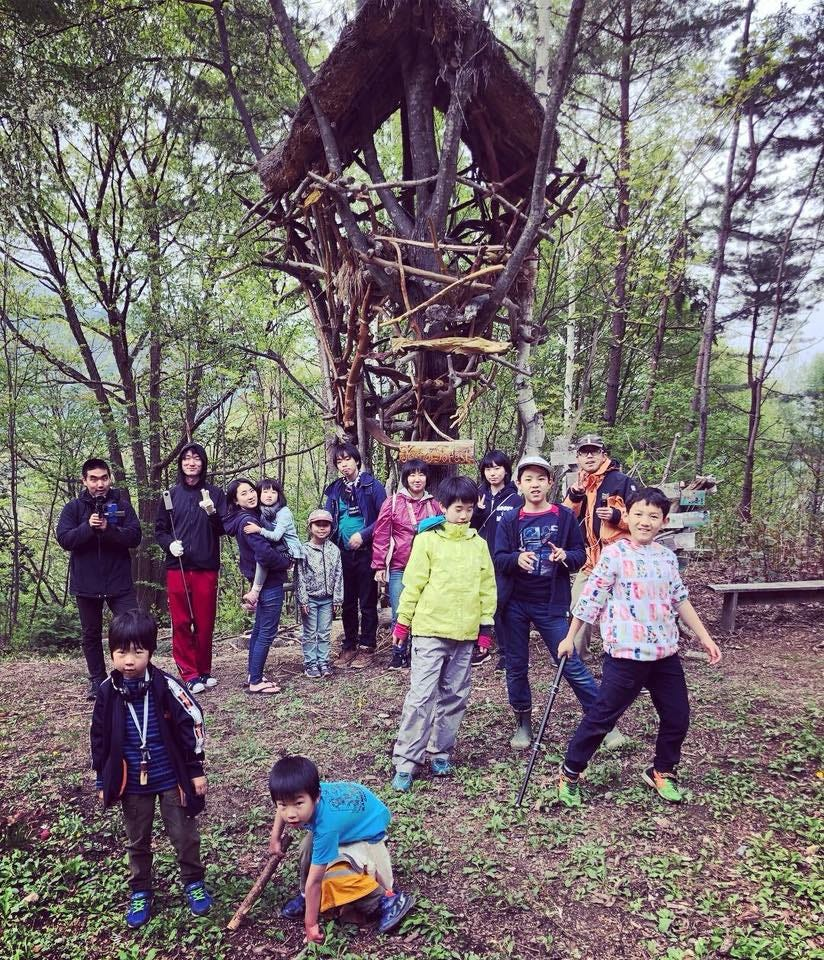

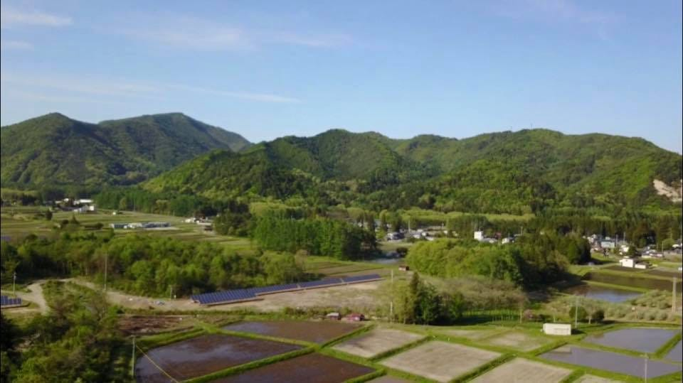

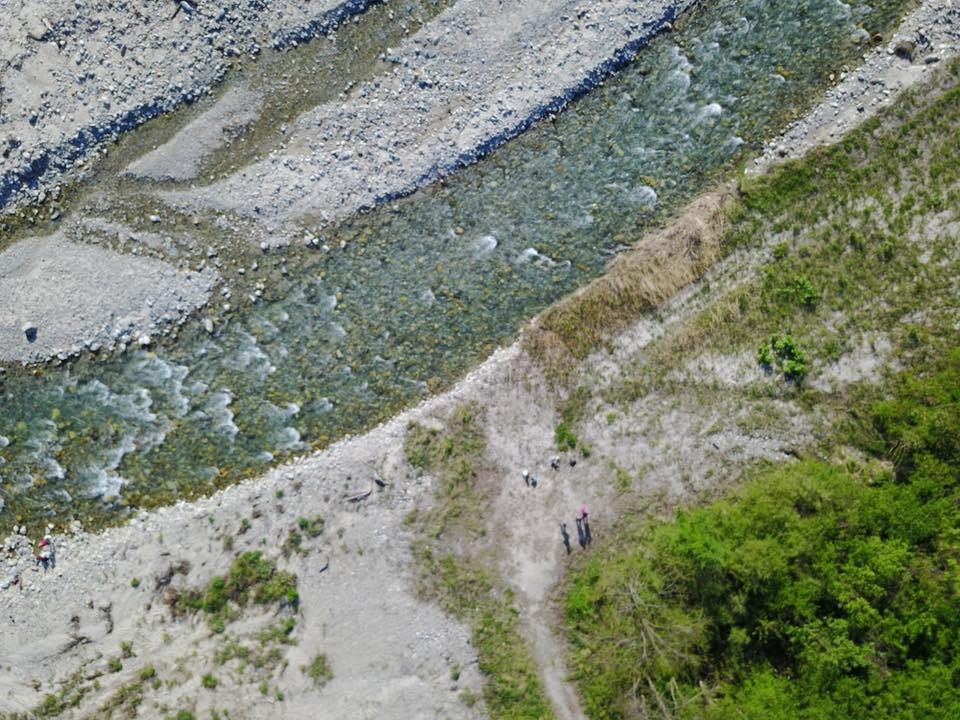
