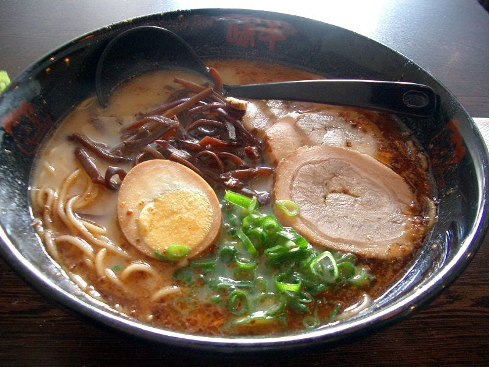
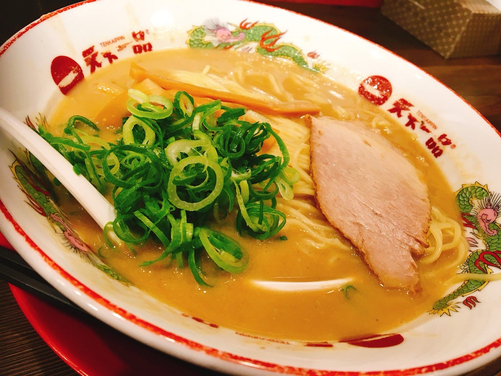

### ラーメン調査１

初めましてこんにちは！青山学院大学地球社会共生学部 古橋ゼミに所属している渡辺ゆうなです。

今週は初ブログということで、私も他のメンバーに倣って卒業研究について書きたいと思います。（まだ下調べ不足で曖昧なところだらけです）

現時点で考えているテーマ１

特定の種類のラーメン（二郎系、家系など）が好きな人に役立つwebサービスを作成する

例えば、現在位置から、電車の乗り換えの回数、店の混雑状況、麺切れ時間、どの店員が麺上げをしているか、などを考えた時に、どのラーメン屋にいくのが一番効率がいいのかをサジェストしてくれるサービスなどを考えています。

もうすでにできあがっているサービスを調べ上げないといけないのですが、既にFacebookやMaps.me、google local guideなどがやりそうなどといった話を古橋さんから伺ったので、保留に近いです・・・。

テーマ２

ラーメンと地域の関連性についての調査

今までに

・好きなラーメンの味、地域別ランキング

・好きなラーメンチェーン店、地域別ランキング

などはたくさん調査されてきたらしいです。その中で、今まで誰も調査をしたことがなく、かつ自分の興味のある調査テーマを探せたらと思っています。（できればそこに二郎系を絡めたいです）

まだ下調べが不十分なため、曖昧ではありますが、現時点ではこの２つを考えています。

今後地域とラーメンのことについて調べることになりそうなので、ラーメン好きを自称しておきながら今まで１度も食べたことがなかった天下一品にこの前行ってみました。

天下一品上野アメ横店

細くもっちりとしたストレート麺、茹で加減は普通、チャーシューは薄くて女性でも食べやすい大きさのもの スープはどろどろだが、背脂チャッチャ系とはまた違う独特な濃さ（私は二郎系ばかり食べているので少し偏った感想かもしれません・・・）

スープがどろどろで脂っこい印象があったのですが、実際食べて見るると案外食べやすかったです。濃い味のスープに細麺を合わせることによって、ほどよいバランスをたもち、多くの層に支持されるようなラーメンになったのではないかと思いました。

今後はラーメンだけではなく食文化についての知識を深めながら、テーマを決めていければと思います。
