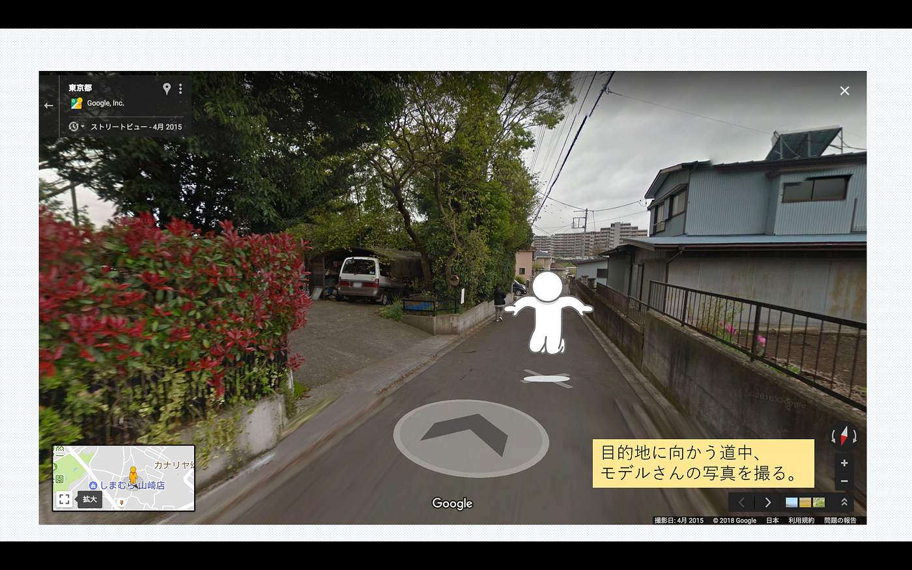
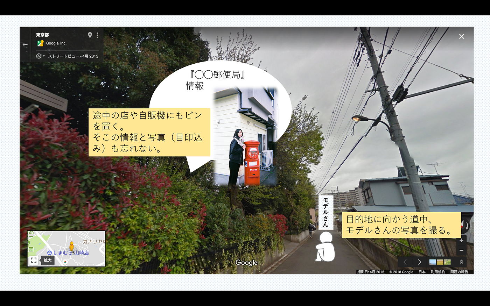

### 安藤 卒論テーマ進行状況 #1

現時点での候補メモです。

# 媒体

- webサイト

- 紙媒体（写真集、雑誌）

# テーマ

- 海の見える町観光マップ or サイト

日本国内の小さな港町をピックアップし、そこの地図を自分でデザイン。宿泊・レストラン・物産情報を写真やリンクなどの挿入によって詳しく盛り込む。旅行のリスクを少しでも解消する情報を提供するシステムを構築する。

- ノルウェー観光情報サイト or 雑誌（日本人向け）

日本人にあまりメジャーでないノルウェー観光へのアプローチ。オスロやベルゲンなど都市を絞って若者にウケるようなフォトジェニックスポットやレストラン・カフェ・ホテルなどの情報をシェア。なるべくオーロラやフィヨルド以外を重視。

- さんぽ写真集 or サイト

聖地巡り・ロケ地巡りの際の行き方を写真でシェア。モデルさんと道の目印になるアイテムとセットで写真作品にする。（ストリートビューでも面白いかもと考えているところ…）

目的地までの道のりをMapillaryのようにコマ撮りしてストリートビューにするが、一枚一枚の写真をモデルさんの作品集にもなるように撮影。ストリートビューをもっと楽しく分かりやすく見せるために工夫する。

