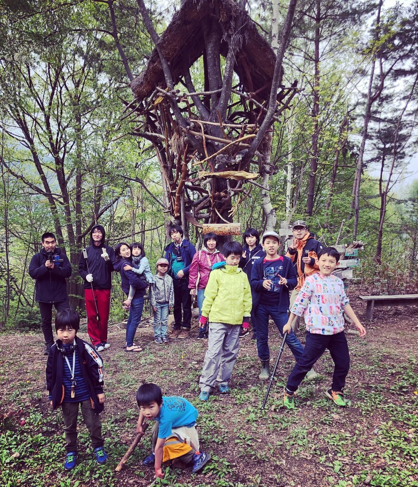
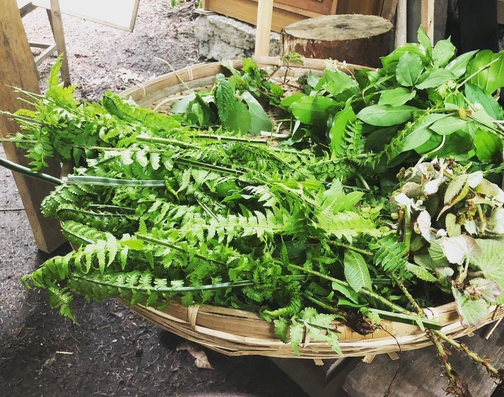
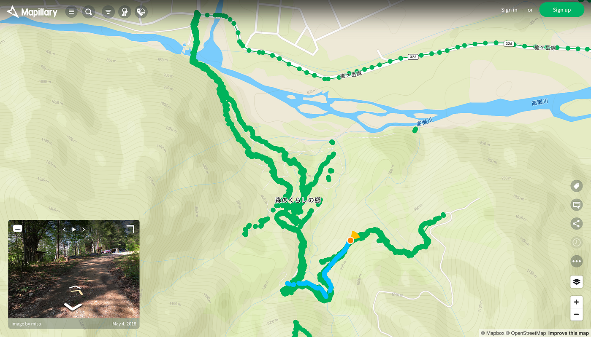

### 山菜の記録手法考

春は山菜が美味い。

自分で採ったものはより美味い。

この美味しさは独り占めしたい気持ちすら生まれ、他人に共有することはつい躊躇ってしまう。ましてや、希少種の群落維持や盗掘の心配をすると尚更山菜の地理空間情報を共有することは御法度のようにも言われることがある。

本当だろうか？

タラの芽、コゴミ、コシアブラ、ユキザサ、、、

毎年、古橋研究室のGWは長野県信濃大町にあるツリーハウスの森「[森のくらしの郷（千年の森）](https://www.facebook.com/morinokurashinosato/?hc_ref=ART9HCbyw6Msx_4QoVcAlFb1PzXrkRCTbcu0LtI76l35NiFuA6iqg79vUdeHpP0rduY)」に学生たちを連れていき、山菜採りや火おこし、その他アウトドアでの活動のイロハを叩き込んでいる。

山菜の盗掘なども問題ではあるが、そもそも森の管理者側が位置情報を共有して日々重要な場所を観察・警戒する[OODA](https://ja.wikipedia.org/wiki/OODA%E3%83%AB%E3%83%BC%E3%83%97)的アプローチのほうが、山菜の群落を維持できるのではないかと話になり、今回、森のくらしの郷で山菜採りを楽しんでいるメンバー同士の情報共有をより加速させるために「山菜の位置情報」をどうやって効率よく・わかりやすく共有するか現地で検討し実践してみた。

# 前提条件
* 山菜の位置・季節(日時)が共有できる。
* 山菜の特徴（同定諸要素・立地条件）を共有できる。
* できるだけ情報取得の作業コストを減らす。

以上の条件を、スマートフォンひとつで実現するために、この森のストリートビューを作成することにした。Googleストリートビューという選択肢もあったが、撮影したデータを自由に使えるライセンスであることを優先し、オープンな[CC BY-SAライセンス](https://creativecommons.org/licenses/by-sa/4.0/legalcode.ja)でストリートビュー画像を共有できる [Mapillary](https://www.mapillary.com/) を採用。学生たちと大量の写真を撮影し、Mapillary に展開した。

Mapillary にはシーケンスという概念がある。連続する写真をひとまとめに撮影開始と撮影終了を明示的に示して管理する手法だが、ひとつのシーケンス間の空間的なつながりを [SfM](https://github.com/mapillary/OpenSfM) と呼ばれる画像間特徴点抽出による三次元解析処理を行うことで 、写真が撮影された場所やカメラの視点、画角などをより正確に落とし込むことができる。

山菜の写真の記録の仕方で、初心者が悩むのは、山菜のプロやセミプロが記録共有する写真がクローズアップしすぎで、その立地条件やまわりの風景が想像できないことだ。

しかし、先述のMapillaryシーケンスとしてそのまわりの風景と山菜の個体へのクローズアップまでを撮影し、シーケンスを再生することで、初心者でもどれが個体なのか理解しやすく、地図と連動して正確な位置情報が共有できる山菜位置情報共有のやり方が効果的であることが確認できた。

ユキザサの個体ズームアップ シーケンス例 https://www.mapillary.com/app/?lat=36.50725039191218&lng=137.79686255393347&z=17&pKey=zwaVvCTkeDr-BsEwcAS7-A&focus=photo&menu=false

このやり方を、もう少しブラッシュアップさせ、かつ 360°パノラマの Mapillaryデータと連携させて、ツリーハウスの森における空間情報の拡充を引き続き実践していくつもりだ。

# 今後の課題
* 森のくらしの郷全域の三次元データ生成（撮影データ全体の拡充）
* 360°パノラマデータとの連携強化（THETAでの撮影データ拡充）
* 山菜の種別ごと解説情報との連携（[Local Wiki](https://ja.localwiki.org/morikura/%E5%B1%B1%E8%8F%9C)化？）
* 季節ごとの変化比較（四季ごとにみんなで撮影？）

追記： とりあえず LocalWiki のページ「山菜｜森のくらしの郷」を作ってみた。 [https://ja.localwiki.org/morikura/%E5%B1%B1%E8%8F%9C](https://ja.localwiki.org/morikura/%E5%B1%B1%E8%8F%9C)
