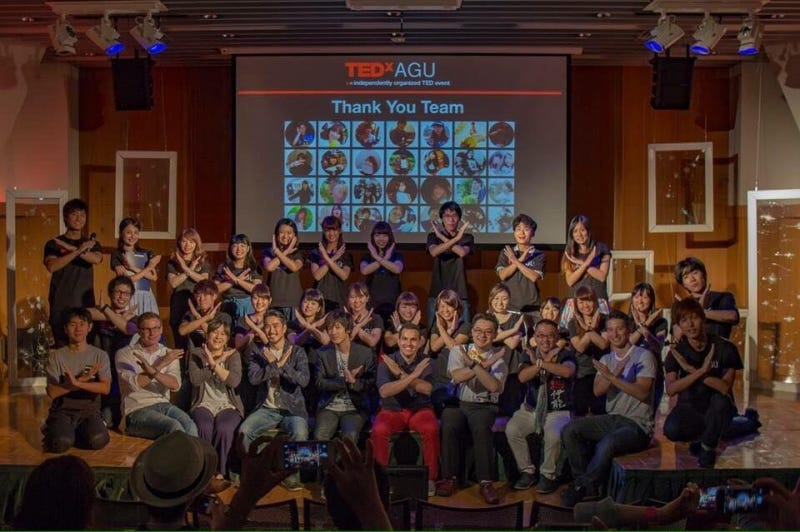
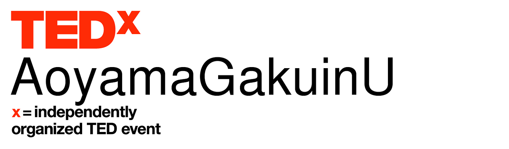

### TEDxとはなんぞや

TED -Ideas worth spreading-
みなさんご存知でしょうか？

興味の幅が広い私はこれ大好きです。

これからこのブログではこのTEDの説明から、
また題の通り、これから卒業制作のテーマとして、また自分の青山学院大学生生活の集大成として、TEDxAoyamagakuinUの開催に向けたTEDxの調査と、運営準備の様子を記録していきます。

**# 卒論テーマ
**TEDxAoyamaGakuinUカンファレンス開催を通したTEDxのブランド価値について、および現在の全国のTEDx事情について

**# output形式**
WEBサイト制作 （予定）

**# 現状**
青山学院大学として、今年の秋にTEDx開催に向けて 青山学院大学TEDxカンファレンス愛好会を中心に開催準備を進行中

また、全国のTEDx事情については現状開催予定を中心とした情報を記載しているマップがWEB上に存在しているため、時系列にそった歴史や諸事情をと行った情報を含めた別のマップを個人的に作成予定

次回のブログではそもそもTEDxとはなんなのか、青山学院大学での開催とはどういうことなのか、を書いていきます。
