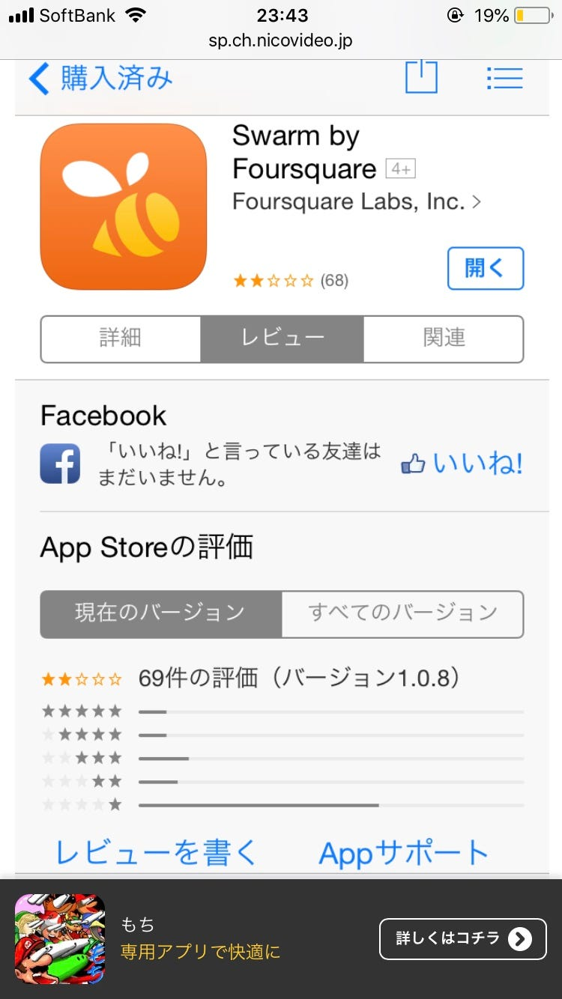

### 今週のおまめ

みなさんこんばんわ〜初めまして彩です☺︎

GWいかがお過ごしでしたか？

わたしは2日間風邪で寝込んでおりました〜元気だけが取り柄なのに、歳のせいか最近病弱になってきているのが悩みです。

せっかくお休み1日伸びたのに、今日はあいにくの雨ですね☂️就活中の雨は、ストッキングが濡れてしまうのでとても嫌いです。

こんな感じのブロガー的なのやってみたかったので、せっかくならブロガーぽくやっていきたいと思います。みんな読んでね♡

本題は卒業制作についてですよね。

私は卒業制作のテーマを【位置情報広告】としてアウトプットはウェブサイトを考えています。

これまでも位置情報広告は色んな企業が挑戦し、失敗してきているみたいです。アマゾングーグルアップルまでも！

やっぱり位置情報って、私達がよく使用するインスタツイッターフェイスブックでも、必ずあるけどあんまり使わないイメージあります。そんなに個人情報晒したくないし、そもそもわざわざ付けるメリットないという感じですよね。

広告で言うと、自分で検索するのじゃなくて勝手に出てくる広告って、やっぱり邪魔だしいいイメージないですよね〜無意識に飛ばしちゃうという感じ。そもそもよくわからないウェブサイトの広告なんて信頼できないな〜って思いますよね、信頼できる情報って何だろうって考えた時に、やっぱり実際に経験した人の口コミって大事だなと思いました。ということで口コミを上手く反映させていきたいです！

これらの課題に加えて、これまでの失敗例を研究した上でそれらを解決するかつ今までにない領域を組み込んで、位置情報からよりパーソナルで需要のある広告を打ち出すサービスを作りたいと考えています。もう一つ重要ポイントとしてはデザイン性！情報が多い現代は、心地よく目に入ってくるものってデザインがすごく重要なんじゃないかなって思いませんか！アップルみたいに素敵に統一されたデザイン目指したいです。

先生の言う今までにないもの、、難しい😭みつけたいです、何か案がある人私に教えてください。笑

そこで今日は、forsquareというアプリの例から学んでいきたいと思います。

swarm by foursquareという新しいものがあるみたいです。

行った場所にチェックインできて、周辺の情報を提示してくれるだけでなく友達の居場所もわかるものみたいですが、チェックインしなくてもプロフィールに自分の場所が表示されるとか。そうなると本当にプライバシーに関わってしまいますね！危険すぎると非難を浴びているようです。

自分の位置情報を他人に知らせる必要があるかは検討の余地がありそうです🤔
