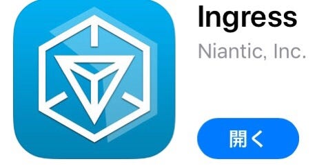
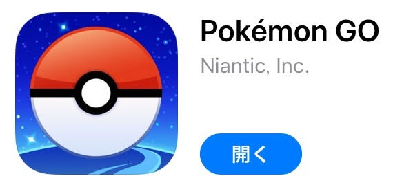
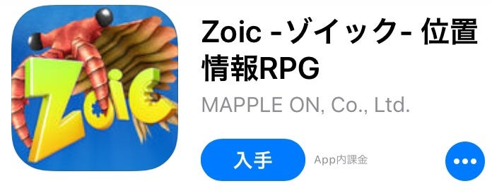

### 位置ゲーまとめ

こんにちは！地球社会共生学科4年古橋ゼミの中井です☺︎

古橋ゼミ生ならIngressやPokémon GOはよくご存知だと思います。

楽しいですよね！

私の卒論のテーマはそんな**「位置情報ゲーム」**です。

さて、位置情報ゲームってなんでしょう？

位置情報ゲームとは、携帯電話の位置登録情報・GPSを利用したゲームのことです。

ということで、今回は既存の位置情報ゲームをいくつか抜粋して紹介していきたいと思います！

- Ingress

Ingressは現実世界を舞台にした陣取り合戦です。謎のエネルギー「エキゾチックマター」を巡って世界中のプレイヤーが「レジスタンス」と「エンライテンド」の2陣営に分かれ、地図上の「ポータル」と呼ばれる拠点を取り合い、「コントロールフィールド」と呼ばれる陣地を広げていくというものです。

- Pokémon GO

あの大人気ゲームが位置情報ゲームになりました！歩いて、バトルして、ゲットして、時にはみんなで協力して……家にいては味わえない楽しさがあります！

- ニッポン城めぐり

日本100名城・続日本100名城をはじめとする、主に戦国時代に日本全国に実在した3000の城をめぐるスタンプラリー！お城や歴史、戦国時代好きな人から初心者まで楽しめます。

- ゾイック

物語はカンブリア紀の地球とそっくりなパラレルワールドとワームホールで繋がってしまった世界。それから150年後、古代生物にそっくりな生物・ゾイックと人間は、その水没した世界で共存していた。遊び方は、上の２つと同じく、現実世界を歩き回り、ゾイックを捕まえて育成・バトルをするというもの。王道のRPGって感じですね！

- 駅メモ！-ステーションメモリーズ！-

これは駅を対象とした位置ゲームです。可愛いキャラクターたちと一緒に毎日の通勤・通学やおでかけを楽しめます。おでかけの記録や称号集めなど、楽しみ方はイロイロ！

- モンクエ

楽しく歩いて、遊べるリアルマップRPG。全国各地に出てくるかわいいモンスターたちを倒して仲間にしよう！

まだまだおもしろいゲームはたくさんありますが、今回はここまで！

次回は実際にプレイしてみた感想やそれぞれの比較なんかをしていきたいと思います。
