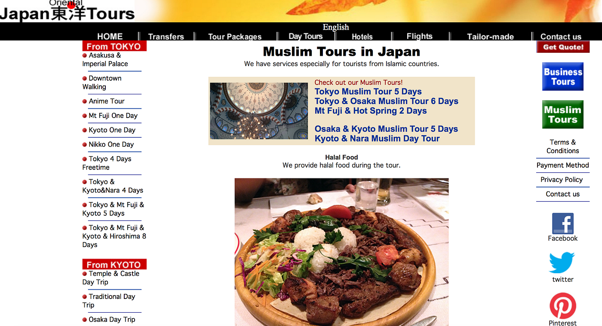
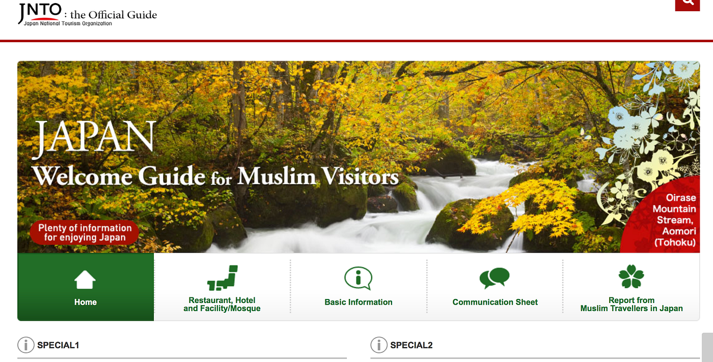
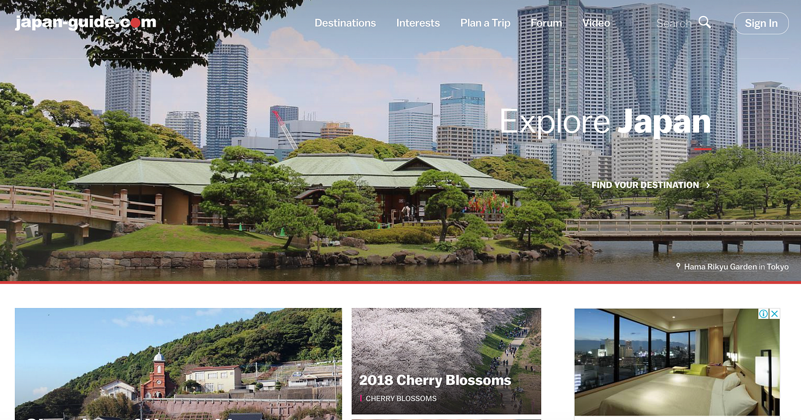

### 卒論 Episode.1

**先週のフィードバックを踏まえて、主に外国人用とムスリム用のどのような観光サイトあるのか調査をしました。**

調査をしていてまず目についたのはインターフェイスの使いづらすと自分のアイディアと同様にいろいろなもの取り入れすぎていることに気づきました。以下の写真のようにフラットでデザイン性の無いサイトが目立っていた。

しかし、一方でシンプルで自分の理想に近いサイトがこれでした。調べやすく日本の様々なエリアのレストラン、ホテルや観光地を検索できる機能と日本のニュースなど

・・・・・

一方はツアーの組み方や日本の文化紹介（ビデオ紹介）などもありとてもシンプルで必要な情報だけが盛り込まれていて使いやすい。

**次の課題：**

実際んどうすれば観光客が使いやすく日本で観光しやすくできるか外国人にアンケートをしてみたいと思う。
