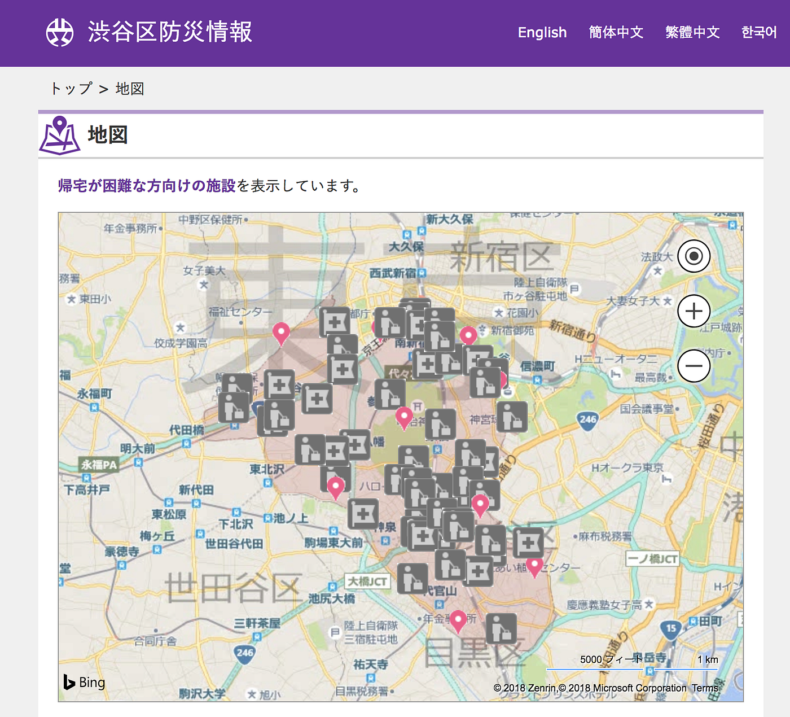

### 防災×観光×地図

卒論として、渋谷区の防災と観光を兼ねた地図をつくり、パンフレット形式で提出する。

1. 内容

対象は渋谷に来た観光客と修学旅行生で、渋谷区の避難所(避難経路)や主な観光地を地図に記載し、万が一の災害が起きた際に利用できるパンフレットを作る。

加えて避難時の注意・便利なアプリ・連絡先・電源場所なども盛り込む。

1. 今後の課題

- 実際に施設がどのように利用できるかを調査する。→帰宅困難者が入れる施設の確認、収容可能人数等

- 修学旅行生が持っているマップを確認し、求められる物を明らかにする

- 渋谷区の現紙地図の設置場所、利用方法を知る→既存のものとは違うデザイン性、内容の追求

- 渋谷のマッピング活動も確認する

パンフレットに加えて、動画でインタビューや施設紹介も検討。作成前にフィールドワークを行い、作成するもののアウトプットをしっかりイメージできるようにするのが最優先！
