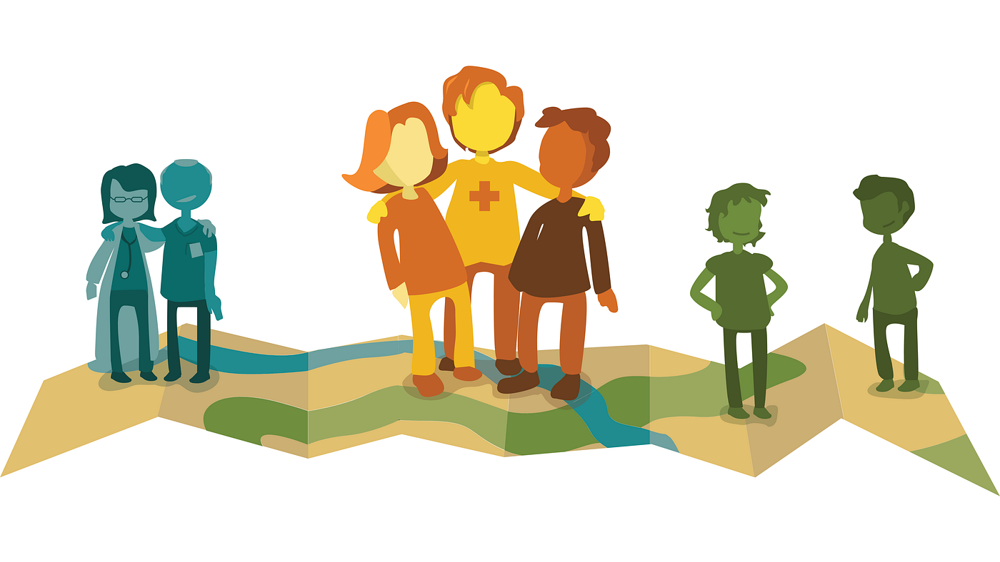
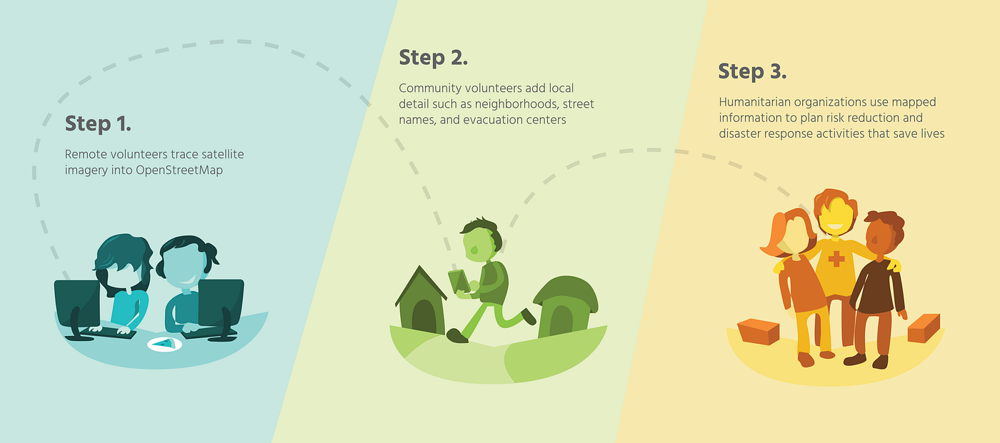
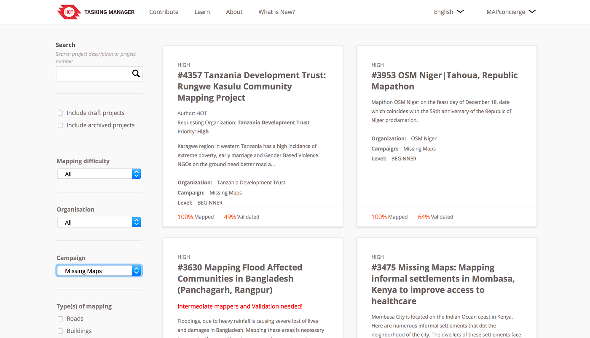
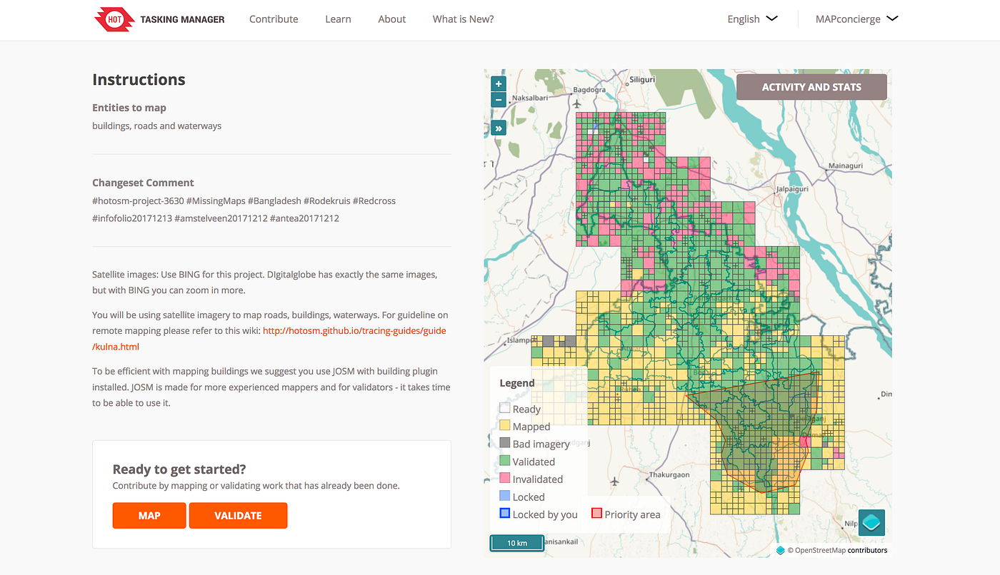
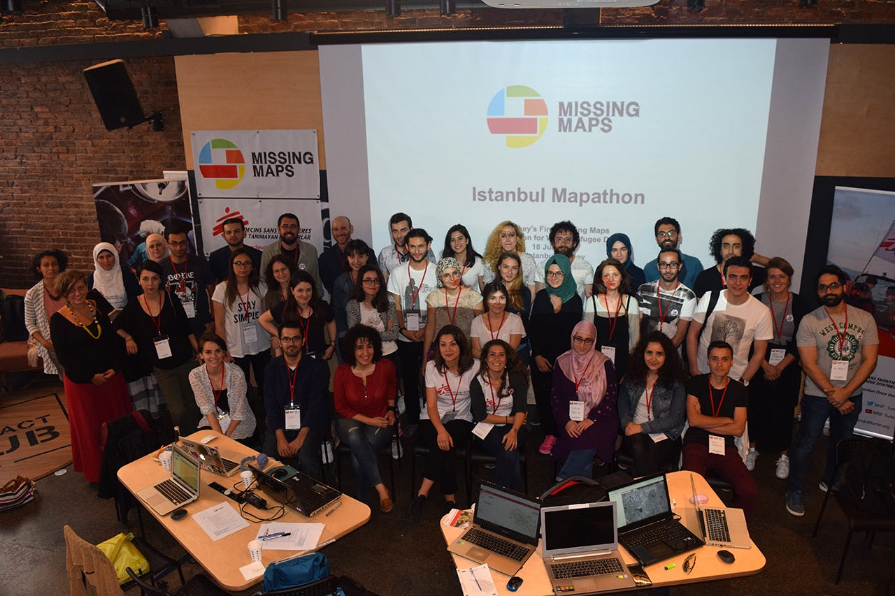
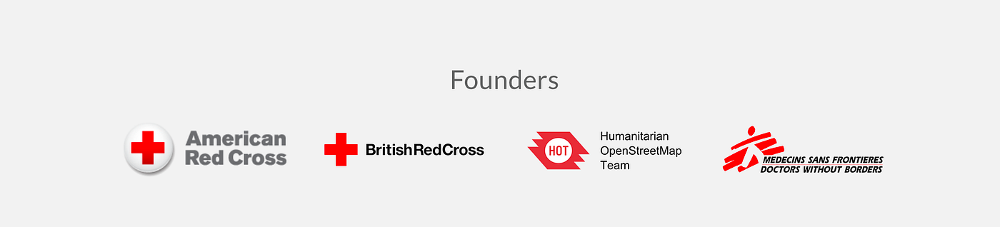
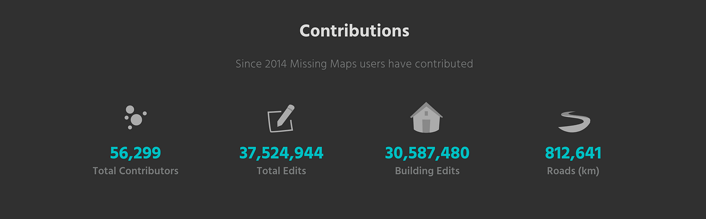

### 災害弱者を減らすMissingMapsの挑戦

思えば始まりはいつも突然やってくる。

2010年のハイチ地震、2011年の東日本大震災、2013年の伊豆大島土砂災害、 2014年エボラ大流行、 2015年ネパール地震、 2016年熊本地震…

大きな災害が起こるたびに、日々の仕事を少し横に置かせてもらい、オンライン上で仲間を集めて被災地の状況を地図に書き込むクライシスマッピング活動に研究室として取り組んでいる。自戒も込めていうと、いつも発災後の対処療法に過ぎない。

事前にもっと準備できていたら、事前にここをマッピングしておけば…

後悔と同時進行でそれでも目の前の災害に向かって出来る限りのことをやるしかなかった。

今、この受け身な姿勢のクライシスマッピング活動が変わろうとしている。流行りの言葉を使うとするとアクティブケア（Active Care）だ。災害が起きそうな場所を先回りしてマッピングする。

そもそも “マッピング” って何？ という方も多いと思うので、気になった方は以下の映像を見てほしい。

映像1. TEDxKids@Chiyoda でのクライシスマッピング紹介

この映像で語っている大事なことは、地図を作る行為としてのマッピング活動には、遠隔でどこからでも誰でも参加できるということだ。

事実、筆者の子どもたちは小学生や保育園児の頃から、地図づくりに参加している。感覚的には航空写真を背景にお絵描きするだけだ。しかもハマると本当に黙々とマッピング作業を行う。

2014年のエボラ出血熱アウトブレイクが起きたアフリカ西側のエリアではWHOや国境なき医師団、各国の赤十字のチームが感染症の封じ込めを行うために大規模に医師や看護師を派遣し、現地で活動を行った。彼らが活動するときに、現地の地図が手に入らなかったらどうするだろうか？手に入ったとしてもそれが２０年前の古い地図だったらどうだろうか？

最新かつ詳細な地図情報は現地で活動する人々にとって文字通り生命線となる。それを遠隔で支えるボランティア活動が今、機能しはじめている。

更に、今後災害や疾病が発生するであろう場所を先回りしてマッピングする動きへと変わり始めている。それが [Missing Maps](https://www.missingmaps.org/) プロジェクトだ。

上の図1が先回りマッピングプロジェクトである[Missing Maps](https://www.missingmaps.org/)の基本的な作業手順だ。まず、今後自然災害や疫病などが発生する可能性の高いエリアを選び、”遠隔” で地図を描く。使用するのはインターネットのつながるノートパソコンのみ。ウェブブラウザを開いて [Tasking Manager](https://tasks.hotosm.org/contribute?difficulty=ALL&campaign=Missing%20Maps) のサイトを開くと、現在の対象エリアが登場するので、あとはひたすら指示通りにマッピングするだけ。

道路や建物など、基本的な情報がまだまだ足りない開発途上国を中心に、事が起きる前にできるだけ地図を作っておく(ここまでがStep1)。これらの結果を踏まえて、現地で入手可能な情報を集め地図に反映する Step2、そして作られた地図を活用し、災害弱者を減らすための具体的な活動へつなげていく Step3 へとすすんでいく。

このような新しい国際貢献手法によって、現場で活躍する救援隊や医療チームの効率的な活動を支えることができる。

[Missing Maps](https://www.missingmaps.org/) プロジェクトは、各国の赤十字、[国境なき医師団](http://www.msf.org/)、そして[オープンストリートマップの人道支援チーム（HOT）](https://www.hotosm.org/)のコラボプロジェクトとして実行されており、[青山学院大学 地球社会共生学部 古橋研究室](https://www.facebook.com/furuhashilab/)だけでなく、多くのサポーターによって勉強会や大規模なマッピングイベント（マッパソン）が実施され、その活動を支えられており、民間企業内での社会貢献活動の一環としても取り組まれている企業は数多くある。

2014年から取り組まれているこの[活動の成果](https://twitter.com/TheMissingMaps/status/986614172438925313)は、例えば2018年現在で入力された建物総数が 3,000万戸を超え、入力された道路総延長距離は80万kmと道路だけで地球20周分に相当する地図情報がボランタリーに書き込まれたことになる。

地球100周分、建物1億戸を目指して、一緒に Missing Maps プロジェクトに参加する仲間を増やしていくために、古橋研究室は引き続き Missing Maps プロジェクトを全面的に支援していく。
