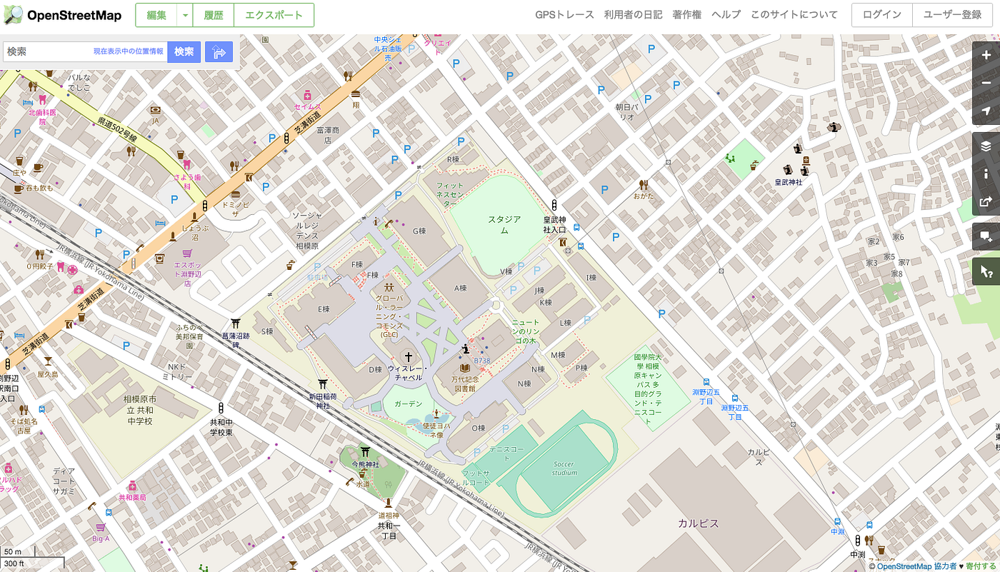
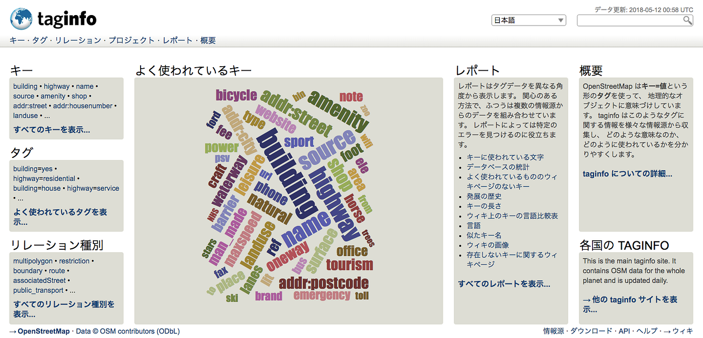

### OpenStreetMapに足りないモノ

“OpenStreetMap” それはオープンでフリーな市民の草の根の力で作られる地図。まさにWikipediaの地図版と呼ばれるモノ。

私はこのOpenStreetMap(以下OSM)の存在を、大学に入学してすぐに知った。きっかけは2015年4月におこったネパール大震災。
初めは地図の必要性やOSMの利点をあまり理解しないうちに、OSMにメンバー登録をしていた。

そんな私もそれから約3年経ち、大学4年生。今までOSMの国際カンファレンスに参加したり、TaskingManagerから様々な被災地の地図作りに参画したり、観光地のOSM作りを手伝ったり、TeachOSM(OSMを他人に教えるためのWebブラウザGIS)を使って他の学生にOSMを教えたり、ドローンで空撮した画像をジオリファレンスしたり、Mapillaryでストリートビューを作ったり、様々なプロジェクトをOSMベースで行ってきた。

そして今回、卒業論文および卒業作品を製作するにあたって、私には絶対に外せない思いがあった。それは、

> “OpenStreetMapに貢献すること。”

地図には完成がない。なぜならそれは、日々変わりゆくリアルを反映させ続けなければならないからだ。

OSMにはまだまだ足りないデータがある。
そこで私が着目したデータは ”**建物**” 。
つまりポリゴン(面)のベクタデータに建物のタグをつけたモノ。

#### 地図に建物の情報があったら、何が読み取れるだろうか？

_**建物がある＝人がいるかもしれない**
_地図に掲載された建物の情報からは、そこに住んでいる人がいるかもしれないという可能性が読み取れる。

#### 人がいるかもしれないという情報は、何に役立つだろうか？

_**人がいるかもしれない→人命救助の可能性
_**考えてみてほしい。地図インフラの整っていない新興国に、支援にいく人々のことを。どこに何の建物があるのか全くわからない状態で、未知の場所に行くのは難しい。かつ地図に建物の情報があれば、だいたいその地域に住む人口が予測でき、物資供給の目安を立てられるなど、様々な利点がある。

そこで今回私がOSMへの貢献として、まだまだ足りない建物の情報をOSMに加えるツールとして、スマートフォンのアプリケーションを開発することにした。

従来、OSMを編集するのに大抵はパソコンを開いて行う。
しかしパソコンを開くという行為には、パソコンを持っていて、パソコンを立ち上げるための時間と空間がなければならない。実体験からも思うに、この「パソコンを開く」という行為は、OSM編集を行う際、しばしば障害となることはあった。

スマートフォンの普及と、持ち運びや操作の容易さから今回私はこの案に行き着いた。すでにOSMへの編集可能なスマートフォンのアプリケーションは存在する。それらと私が作りたいと考えているアプリケーションの比較は後日、詳細に語ろうと思う。
