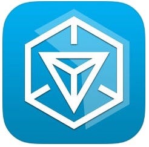
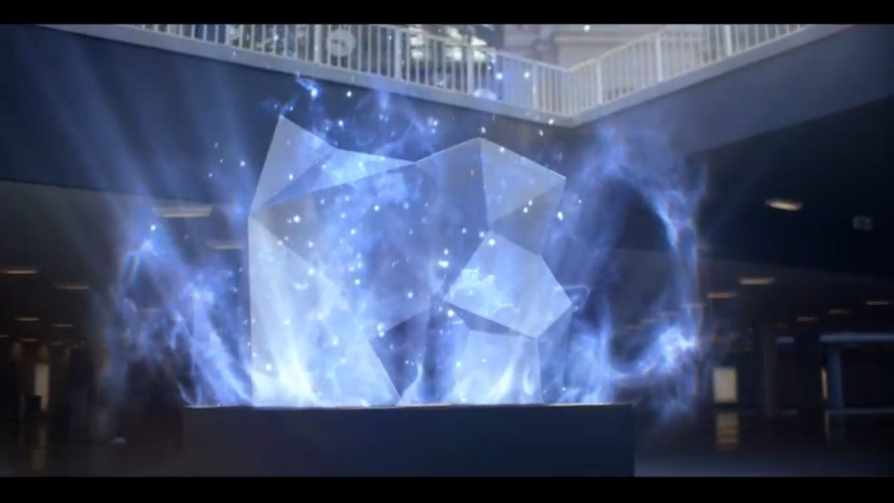

### Ingress特集①

#### 〜ストーリーと用語〜

The world around you is not what it seems.（あなたの周りの世界は、見たままのものとは限らない）

今月はIngress特集です！

１．Ingressとは？

イングレスは、２つの陣営に分かれたプレイヤーが、現実の世界を動き、競い合うことによって進行する世界規模の壮大な陣取り合戦です。
 プレイヤーは「エージェント」となって、自分の周囲に配置されたスポット「ポータル」で様々なアイテムを取得し、自チームのために活用しながら成長していきます。そして、相手チームの「ポータル」を攻撃し、「レゾネーター」などの各種アイテムを使って陣地を拡張させていく。
 イングレスはあなたのまわりの現実世界を、世界規模での謎と陰謀と競争の世界へと変化させていきます。
 現実世界に存在する建造物やモニュメントがポータルとなっています。そして、ポータルを自チームのものにするためには実際にその場所まで行かなければいけません。そのため、スマートフォン上で衛星測位システム（GPS）機能を有効にすることがプレイの前提となっています。

２．ストーリー

ある神秘的なエネルギーがヨーロッパの科学者チームにより発見された。その力の起源や目的は不明だが、研究者たちは、この力が我々の思考に影響を及ぼしていると考えている。
 「エンライテンド(覚醒者)」は、このエネルギーが我々に与えるものを受け入れ、「レジスタンス(抵抗勢力)」は、人類に残されたものを守り、保護するために戦っている。世界の未来を変えるのは、あなただ。

３．用語解説

用語がわからなければ始まらない！

Ingressをプレイする上で知っておかなければならない用語を紹介します。

- ポータル
 神社や変わった銅像・モニュメントなどがポータルとしてマップに表示されている。青色のときは「レジスタンス勢力」緑色のときは「エンライテンド勢力」灰色の時は「中立」と色で判断できる。自身で登録されていないモニュメントなどを申請することもできる。

- XM
エキゾチック・マターの略がXM。マップ上にある白い点のこと。XMは体力のようなもので攻撃するときに消費したりレゾネーターを回復させるときに使用する。

- ハック
ポータルをハックすることができる。ハックすることでアイテムや経験値を得ることができる。自勢力のポータルをハックするとアイテムが、敵勢力のポータルをハックすると経験値とアイテムがもらえる。もらえるアイテムのレベルはハックしたポータルに依存する。

- リンク
自勢力のポータルどうしを結ぶことができる。リンクはポータルキーを持っていなければならない。キーを持っているポータルへリンクを貼ることができる。

- コントロールフィールド/CF
３つのポータルをリンクで結んで三角形ができるとコントロールフィールドができる。コントロールフィールド内の人口密度によって自勢力に加算される。

- マインドユニット/MU
コントロールフィールドの範囲内の暮らしている人の数。

- モッド/MOD
MODはポータルに追加できるアイテムの総称。シールドや反撃用のアイテムなどを追加することができる。4つスロットはありますが、1人2つまでしか追加できない。

- AP
経験値のこと。APは敵レゾネーターの破壊(75AP/個)やCF破壊(750AP/CF)で得ることができる。敵ポータルのハックだけでも100AP加算される。

レベル1→レベル2 ≪2,500AP≫
レベル2→レベル3 ≪20,000AP≫
レベル3→レベル4 ≪70,000AP≫
レベル4→レベル5 ≪150,000AP≫
レベル5→レベル6 ≪300,000AP≫
レベル6→レベル7 ≪600,000AP≫
レベル7→レベル8 ≪1,200,000AP≫

- メダル/Achievement Medal
実績に応じてメダルを得ることができる。L8以降からAPに加えてメダルもレベルアップ条件のひとつになる。銅、銀、金、プラチナ、黒と5段階のメダルレベルがある。

- ファクション/Faction
所属の陣営を指す。COMMでもFactionを開くと所属陣営のみのやり取りが閲覧できる。

- スキャナー/Scanner
プレイ用の携帯端末のこと。イングレスの独自の設置名称。

- ディプロイ/DEPLOY
ポータルにレゾネーターを設置することを指す。中立のポータルにレゾネーターを差すことを「キャプチャー」と呼ぶ。

- ユニークポータルズビジティッド/UPV
ポータルに訪問(ハック)した数。

- ユニークポータルキャプチャード/UPC
キャプチャーしたポータルの数。

- キャプチャー
レゾネーターをディプロイすること。

なかなか多いですよね、覚えられそうですか？笑

とりあえずはプレイしてみましょう！

次回はあそびかたと特徴を解説していきます。
