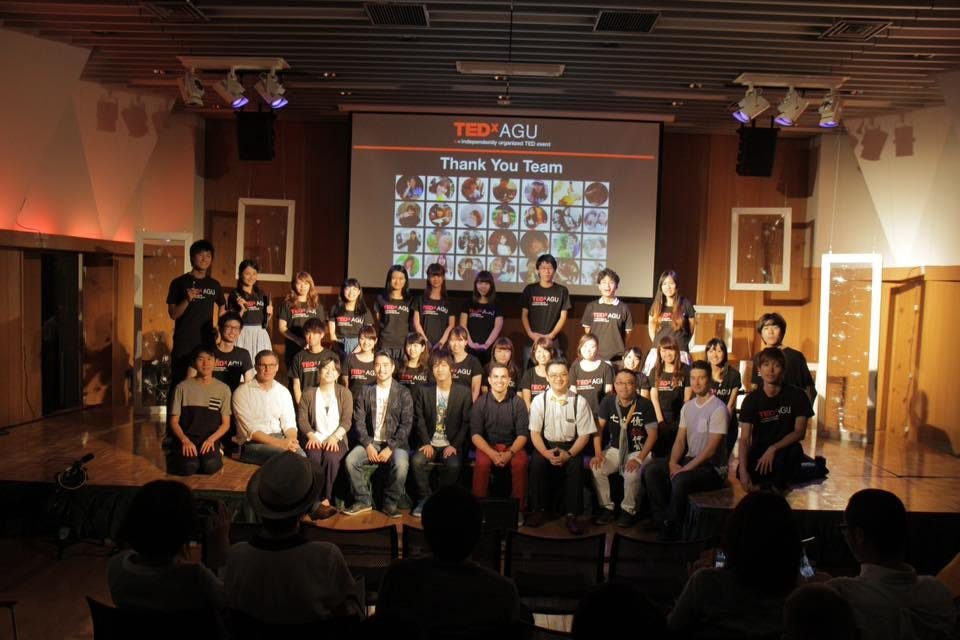
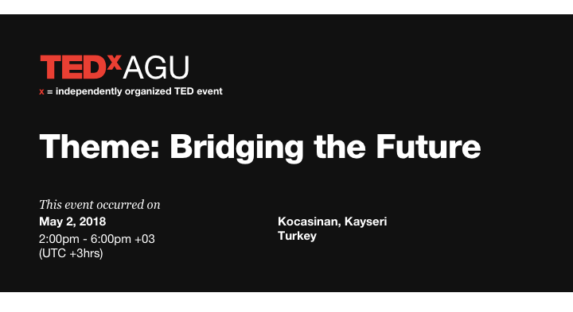

### TEDxAoyamaGakuinUって名前長くない？

青山学院大学で開催しようとしているTEDxカンファレンスの名称です。
なんで長くないかなど題名で問うているのかという説明は後ほど。
まずは前回ブログで予告下通り、このTEDxがそもそもなんなのかお話します。

[TED](https://www.ted.com/)というカンファレンスはご存知でしょうか？
Technology, Entertainment, Design が一体となって未来を形作る、という考えに由来するコミュニティー・イベント(カンファレンス)です。**
**（クマのぬいぐるみではありません！！）

このイベントでは、**”Ideas Worth Spreading (価値あるアイディアを広める)”** というテーマのもと、プレゼンテーションやパフォーマンンスを通じてあらゆる分野のアイディアを紹介します。
1984年に米国で始まったこのカンファレンスは、2006年以降TEDTalksとして世界に無料動画配信されると、**年間10億回以上の再生回数**を記録し話題になりました。今や毎日10万時間相当分の視聴がある大人気コンテンツです。
TEDは、参加者、講演者がそれぞれ異なるバックグラウンドを持っている為、予想もしない他者からのインスピレーションを得られ、アイディアを膨らませる場所として世界中から注目を集めています。

そしてこのTEDから正式にライセンスを受託され、各地域やコミュニティー、大学などで独自に運営されるプログラムが **[TEDx **](https://www.ted.com/watch/tedx-talks)カンファレンスです。
この各団体はTEDのIdeas worth spreadingの精神を受け継ぎつつ、それぞれの団体からの独自のアイディアを発信します。

私たちは青山学院大学に所属する生徒として、このTEDxカンファレンスを開催しようとしています。その名称がTEDxAoyamaGakuinUです。

題名でこの名前長くない？と訴えましたが、名前、意外と重要なんです。
TEDxはこのxが各団体の独自性を表し、独自のアイディアの発信を行うという意味合いを持っています。
それゆえ同じ名前の団体が世界に二つとあってはいけません。
実は私たちはライセンス最初のライセンス申請時点ではTEDxAGUで申請を行なっていました。
というのも、2015年に一度青山学院大学ESSの下でTEDxAGUとして開催したためです。

ここから２年時間が空いてしまったので再びTEDxAGUでライセンス申請を行おうとしましたが、

トルコで先に名乗られていました。
ということで私たちは TEDxAoyamaGakuinU を名乗っております。

と諸事情はこれくらいにして、
ここから私たちは
青山学院大学の掲げるサーバントリーダーの育成に貢献できるようなアイディアを持った方々を紹介、発信していく予定です。
より細かな詳細はまた準備段階を記載するさいにその都度発信したいと思います。
まだまだ準備途中で様々な方々にご迷惑をおかけするかも知れませんが、ご協力と暖かい見守りをよろしくお願いいたします。

こちらのブログ次回からは他団体のTEDxをいくつかづつ紹介していくシリーズを更新しようと思います。

青山学院大学
地球社会共生学部
古橋研究室
加藤夕佳

Photos by
TED Website ([https://www.ted.com/](https://www.ted.com/))
TEDxAoyamaGakuinU Facebook ([https://www.facebook.com/tedxaogaku17/?ref=bookmarks](https://www.facebook.com/tedxaogaku17/?ref=bookmarks))
