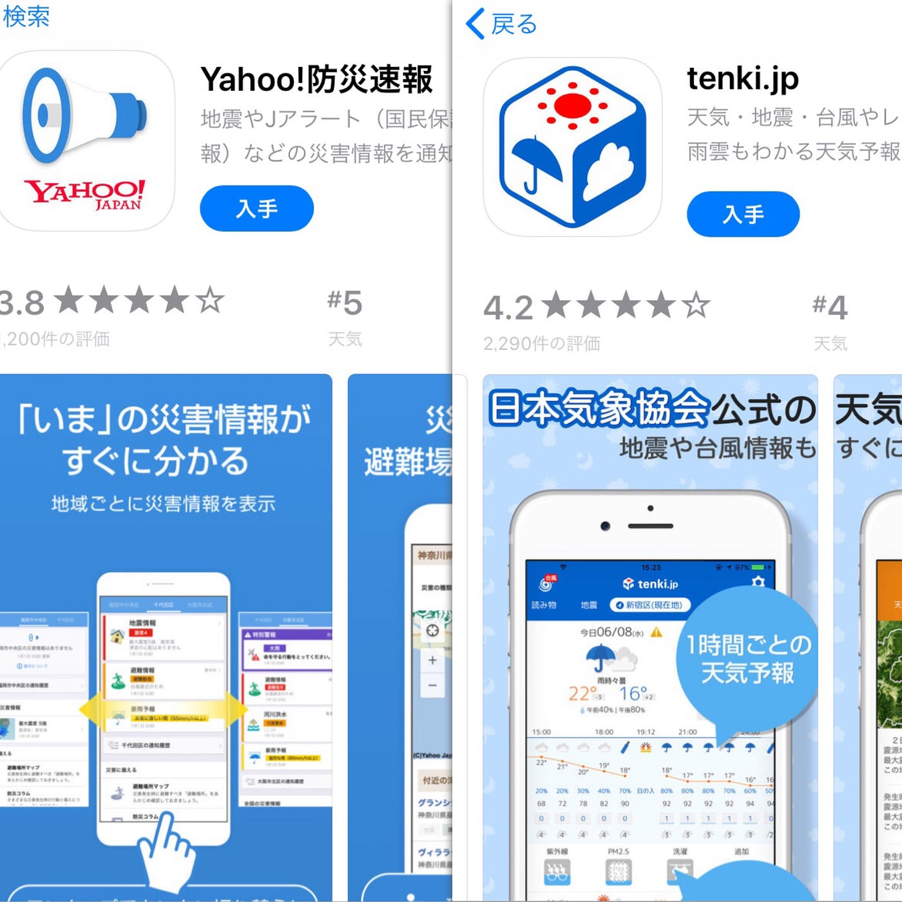

### 災害Appたくさん…

今回はパンフレットに組み込みたい災害アプリを調べました。

まず災害時にどんなアプリが必要か考えて、

今の災害情報全般がわかる、避難場所がわかる、家族や友人と連絡がとれる

この３つは必須なのかなと思いました。

ただ災害対策をしようと考えると、無料ラジオやコンセント、天気予報とかたくさんでてきて…

appleとandroidそれぞれのアプリも組みこもうと思うと、意外と選択は難しかったです。

使いやすさをフィールドワークで実際に検証してみて、パンフレットに入れるかを考えるのも新たな課題としてみます。

アプリの種類を最重要とおまけ的なものでわけて記載するのがありかなと思いました！

青山学院大学

地球社会共生学部

山口詩織
