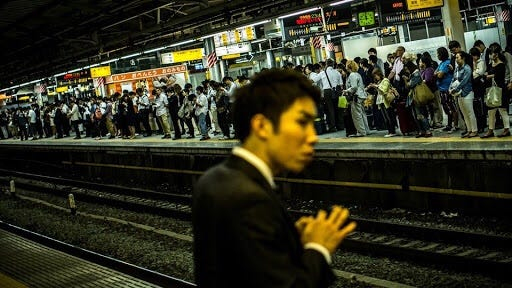
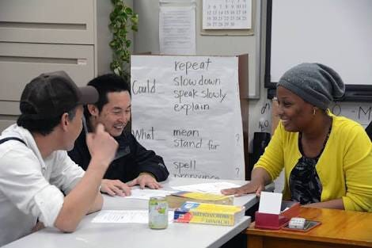

### 観光客は日本のココに不満！

### Episode.2

自分は今回10人ほど外国人に日本に来て困ったことについて話しを聞いた。

その中でも多かったも交通手段についてであった。

- 路線が多すぎてわかりにくい

- 標識や案内版がわかりにくい

- アナウンスがうるさい

- 値段が高い

- 混みすぎている

もう一つ多かったのが英語を喋れる人の少なさでした。

- どうしてもボディランゲージになってしまう

- 助けようとしない

などであった他にはゴミ箱が少ないなど綺麗すぎるゆえに不便なところがあるといったところでした。

これらを踏まえてこれからオリンピックや観光としてくる外国人観光客のニーズが少しずつ見えてきたがよろクリアにできるようリサーチを続けていきたい。

@
