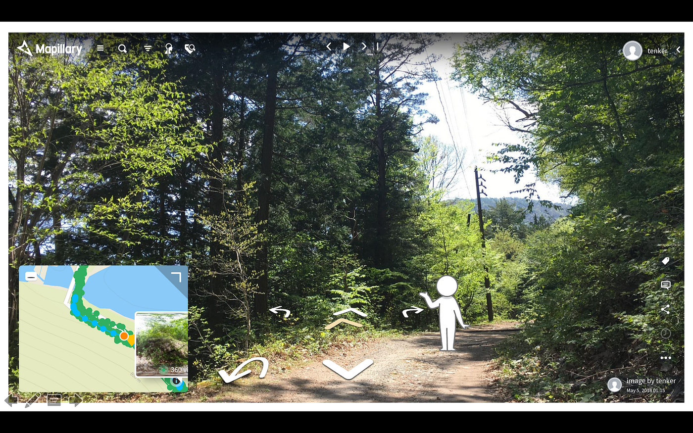
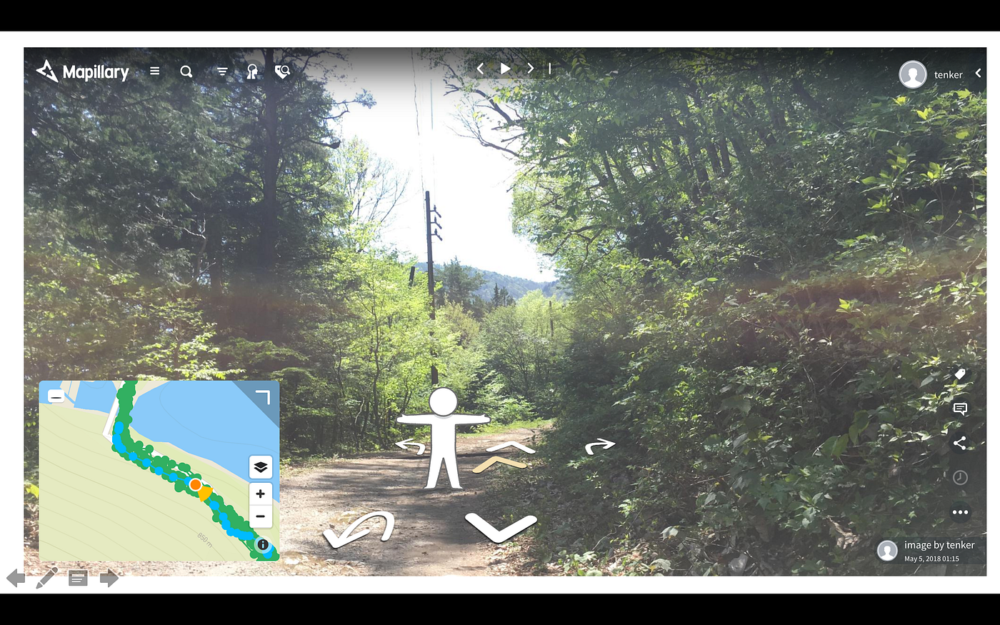
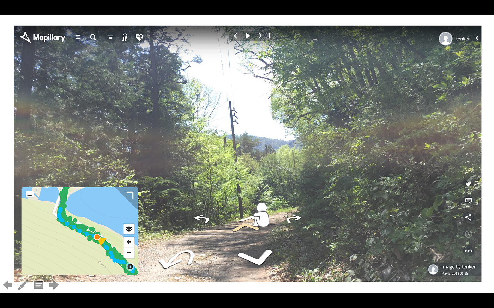

### ストリートビューの可能性

#### 卒論テーマ進行状況 #2

# 今回の思案

前回提案した、『**さんぽ写真サイト**』において、

ストリートビューをもっと楽しいものにできまいか。

①ホームページ（webサイト）を作成

②写真集ではありながら、目的地へ向かう道中をコマ撮りして一つの作品とする。

写真上に店舗など出てきた場合、そこの情報も既存グルメアプリなどよりも写真情報や店の雰囲気情報を追加する。

# 課題点

今までにない新しいアイディアを付随させる。

何をつけるか…
