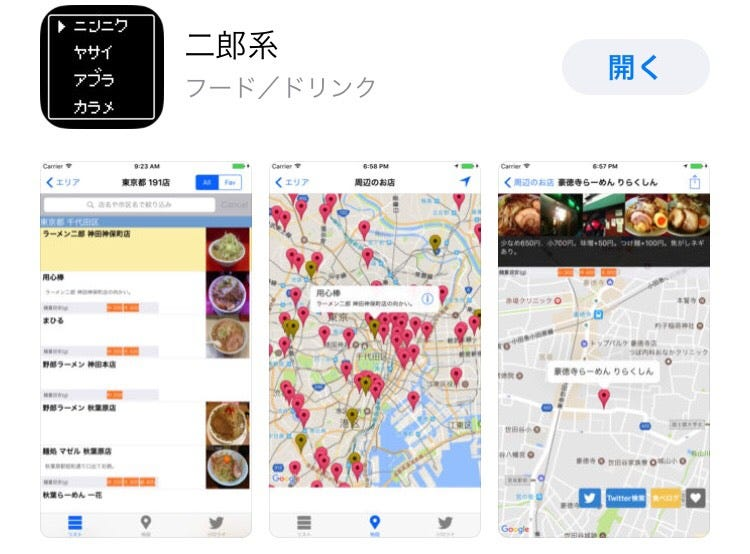
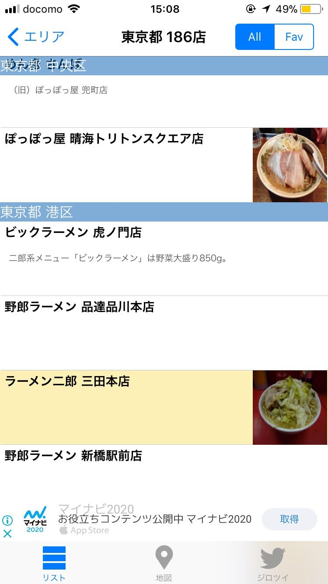
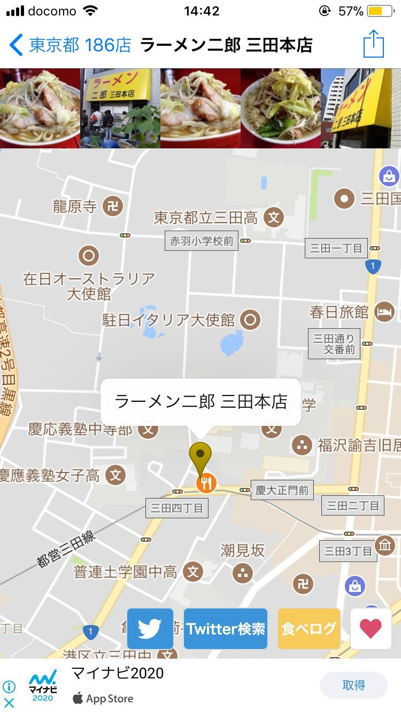
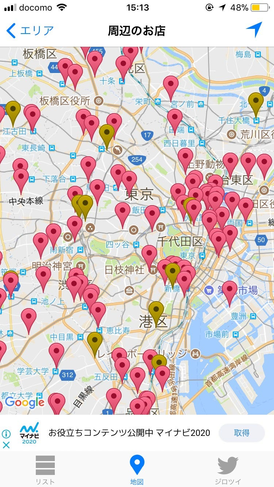
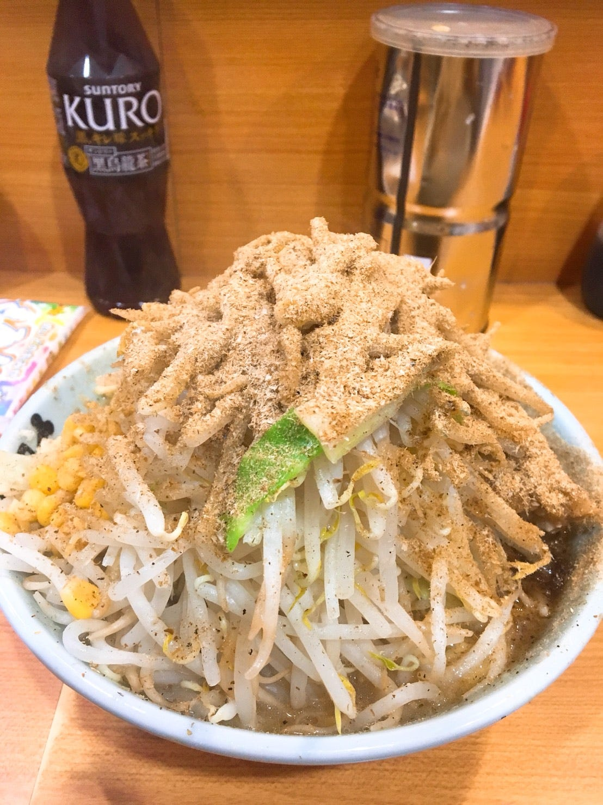

### 二郎系アプリ

こんにちは渡辺ゆうなです！

前回ここに書いたように、下調べが足りなかったので、今週は二郎系アプリについて調べて見ました。

検索ワードは、「二郎」「ラーメン二郎」の２つで調べました。

そこで興味深いアプリが見つかりました。その名も「二郎系」！そのまますぎますね

さっそくダウンロードしてみました！

このようなかんじで、どの地域にどんな二郎系ラーメンがあるのかが、地区ごとにまとめられています。クリックしてみると

このような画面になります。上には写真（拡大不可）一番下には広告があります。地図の下にあるツイッターや食べログをクリックすると、このアプリ上でのブラウザでツイッターや食べログを開いてくれます。

また、

このように、どの地域にどんな二郎系があるのかもみることができます。

とても便利ですね、こんなアプリがあるなんて知りませんでした。これから研究を進めていくにおいて、このデータは使えそうですね！

（ただ、１ヶ月前ぐらいにオープンしたばかりの淵野辺の二郎系の情報はまだ書き足されてませんでした・・・）

今週のラーメン

今週は二郎野猿街道店です〜 この日はあまりお腹が空いていなかったのでプチにしました！麺の量が茹で前２００gぐらいなので女性にぴったりです。ここの店舗は二郎には珍しくテーブル席があります。なので幼いお子さんを釣れた家族の方などもよくいらっしゃいます。 和風BBというのは魚粉です！ 街道系と呼ばれる二郎は、野猿、小金井、栃木と３店舗あり、野猿で修行を積んだ人が店舗デビューすると、店舗名に「街道」の名前がつくと言われています。街道系は麺がバキバキしていて豚も大きく、まし幅も大きいので、二郎系初心者の方は落ち着いたオーダーをしたほうがいいかもしれないですね！でも街道系の店主さんはみなさん優しいです！

来週は何を食べようかな〜
