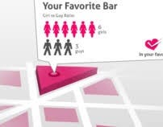

### 今週のおまめ

不安定なお天気が続いていますね、こんばんは〜

今週のおまめは、先週お伝えしたfoursquare の発展編！ということで、foursquare が提供するAPIを使ったアプリケーションを一部紹介していきます☺︎

なんとAPIを利用したアプリケーションは60程もあるのだとか！知らなかった！今回は中でも私が気になったアプリ4選を紹介します〜〜

・Assisted Serendipity

お気に入りの場所を指定して、その場所の男女比率が傾いた時に通知がいくというもの。うーん。

・Beerby

自分が飲んだビールを場所と一緒に記録出来る仕組み。近くにどんなビールがおいてるかわかったら使えそう🍺

・Fourcash

位置ベースで支出管理してくれるもの。自分が散財しやすい場所がわかったところで金欠でもそこ行っちゃいそうですけどね、、

・PeeFee

公共トイレの場所を表示してくれる。トイレへの行きやすさや料金、清潔度までもわかるそう。これ私が欲しかったやつですね！

今回は特に何かしらに特化して応用されたアプリを紹介しました！次回はよりfoursquare のチェックインシステムに近いものを紹介していきたいと思いますお楽しみに〜〜
