### 大自然のなかでどう生きる？長野大町でのゼミ合宿レポ①

念願のツリーハウス、そして美しき北アルプス！

大変遅くなりましたが、今回はゴールデンウィーク中のゼミ合宿についてまとめていきたいと思います。

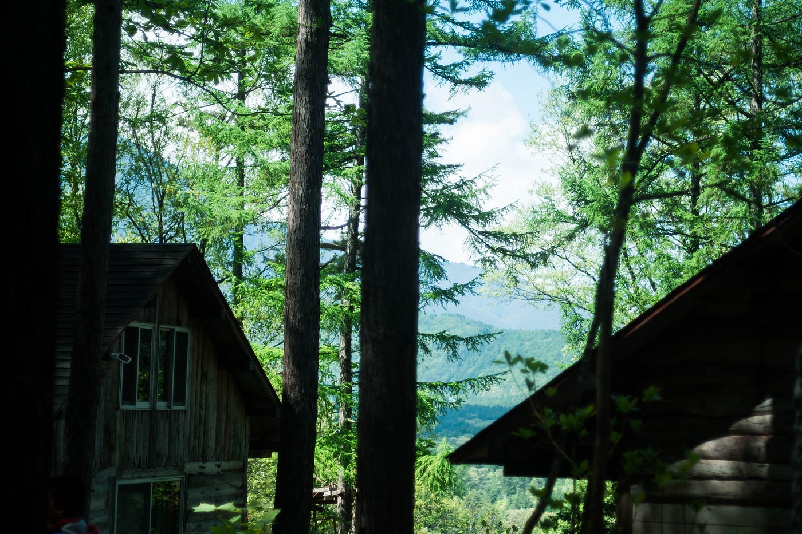

淵野辺から鈍行で約5時間かけて辿り着いた**信濃大町**。GWということもあって、山登りに行くであろう人々が多く見受けられました。

# おおまちとは

大町市は人口約2万8000人の町です。長野県の中でも北部に位置し、富山県と隣り合っています。

なにが有名なところかと言われれば、一番メジャーなのは『**黒部ダム**』ですかね。他には、

- 高瀬川、高瀬渓谷

- 青木湖、中綱湖、木崎湖

- 中山高原

など、とにかく自然が多いエリアだということです。

# 千年の森自然学校

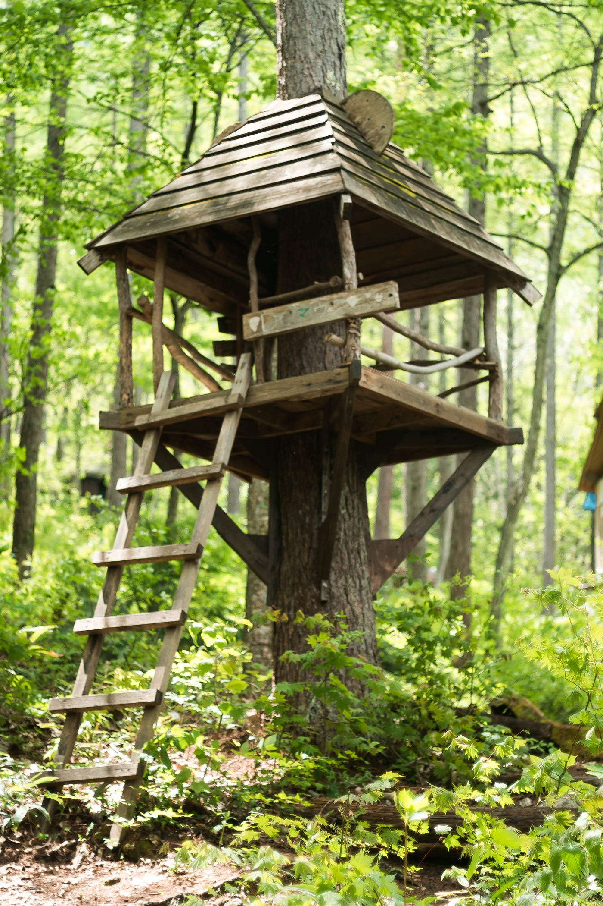

300ヘクタールの広大な森に**30戸**のツリーハウスが設けられています。

日帰りでのんびりぶらぶらも良し、ガイド付きのツアーも有り、小キャビンやツリーハウスの宿泊も可能だそうです。

[千年の森自然学校]([http://morikura.com/](http://morikura.com/))

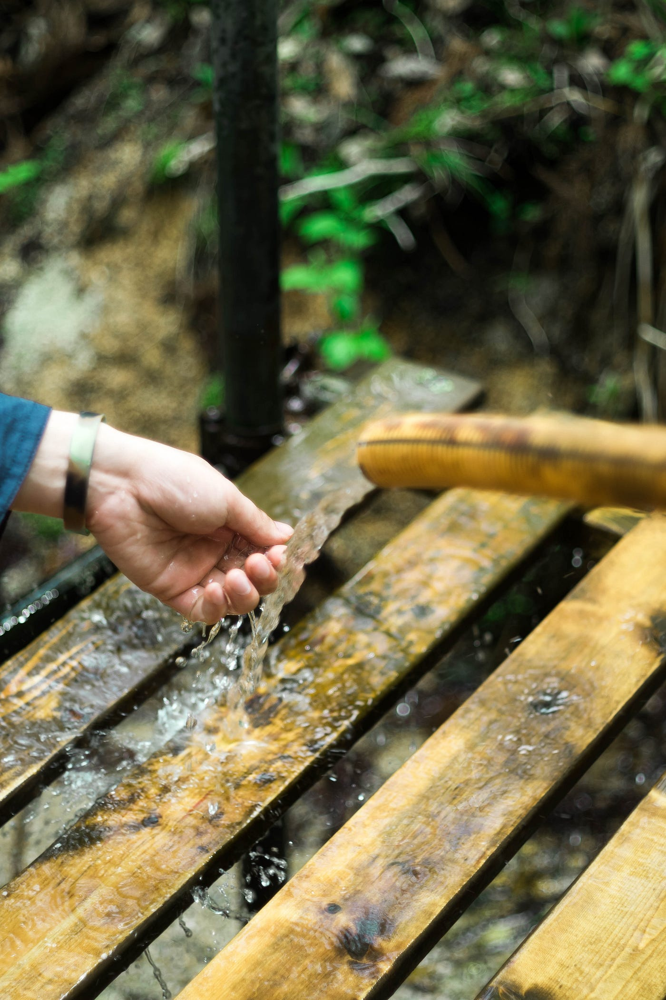

# オリエンテーション

まず過ごすにあたって基礎的知識や技術をシェアしていただきました。

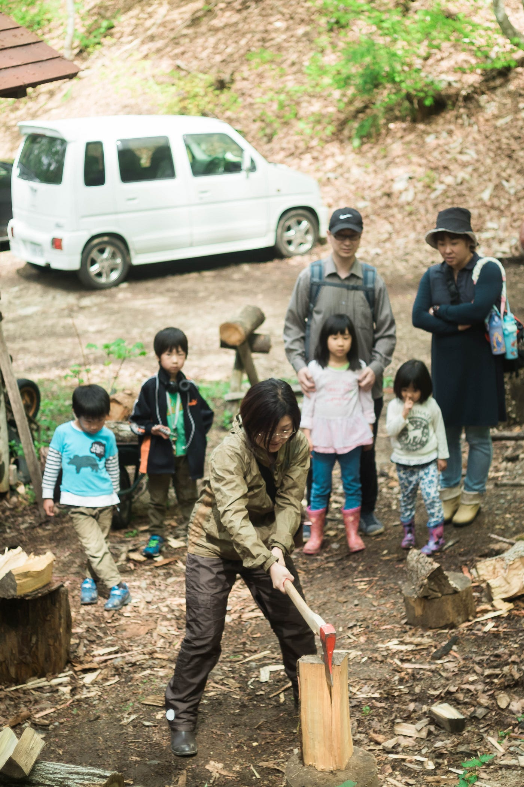

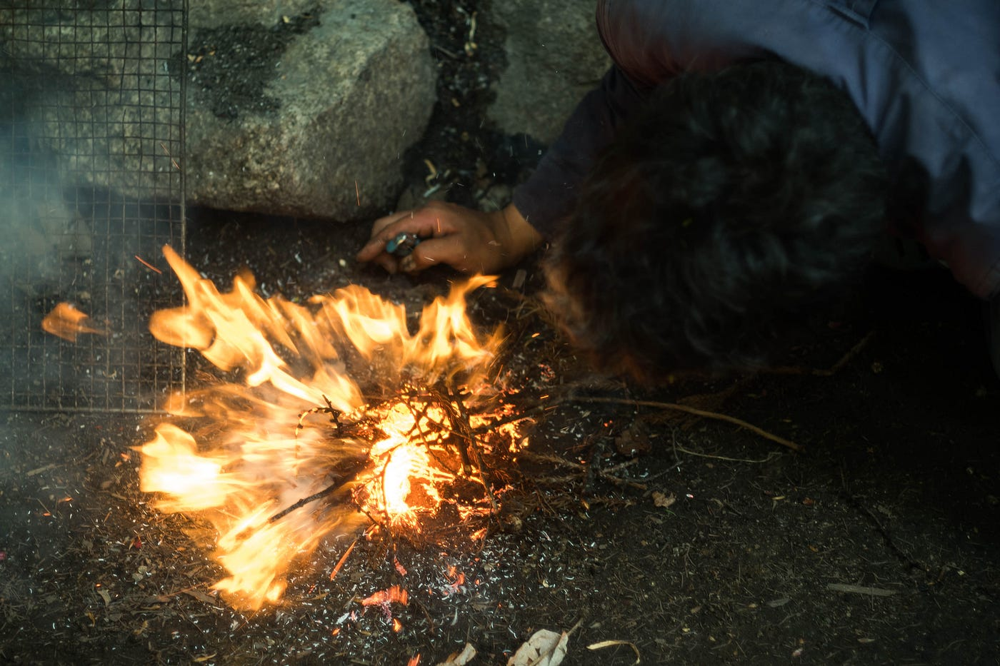

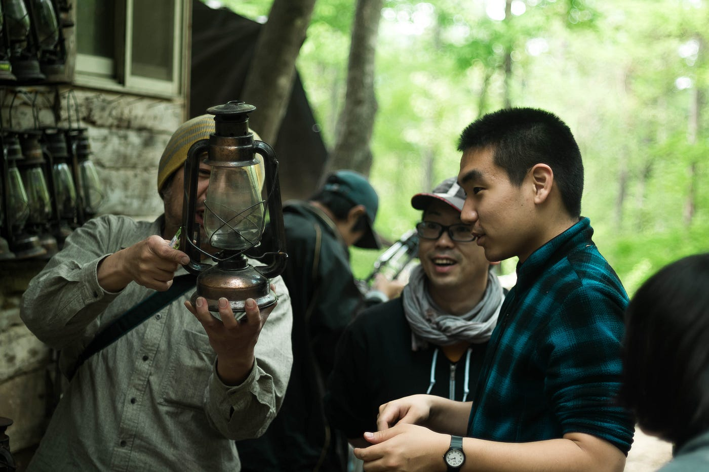

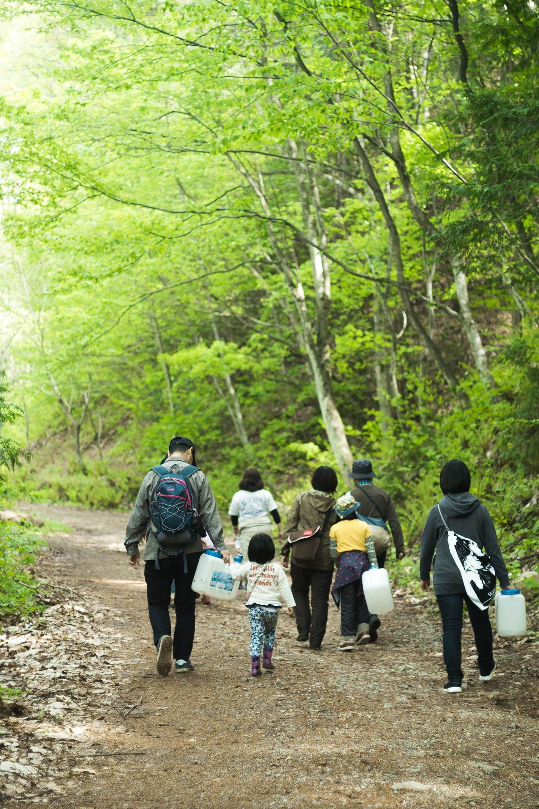

# クロモジ探索&アロマウォーター作り

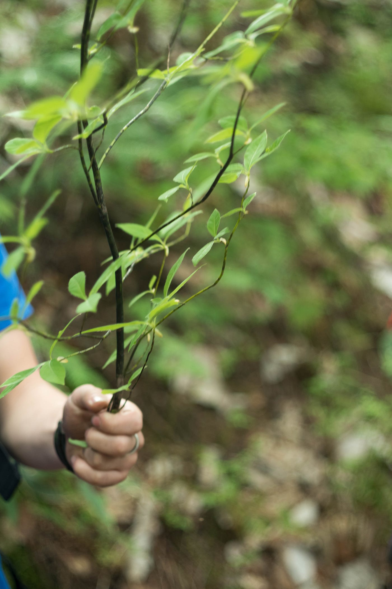

アロマウォーターを作るため、クロモジという植物を探しに出ました。

特徴は

- 枝が黒い

- 葉っぱがひし形っぽい

- 潰すとすぅっとする匂いがある

枝の香りが良いことから古くから楊枝、箸、串、薬用などに使われていたそう。枝葉を浴槽にいれると薬効もあるとのこと。

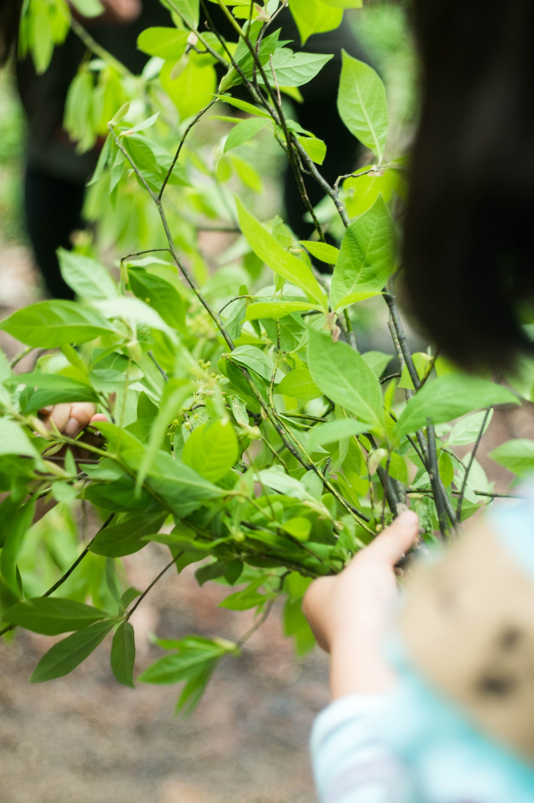

こどもたちがたくさん収穫してくれました。

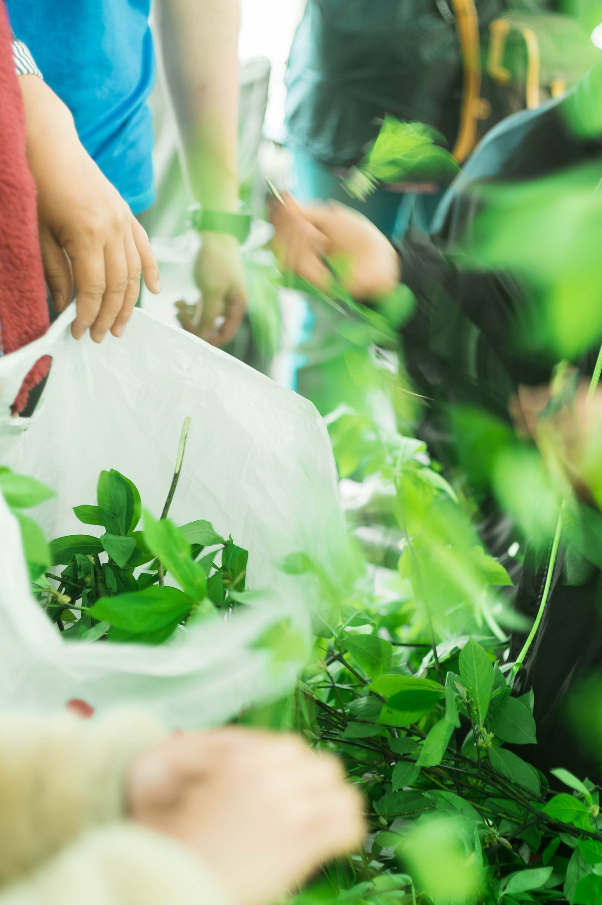

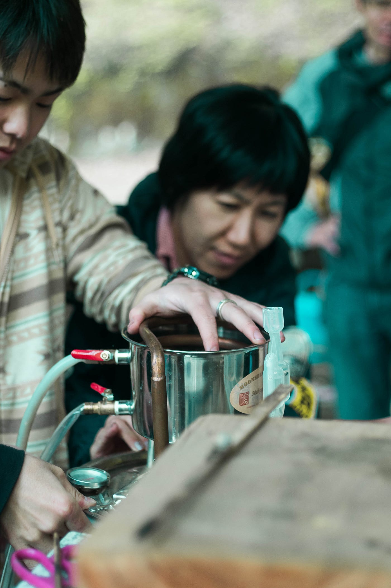

小学校の理科実験のよう。

# 夕食調理

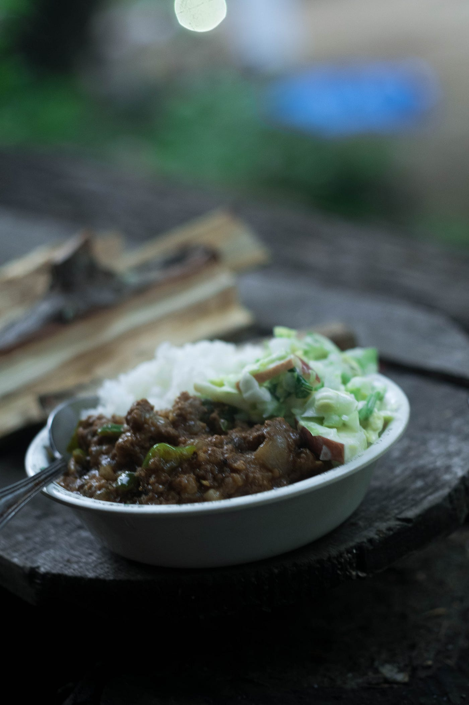

古橋ゼミの一行はケララカレーを。

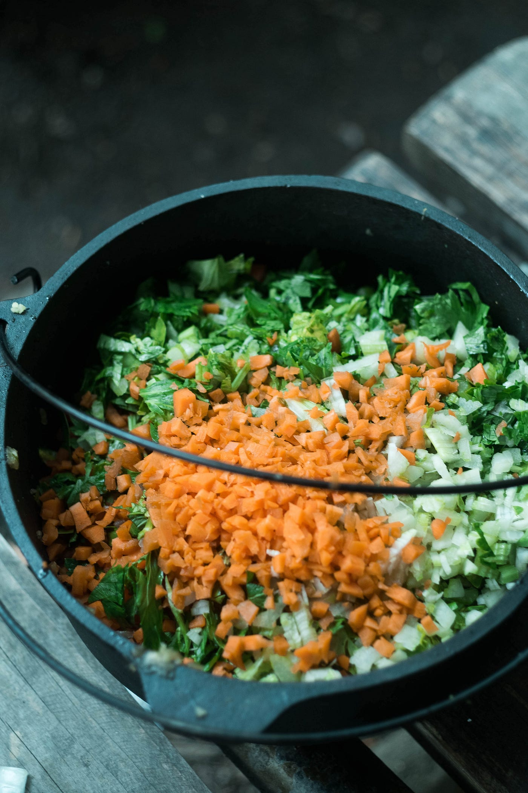

材料は、

- 人参

- 玉ねぎ

- パセリ

- 生姜

- にんにく

- 林檎

火がなかなか強められず、完成が大幅に遅れる我々。雨で湿気っていた枝を使って火おこしはなかなか難儀でした。

夜には温泉に行き、昼間張ったテント内で厚着寝袋装着で就寝しました。

1日目終了。随時大町レポ更新していきます。

# 参考資料

- 『信濃大町なび』[http://www.kanko-omachi.gr.jp/](http://www.kanko-omachi.gr.jp/)

- 『大町市公式サイト』[http://www.city.omachi.nagano.jp/](http://www.city.omachi.nagano.jp/)

- 『千年の森自然学校』[http://morikura.com/](http://morikura.com/)

青山学院大学 地球社会共生学部 古橋研究室 安藤瑛梨
