### 地図に建物って載ってる？

地図に載っているモノって、何だろう。山や川、地名や国境線！
では建物って載っているのかな。ん〜、地図による気がする。。

そう。全くその通りだ。建物という情報が地図に載っているかどうかは、地図の縮尺による。例えば世界地図を思い描くと、一軒一軒、建物の情報が載っていたら、なんかもうそれは絶対に不可能そうで見るに絶えないモノになりそうだ。

しかし、自分が目的地に行く時、最寄りの駅で降りて地図を開いた時、周辺の建物の情報が何も載っていないと私は不安でたまらなくなる。
具体的には、XYZタイル地図でズームレベルが１２以上。１３以上のズームレベルになると、だんだんと建物の情報が必要になってくる。

では実際に地図にどれだけの建物の情報が入っているのだろうか。
これからそれをOpenStreetMap(以下OSM)を中心に、他の地図や時系列を加えて比較をしてみる。

まずOSMというのは、2004年７月にイギリスで作られた、オープンでフリーなWikipediaの地図版と言われる。ライセンスについて少し触れると、当初は[CC-BY-SA](https://ja.wikipedia.org/wiki/CC-BY-SA)だったが、2012年9月12日にライセンスが[オープンデータベースライセンス](https://ja.wikipedia.org/wiki/%E3%82%AA%E3%83%BC%E3%83%97%E3%83%B3%E3%83%87%E3%83%BC%E3%82%BF%E3%83%99%E3%83%BC%E3%82%B9%E3%83%A9%E3%82%A4%E3%82%BB%E3%83%B3%E3%82%B9) (ODbL) 1.0に切り替えられた。

### それではいきましょう、OSMのデータ分析！！

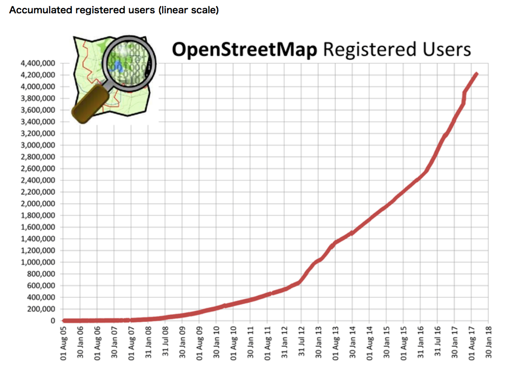

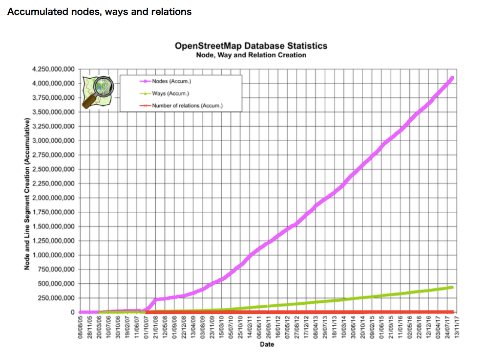

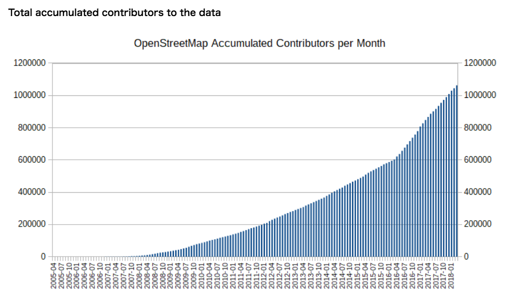

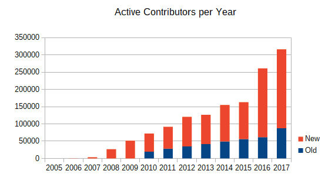

４つのグラフを見て言えることは、OSM登録者も増えて、データ量も増えているということ。しかもここ２〜３年のOSM登録者数や編集数は大きな伸びを示している。編集履歴からは点の編集が圧倒的に多い。

### 続きまして、編集ツールの使われ方分析！！

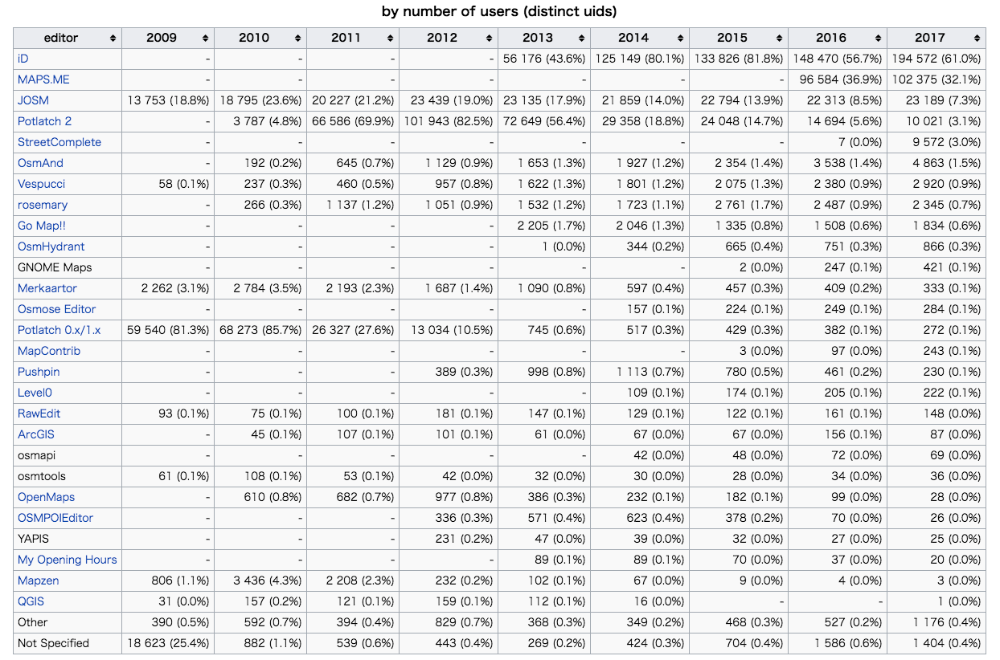

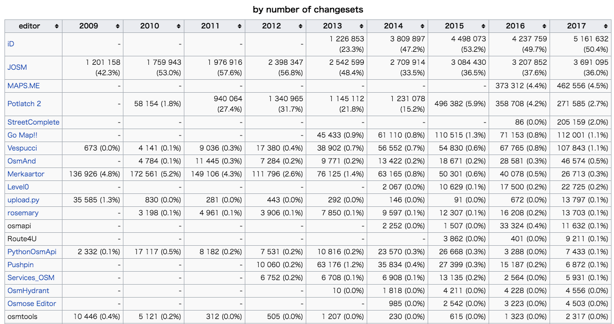

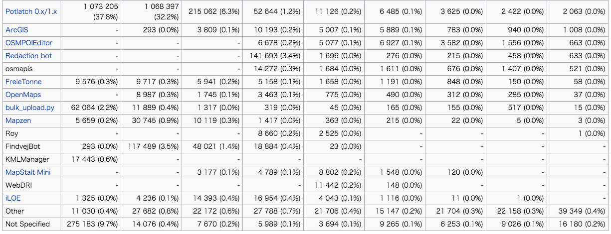

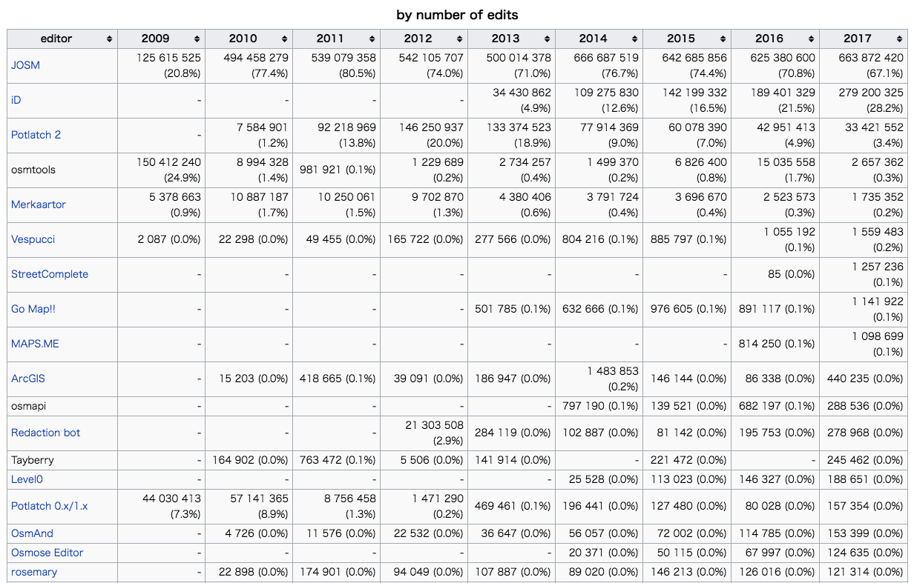

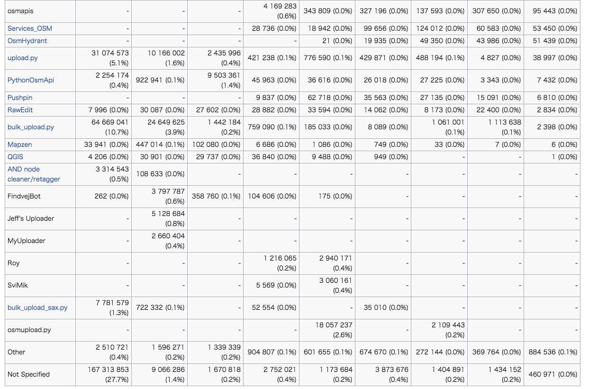

全体の傾向としてスタンドアローンのエディタ(JOSM等)からウェブブラウザベースのエディタ(iD)の編集者数や変更セットは近年多いが、実際の編集数ではJOSMが圧倒的に多いことから、一度にたくさん編集する際はやはりまだJOSMの方が効率が良いのかもしれない。

### どんどんいきます、今度は建物データについて

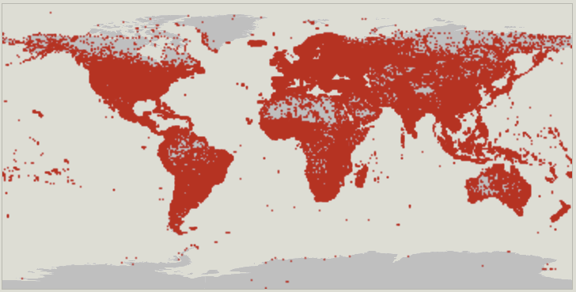

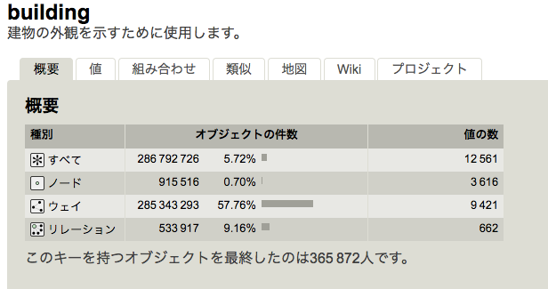

OSM上にある建物(building)のオブジェクト数は286,792,726個だが、Google mapsではオブジェクト数がどのくらい上がっているのか、データを見つけることはできませんでした。。

結構長くなってしまったので今回はここまでにします！
今回できなかったこの建物のデータが、実際の地図上ではどのように分布され、十分な情報量なのか、不十分なのかを検討する。
