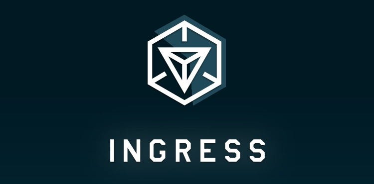
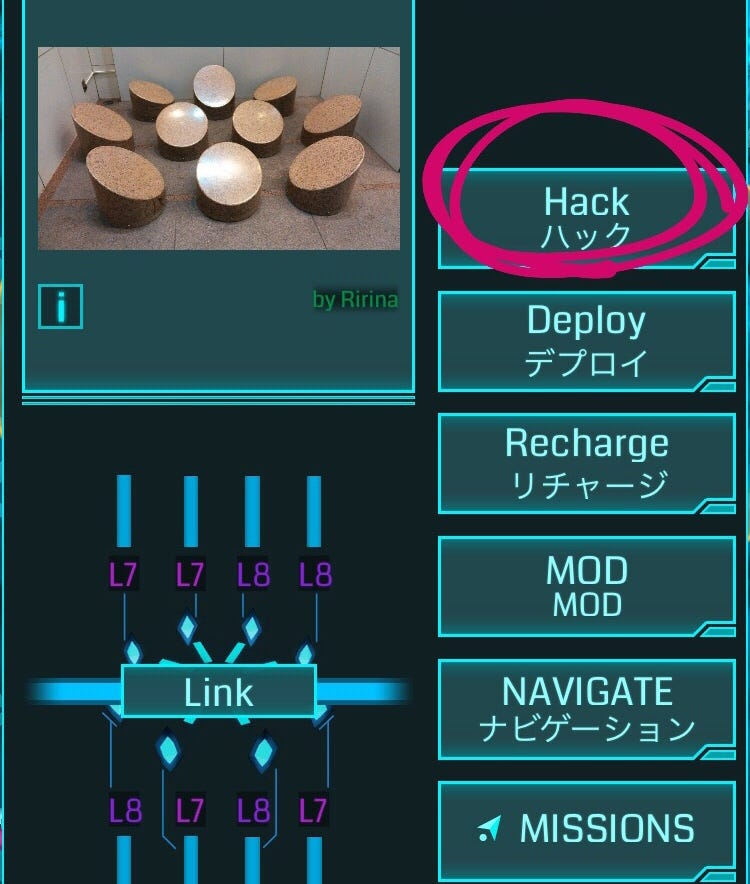
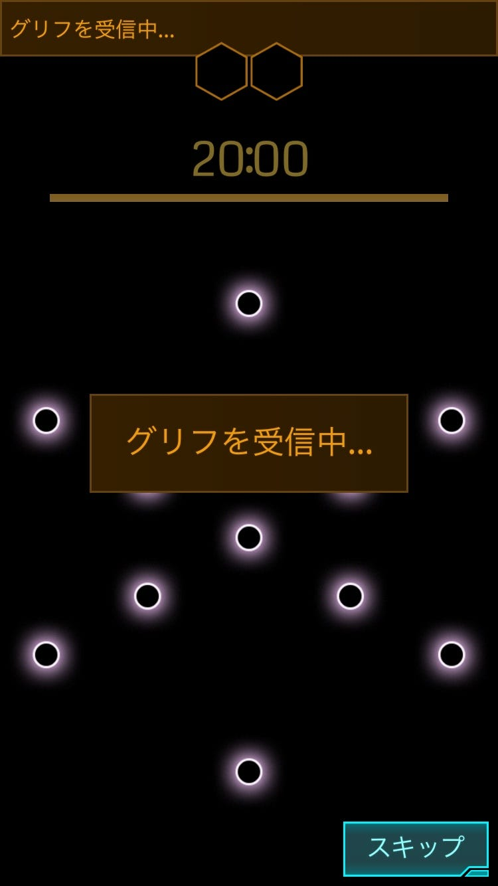
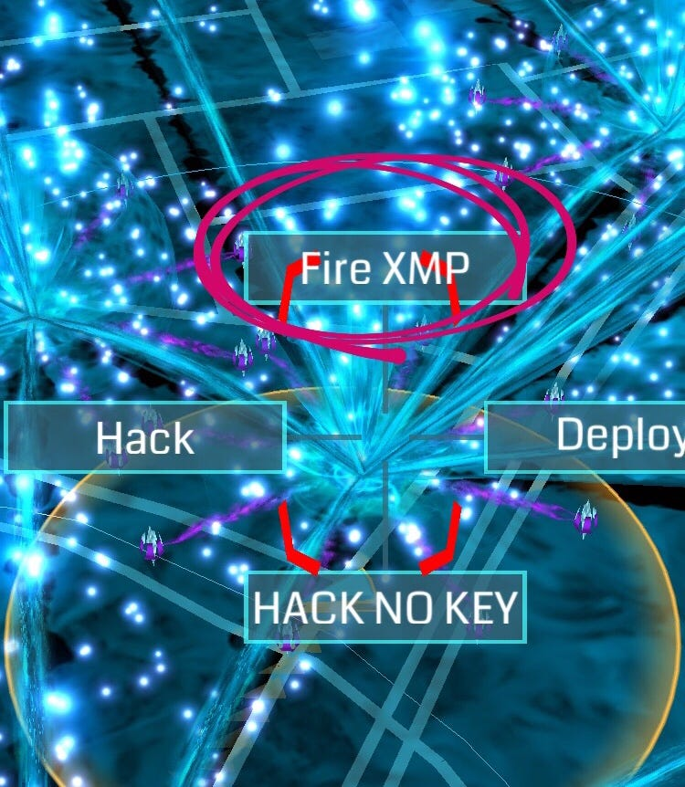
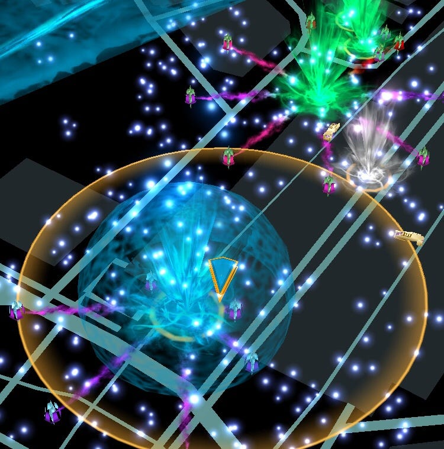
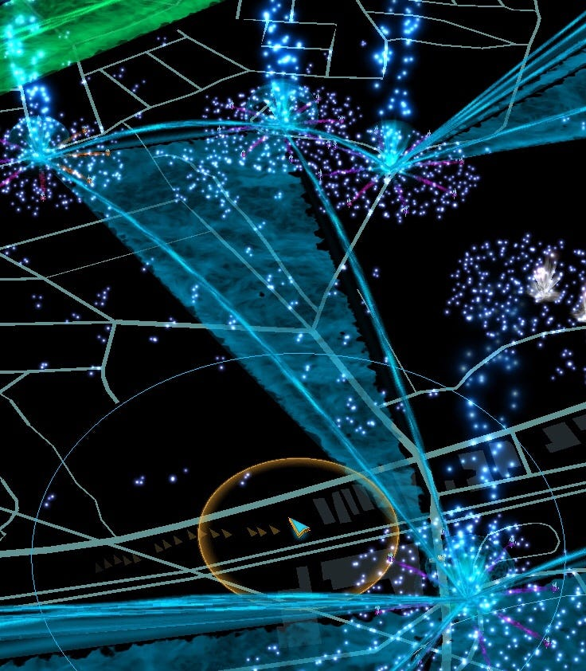
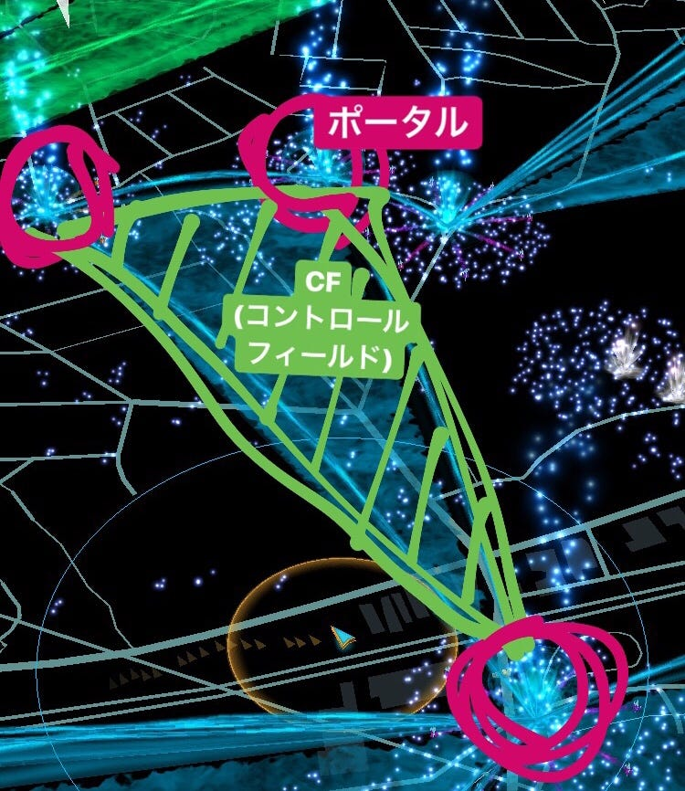

### Ingress特集②
〜遊び方〜

前回はストーリーと用語について確認しましたよね。
今回は実際の遊び方についてみていきたいと思います！

そのまえに、
このゲームは個人の行動パターンが見えてしまう可能性があります。
安全に楽しむために、ID登録は個人が特定されないものを選びましょう。

### 基本の遊び方

- XMを集めよう！
Ingressの基本は歩くことです。Ingressを起動させながらいつも通勤・通学に使う道を歩いてXMを集めましょう。

- ポータルをハックしよう！
「ポータルをハックする」ことはレベルをあげる上で大切なことです。まずは、どこにポータルがあるかを覚えて、ハックの機会を逃さないようにしましょう。

ポータルは都心部や観光名所に多くあります。都心を歩くとき、観光地巡りをするときは要チェック！

ハックすることで
・相手のポータルを破壊する攻撃アイテム
・レゾネーター
・回復アイテム
・ポータルキー
・経験値
がもらえます。

**POINT**
１．1回ハックしたら、5分間そのポータルはハックできない
２．必ずアイテムやポータルキーが手に入るわけではない
３．4回ハックすると「バーンアウト」状態になり、4時間はそのポータルをハックできなくなる
４．[HACK]を長押しすると「グリフハック」と呼ばれる画面になる。成功するとボーナスとしてアイテムが多めに手に入る

- ポータルを攻撃しよう！
敵のポータルが操作範囲にはいったら、ポータルを長押しして上にスライドし、[FIRE XMP]ボタンをタップします。次に、武器を選びます。武器は2種類です。

攻撃範囲の広い「Xmp Burster」、「Ultra Strike」攻撃範囲は狭く強力です。

武器を選んだら[FIRE]をタップ！
これで攻撃できます。

- デプロイしよう！
中立の白いポータルにレゾネーターを設置すると、ポータルは自陣営の色に変わります。デプロイするとハックするよりAPが多くもらえます。どんどんデプロイしていきましょう！

- リンク、コントロールフィールドを作ろう！

ポータルとポータルを結ぶ線がありますよね？この線を引くことを「リンクを張る」といい、内側がCF(コントロールフィールド)です。

リンクを張るにはいくつかの条件があります。

1. リンクを張る先のポータルキーを持っていること

1. リンク元・リンク先のポータル両方にレゾネーターが8本刺さっていること

1. 他のリンクと交差していないこと

1. ポータル同士が別のCFの中にないこと

これらの条件を満たしていないとリンクが張れません。

とりあえず基本の遊び方のみ紹介してきました。

次回はIngressの良さと弱点を見ていきます！
