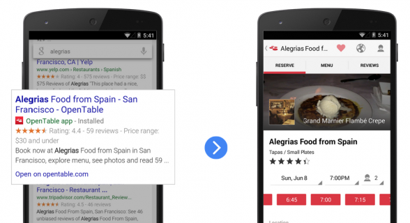
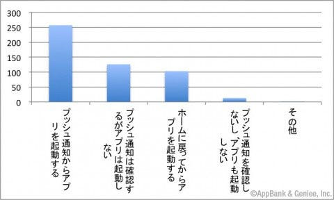

### アプリ VS ウエブサイト！EP.3

_スマートホン版のウエブサイトとアプリとどちら使いやすいか？_

私は今回自分のプロジェクトをサイトかアプリどちらを最終的にどうするのか比較するためにウエブサイトとしての強みアプリとしての強みをリストアップしていく。

> サイトは検索履歴などが表示されアプリの場合はそのアプリ内では履歴を表示できるアプリなどもあるが少ない。

> サイトはアプリのように容量を使わない。

> サイトはアプリよりも低コストで開発することができる。

> アプリはホーム画面からすぐにアクセスすることができる。

> アプリは通知機能がつけらる。

> アプリはサイトよりもアクセスが深い。

しかし、それぞれの使う目的が違うと意味がありません。サイトは「今日はなんの日？」などといった思ったことを好きなサイトを使い検索することができる。つまり疑問があればサイトですぐに解決が可能である。

アプリの方は好きなブランドの最新情報、目的にあった画面にアクセスができるという「深い」アクセスが可能となり観覧数が伸びる。さらに、広告をつけてお金もサイトよりも稼ぐことができる。

ということがわかりました。自分のプロジェクトの土台をしっかりと決めサイトなのかアプリなのか慎重に決めていきたいと思っている。
