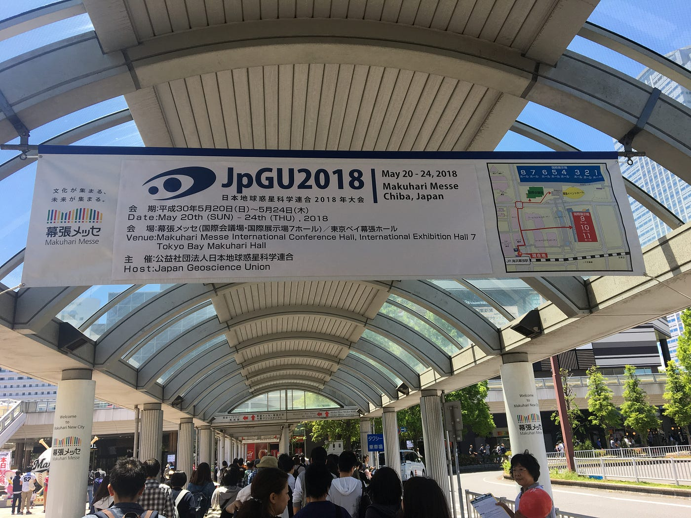
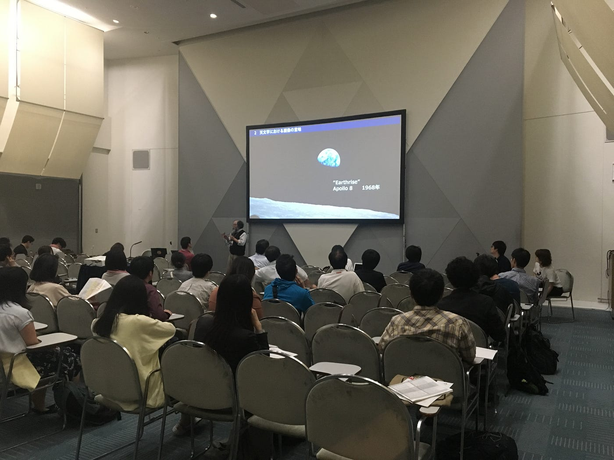
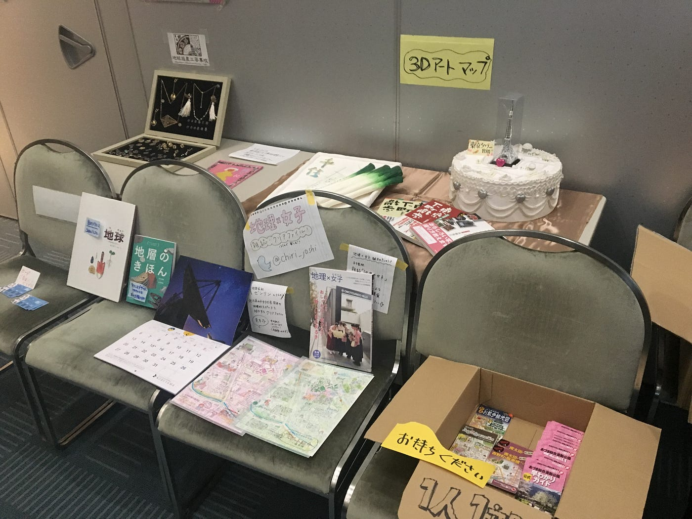
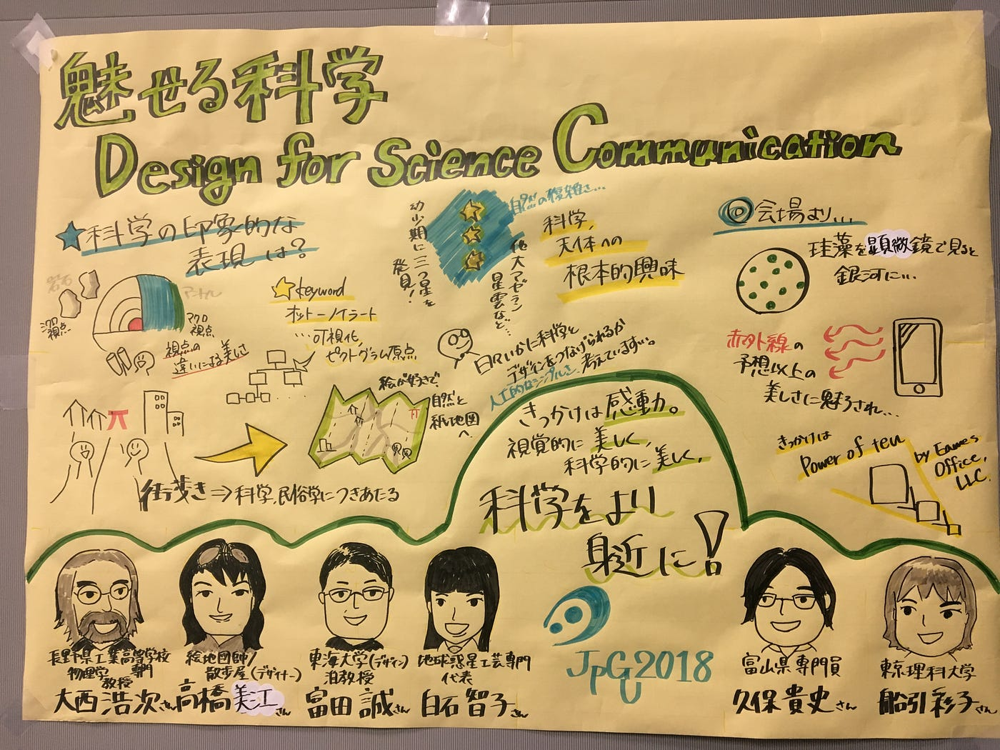

### グラレコ＠地球惑星連合/幕張メッセ

今週はTEDxのお話を一回お休みして、脱線し「日本地球惑星科学連合2018年大会」で行なったグラレコについて書きます。

５月２０日（日）に「[日本地球惑星科学連合2018年大会](http://www.jpgu.org/meeting_2018/)」が幕張メッセで開催されました。
このイベント自体は５月２０日から２４日まで行われ、世界中から地球惑星科学の研究者や学生が集い、多くの口頭発表やポスター発表，招待講演やスペシャルレクチャーなどが行われるそうです。
（一般の方でも入れるそうなのでぜひ！）

私はこのイベントの数あるセッションの中の「[地球科学とアートの協働・共創](https://www.facebook.com/GeoscienceandArt/)」に参加させていただきました。
このセッションでは各研究者の方や学生の方、サイエンスデザイナーの方々が、地球科学をデザインと掛け合わせ、いかにわかりやすく美しく表現するか、大衆へ向けて伝えるかを考えるセッションです。

個人での発表や、

展示ブースなど、

様々なコンテンツがありとても面白いものでした。

中でも私個人的な感想は上記の写真の圧倒的存在感の「ねぎ」、、、！！

このねぎは「千住ねぎ地図」という絵地図家/散歩屋、デザイナーの[高橋美江](https://www.facebook.com/mie.takahashi.923)さんによる作品です。
町歩きを通して地図を作る中で、人の印象に残る地図、をテーマに柔軟な発想でこうした３Dアートなどを含めた様々な地図を作成している方です。
なんで私がこの方の話がとても印象に残ったのかと言いますと、導入はねぎでした（笑）
しかし一番は、地図というものに対するハードルの下げ方が自分自身で目から鱗だったためです。
というのも、高橋さんがお話の中でAKB48の方々が描いためちゃくちゃな都道府県の配置の地図？が紹介された時、会場にいた人はみなさん失笑した一方で、高橋さんは「これは日本地図を描いてくださいと言われた時に、彼女たちが描いた「地図」です。科学者の人にとっては正しいものだけが地図だとしても、私は科学者ではなくデザイナーなので、これだって地図です。」とおっしゃいました。

私は大学に入って一年生の時に古橋教授の授業を受講することによって[OSM(OpenStreetMap)](https://osm.org/)や[CARTO](https://carto.com/)などに触れ、それまで持っていた地図に対する苦手意識を払拭することができました。
かつての私のように、地図に対して苦手意識を持つ人は少なくはないと思いますが、こうして自分でラフに描いてみる、柔軟な発想で自分が地図だと思うものを考えてみる、といったくらいまで地図のハードルを低くしてもいいのではないだろうか、
という発想は私にとってとても新鮮で印象に残るものでした。

そしてやっと自分の話をします。
今回私はこのセッションの一番最後に行われた「魅せる科学、Design for Sciense Communication」というテーマのパネルディスカッションのグラレコをやらせていただきました。

４名のパネリストの方と２名の司会の方でこのテーマについて話し合われていたのですが、、、
専門用語・漢字がわからない、、、
また、私はグラレコのインターンをさせていただき、その経験から大きな模造紙にリアルタイムで描く練習は何度かできていたのですが、一人で描くことは初めてでした。
そのため、二人分の耳があり動かすペンがあったのですが、今回それが半分になるだけで情報をいくつ聞き逃したかわからない、、、

こうしたことを踏まえて反省点いくつか
**・事前の知識共有を徹底的に行なっておく
・リアルタイムで描くことを意識しすぎて聞き逃すことが多々あるため、ある程度メモをとっておき、そのメモが溜まったらそのまとめを描く
・わからない単語、漢字があったら飛ばして描いてあとで調べる**

あとは自分を褒めたい点
**・前回から自分の中で課題だった、大きく描く、ができたこと
・苦手だった似顔絵を教わったコツを使ってしっかり差異を出してかけたこと
・ディスカッションの全体を考えながらかけたこと**

反省は次にここを特に直していくこと、褒めたい点は継続すること
を目標にまた次回ご機会いただければまた挑戦したいです。

たくさん書いてきましたが、最後にまとめをします。

### **何よりの今日の反省！朝のおにぎり一個で挑んだこと！！カロリー足りない！！**

（グラレコは同時通訳をしているようなものなのでめちゃくちゃ頭を使うためお菓子が必須です）

来週はまたTEDxの話をしたいと思います。

(本投稿は [OSMアドベントカレンダー2018](https://qiita.com/advent-calendar/2018/osmjp) に向けて一部修正)
