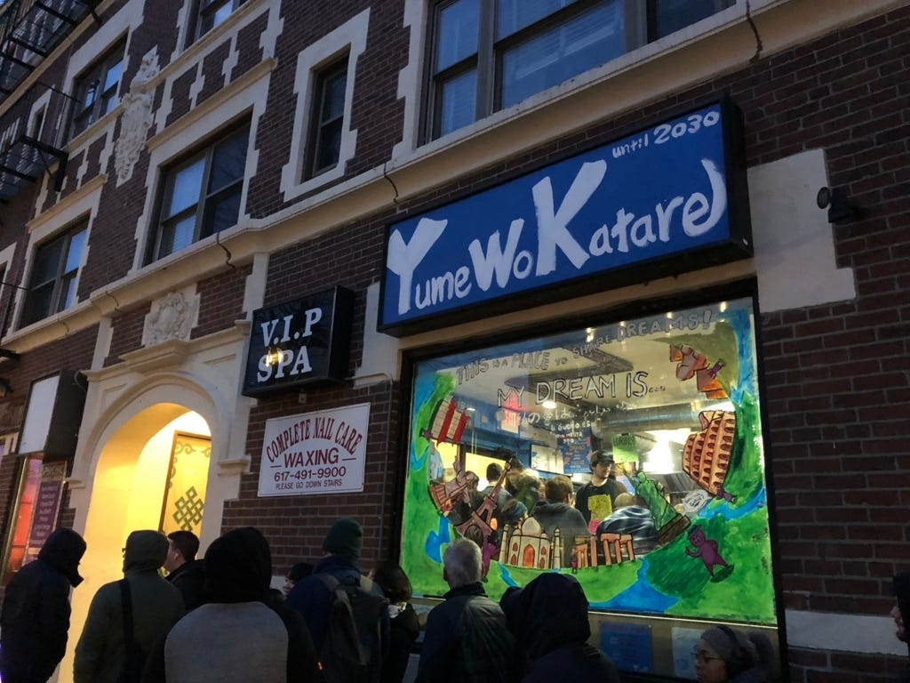
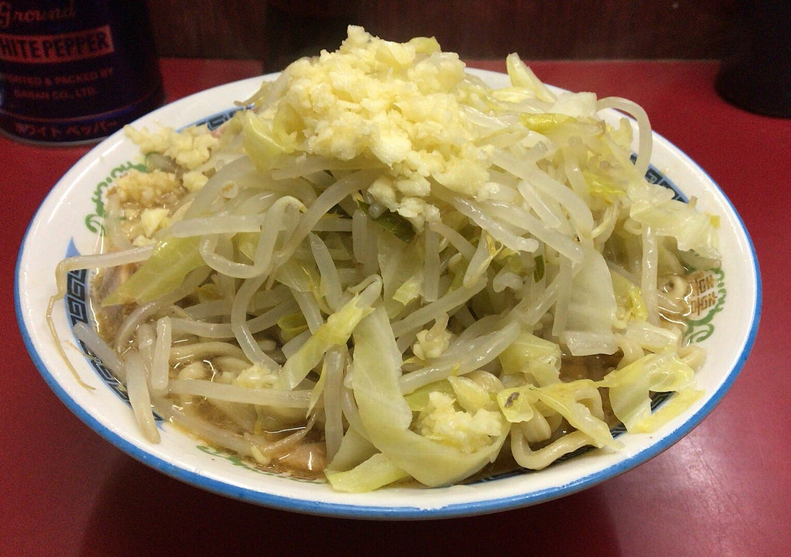
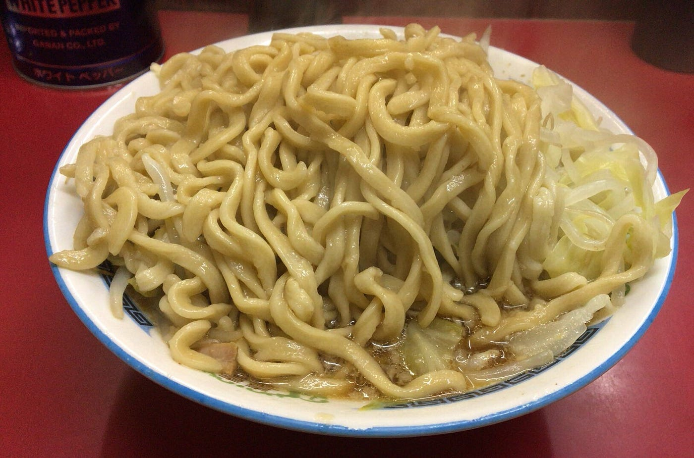

海外の二郎系

暑いのか寒いのかよくわからないですね！？ 渡辺ゆうなです。

今回は、海外にある二郎系ラーメンを紹介したいと思います。

2012年9月、アメリカボストンに、海外でおそらく初めての二郎系ラーメン専門店ができました。その名も「夢を語れ」

「夢を語れ」というのは、関西に多く出店している「ラーメン荘グループ」のラーメン屋です。（ラーメン二郎直系ではありません。）

夢を語れがアメリカに進出したことは、ジロリアンの中で大きなニュースになりました。というのも、二郎系ラーメンは今までは日本にしかなかったからです。

この夢を語れボストン店は、真冬にはマイナス10度にもなる気温の中でも、いつも３０分〜１時間の待ち時間を誇るほどの人気店で、地元の「ボストン・グローブ」誌にも掲載されたほどだそうです。

日本食が世界に認められてきたことは有名ですが、海外にまでジロリアン（ラーメン二郎のファン）が増えるとは・・・嬉しい限りですね！

今後、ラーメン荘がどのような店舗展開をしていくのか、それに対する海外の方々の反応には注目していきたいです。

今週のラーメン ラーメン二郎目黒店

今週のラーメンは目黒二郎（通称めぐじ）です！目黒駅から徒歩約１０分ほどのところにあります。ラーメ二郎の中では２番目に古いお店で、外も中もそこまで綺麗ではなく、めちゃくちゃ狭いです。

めぐじのいいところ（悪いところでもある）は、何より量が少ないところ！普通、ラーメン二郎の小の麺の量は茹で前300gぐらい（普通のラーメンの２人前ぐらい？）なのですが、ここの小は普通のラーメンの１人前がでてきます！なので、女性や二郎初心者でも食べやすい量なのです！二郎に慣れている人は、大豚全マシでも足りなくなってしまうぐらい、実際私も大豚全マシは食べれるぐらいで、店主さんも比較的優しいのでビビらないで食べに行けます！

また、めぐじには「鍋二郎」というものがあります。鍋二郎とは、二郎に鍋を持っていき、麺とスープをもらい、家などの二郎以外のところで食べれる二郎のことを言います。鍋二郎がもらえる店舗は限られており、その中でも期間限定ではなくいつでも鍋二郎ができるお店は目黒の他に数店舗しかありません。スピード感や周りの目を気にせず、ゆっくりお酒を飲みながら二郎を食べたい！コスパ良くパーティーしたい！などといった人にはおすすめです〜！
