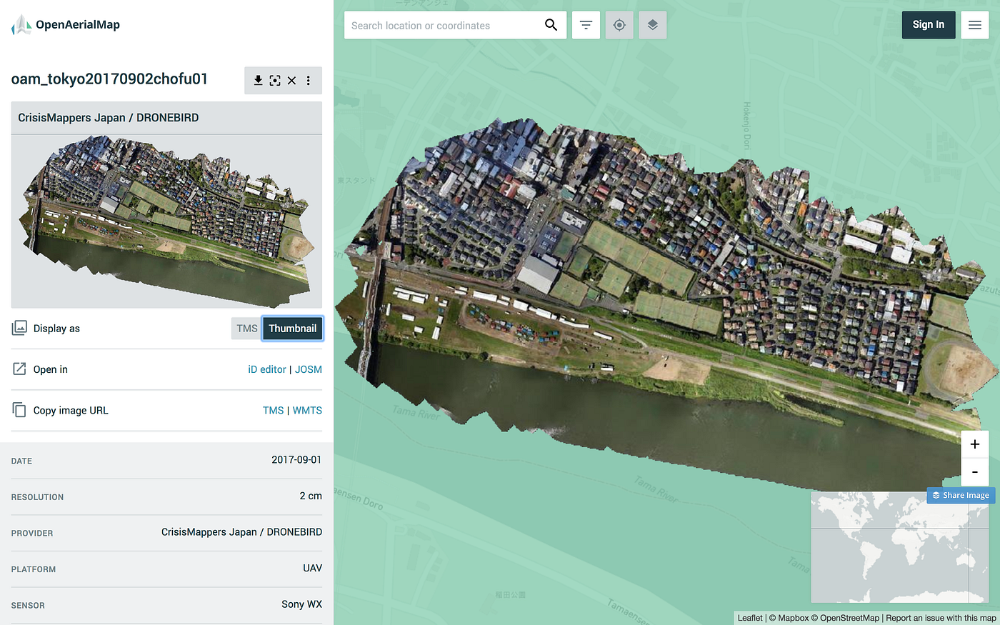

### 2000年から20年で起きたオープンなジオの話

これからの20年先を見通すために、過去20年を振り返ってみよう。

西暦2000年は、世界の地理空間情報を大きく変えた象徴的な年として、地理空間情報に関わる者ならば忘れられないほどのインパクトを与えた。

そして昨今のトランプ大統領の振る舞いを見るにつけ、当時民主党クリントン政権であったことは幸運であったとも感じている。いずれにしても、この 2000年を境にして米国が軍事目的で運用していたGPSによる衛星測位の精度を意図的に下げるSAと呼ばれる信号劣化処理は米国大統領令によって解除され、水平方向で誤差数ｍの現在地特定ができるようになった。この、国や人種、性別問わず、誰もが最先端の測位技術を利用できるオープンな仕組みによって、すべての人がGPS(GNSS)端末を持ち、誰でも簡易に測量行為を行うことができ、それまで考えられなかったような様々な地図サービスを高度に発展させる時代へと突入した。今では誰でもスマートフォン片手に、あたかも自分が伊能忠敬になったように地図を作れる時代。さらにその位置情報を多くの友人や不特定多数の人々とシェア（共有）する文化が生まれ、自分たちが測量した情報を世界中の仲間と共有することによって、誰もが自由に使える世界地図が実現できることが見えてきた。日本人1億人、世界70億人すべての人々が伊能忠敬のように自ら測量する「一億総伊能化」時代の到来を見据え、これからの新しい地図づくりのあり方としての参加型でオープンなジオコミュニティが何を行い、どこへ向かおうとしているのか、改めてまとめてみた。

### **# オープンな地図 OpenStreetMap の登場。**

2004年8月、イギリスロンドンにあるUCLの大学院生であったSteve Coast氏が、当時のイギリスにおけるデジタル地図サービスのクローズドな状況を変えることを目標に許諾不要で商用利用可能なOpenStreetMapをローンチした。当時の地物の描き方はGPSロガーを持って市街地を移動することで得られる軌跡を元に、道路の中心線を手作業で描くシンプルなアプローチが中心であったが、安価なGPSロガーの普及とともに、イギリスと同様クローズドな地図サービスが主流であったヨーロッパ各国にマッピング活動は広がり、2007年の第1回 State of the Map カンファレンスをきっかけにそのコミュニティが世界中に広がった。2008年には、北米や日本などのコミュニティも活発化し、当初は先進国を中心とした都市部での活動が主であったが、2010年のハイチ地震におけるクライシスマッピングが被災地の救援活動を後方支援するなど、開発途上国や新興国においても一般図としての地図情報が足りていない現状と、その必要性が議論され、以降世界各地で発生した自然災害やエボラ等の感染症の流行、政治的な混乱における危機的状況下に応じて、対象地域の優先的なマッピング活動など人道支援に基づいたボランタリーな地理空間情報コミュニティの中心となっていった。合わせてマイクロソフト社のBing mapsを始め、DigitalGlobe、国土地理院、ESRIといった航空写真・衛星画像データプロバイダーがOpenStreetMapに対し、トレース許可を与えることで、従来のGPSロガーによる軌跡の図化から、地図編集者が現地に赴かなくても、遠隔からトレースマッピングできるようになったことが、その活動を後押しした。2018年現在、世界のOpenStreetMap地図編集者コミュニティはのべアカウント数で約500万ユーザー規模、１日あたりの活動量は約5,000ユーザーが毎日ボランティアで地図更新作業を行っており、その情報はFacebookやUBER、ESRI、Appleといった大手地理空間情報サービスプロバイダーが利用するだけでなく、2017年11月末にはNiantic社が提供する位置情報ゲーム「INGRESS」「ポケモンGO」がそれまで利用してたGoogleマップからOpenStreetMapに地図情報を全面的に切り替えるなど、現在のグローバルな地理空間情報データプロバイダーとして存在感を増している。そしてこの普及を支えている原動力は許諾不要で商用利用可能なオープンなデータライセンスと、それを支えるコミュニティの存在無くしては成り立たない。

### # オープンなストリートビュー Mapillary 現る。

OpenStreetMapのコミュニティ規模が拡大するにつれ、関連するオープンなジオサービスが多様化してきている。その代表格が、参加型ストリートビュー構築プロジェクトであるMapillaryだ。2007年にGoogleがはじめたストリートビューは、個人情報保護などの観点から当初は批判の対象ともなったが、同時期にはじまった各社のMMSによる都市部の360°パノラマデータサービスはその有用性が浸透し、新しい地理空間情報のジャンルを作った。しかしGoogle StreetViewのデータは、今までの商用地図サービスと同様に自由な二次利用は制限されており、OpenStreetMapと同様、許諾不要で商用可能なオープンなストリートビューの必要性が指摘されてきてた。何度かの試行錯誤的なアプローチが2010年前後から行われてきたが、2009年にOpenStreetCam(スタート時はOpenStreetView)が、2014年にMapillaryがそれぞれローンチし、本格的なストリートビューサービスが普及を始めた。2018年現在 Mapillary には約2.9億枚の写真がボランティアによって集まり、CC BY-SAライセンス採用することで、集約された情報を元にその二次利用が促進され、SfM技術を用いた都市の三次元モデル生成やDeep Learning 手法による機械学習から画像内に写り込んでいるオブジェクトの自動認識など、クローズドなGoogle StreetView では実現できなかった新しい地理空間情報の創出を支えている。また、自動運転車の実現を目指す大手自動車メーカーからも資金援助を受け、その活動を加速している。

### # OpenAerialMapとドローンが変える未来

ドローンの活用も進んでいる。安価で高性能な空撮用ドローンが普及するにつれ、その撮影データの共有プラットフォームがOpenStreetMapコミュニティから生まれた。それがOpenAerialMapだ。ドローンによる空撮データと言っても大きく映像、斜め写真、オルソモザイクの３種類があり、映像の多くは YouTube や Vimeo、各種SNSなどの映像共有プラットフォームの利用が主である。斜め写真も同様にGoogleフォト、Flickr、各種SNSと、それぞれ写真共有プラットフォームも普及しているが、後者であるオルソモザイク画像のオープンな共有プラットフォームは確立されてきていなかった。OpenAerialMapのアイディアと実装は2007年から行われてきたが、様々な問題を乗り越え、2014年にHumanitarian OpenStreetMap Teamを中心に大幅なリニューアルを経て、2018年現在約5,500枚のドローンによるオルソモザイク画像とCC BY 4.0ライセンスに適合する衛星画像が利用可能になるまでに成長した。日本においても古橋研究室が中心となり、主に災害時の空撮画像共有とそれを利用したクライシスマッピングプロジェクトである「災害ドローン救援隊 DRONEBIRD」が活動を開始し、災害時に機能するよう地方自治体との防災協定をすすめて、安全かつ各種法律を遵守する形での社会実装がすすんでいる。

以上のように、2000年に米国大統領令によってSA解除され、劇的に測位精度が向上し、かつ誰でも自由に利用可能なオープンな条件を活用してさまざまなジオサービスが生まれ、その過程の中で許諾不要かつ商用利用可能なオープンなジオサービスがコミュニティを軸に世界に広がってきた。2040年前後に迎えるであろうシンギュラリティを見据え、今後はボランタリーな地理空間情報作成の活動も、人間がやるべき作業と機械がやるべき作業の棲み分けがされ、お互いに共創する時代へと突入していく。その先にどのような未来が待っているのか、この先の10年は今までの10年よりも更に技術革新が加速していくことは想像に難くない。

### # 参考資料

Matt Brown(2007): Londonist Interviews…OpenStreetMap Guru Steve Coast, [http://londonist.com/2007/04/londonist_inter_11](http://londonist.com/2007/04/londonist_inter_11)

片岡 義明(2016):こんなにスゴイ！ 地図作りの現場, インプレスr&d

OpenStreetMap, [https://www.openstreetmap.org/](https://www.openstreetmap.org/)

OpenStreetCam, [https://openstreetcam.org/](https://openstreetcam.org/)

Mapillary, [https://www.mapillary.com/](https://www.mapillary.com/)

OpenAerialMap, [https://openaerialmap.org/](https://openaerialmap.org/)
