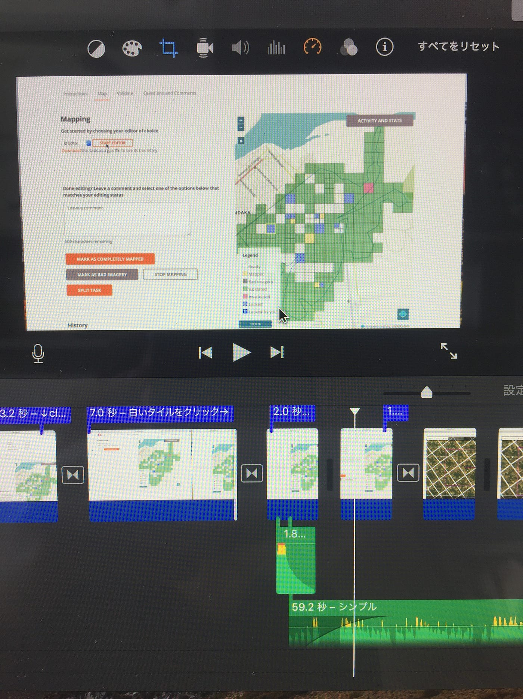

### iMovieを使う

### ゼミで初めてiMovieを使いました！

今回ゼミで’’taskimng manager’’の説明動画を作りました。

今まではただ動画を繋げたりちょっとした編集ができるだけと思っていたけど…

効果音とか音楽を入れる編集が思っていたより高度にできて、予告みたいな動画が作れてすごかった！！

特に感動したのは、

- 入れた音楽をそれぞれ、入り方とか音量まで調節できるところ

- 動画の色まで変えられるところ

等々。

今はPCはAppleじゃないけど、使えるようになったらぜひ自分で色々作りたい！

パワーポイントとかで説明するより、動画を作る方が楽しいしいいなと思いました。

退屈な説明をもっと面白くわかりやすくしたい！！

青山学院大学

山口詩織
