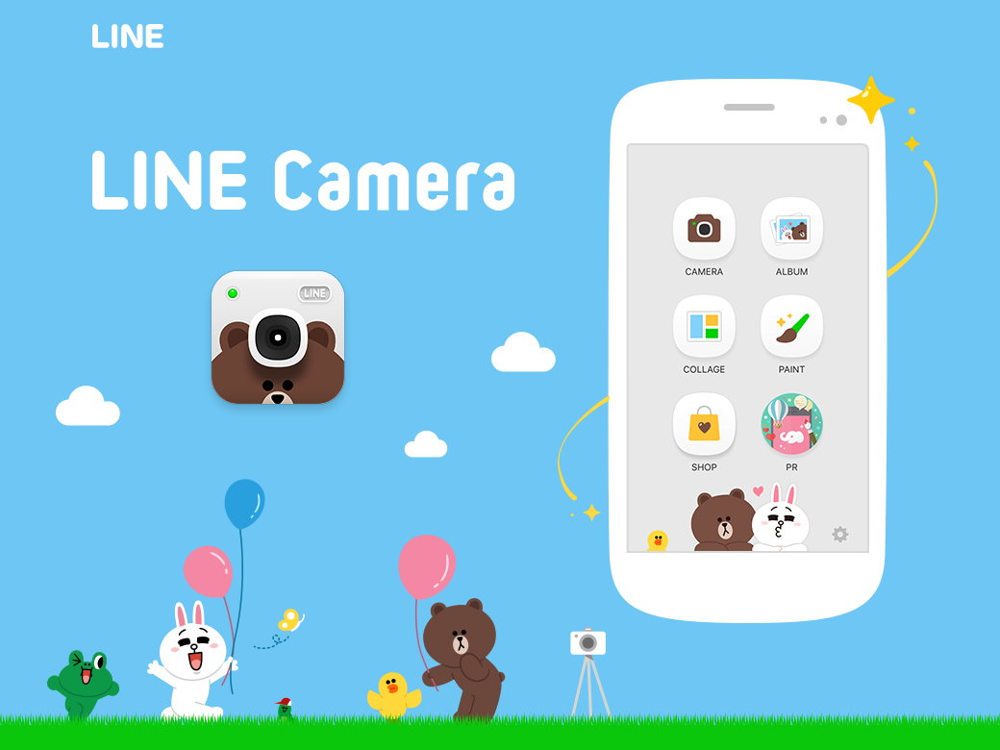

### 動画編集してみた。

動画を、編集する。
ちょっと前までは専用の機器や技術者が必要だったハズ。
今ではスマホ一つで動画の撮影から編集まで出来ちゃうんですね…ファ…スゴイ………(小並感)

今回はtasking managerの使い方をテーマに、
iPhone(やmac book)に初期装備されている強い武器、【iMovie】を用いて動画を編集してみました。

動画が繋がる！
モーションがつけられる！
字幕が入れられる！
BGMが入る！

iMovieは殆ど使ったことがないため、手探り状態で編集作業を進めていきました。
４分ちょっとの動画でしたが、1時間半くらい編集にかかった気がします。……大変だった。笑

サムネは【LINE Camera】で作成。LINEcameraは画像編集には最適です、とってもよく出来る子。

今回動画を作成してみて、
macのiMovieと、わたしのポンコツiPhoneでは出来る事に違いがある事が判明。macのiMovieは有料ソフト要らないレベルで、様々なことが出来ます。ただ、使いこなすには……時間がかかりそう。

iMovieをうまく使って、効率よく、テンポの良い動画を作れるようになりたいものです。
