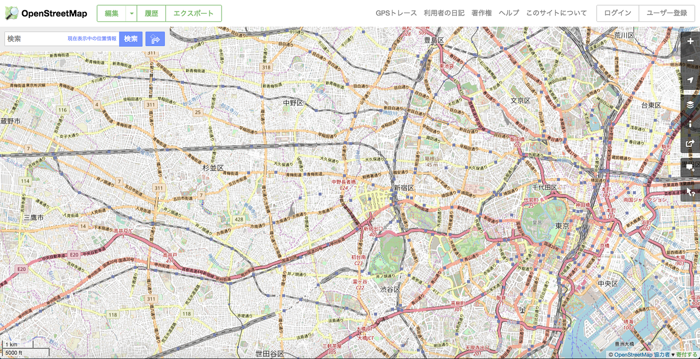
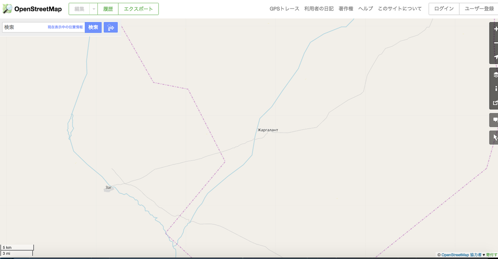
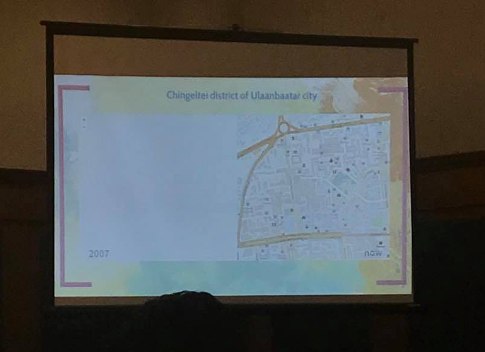
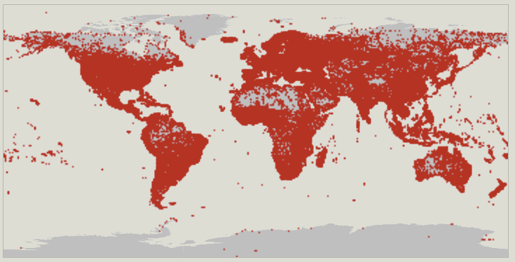

### 地図インフラ格差

地図インフラ格差、それはきっとあってはならないモノ。しかし地図とは人に使われて初めて存在価値を示せるモノ。つまり、人がいないところの地図情報は不要である。このように考えた人は多い。

東京エリアのOSMと
モンゴルの山奥のOSM。

地図に載っている情報量の違いは一目でわかる。
しかし考えてみよう。

建物や道が全くないところ、
そもそも地図に乗っける情報がなかったとしたら。

人が容易に近づくことができないような自然地帯。

人が1人もいない、地図情報を自ら加える人も活用する人もいなかったら。
地図インフラ格差、同じエリアを時間軸から分析することは容易だが、違うエリアを分析するのは難しい。

最も簡単な例は人口密集地の地図に建物や道の情報がない時。
地図の情報が10年以上前で現実世界と大きく情報が異なっている時。

上記の写真はスリランカの一画のOSMだ。2007年と2017年のもの。
このように同じエリアを時間軸から分析すると、地図インフラの格差は非常にわかりやすい。

データ更新: 2018–05–24 00:59 UTC
この地図は前回のブログでも活用したOSMにおけるbuilding(建物)の分布図だ。これだけを見るとアフリカ大陸の北部やオーストラリアの西部は、地図インフラ格差がおきている！！と見えるかもしれないが、そこにはそもそも建物がないというだけなのかもしれない。

次週は人がいないエリアは切り捨て、人口密集地における地図インフラ格差をより詳細に見る。そしてその課題を解決するアプローチを提案することにする。
