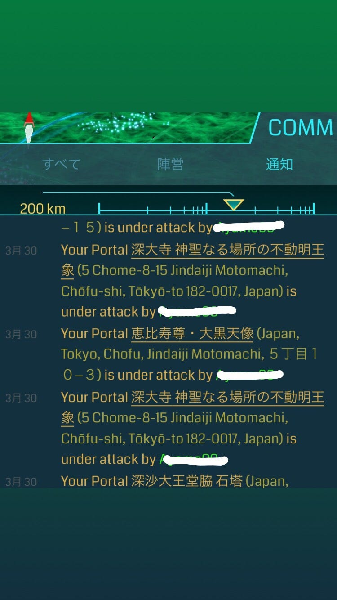

### Ingress特集③〜特徴と問題点〜

前回はIngressの基本の遊び方について見てきましたね。今回はIngressの特徴と問題点を見ていきましょう。

#### 特徴

・課金要素がない
 Ingressは「スポンサードロケーション」を考案しています。これはコストパービジットという考え方で、プレイヤーがポータルとなっている店舗を訪問した回数に従っ て報酬が入る仕組みとなっています。つまり、ユーザーには店舗まで足を運んでもらい、商品と交流を持ってもらうことを前 提に考えた仕組みです。

・プレイヤー同士の交流
 Ingress自体、他のプレイヤーとの交流を促しているきらいがあります。2015年に京都でも「XM Anomary」という世界イベントが開催されました。そのときは5000人を超える参加者が集まったとか。プレイヤー同士が協力してプレイすることで友情が芽生えたり、時には恋愛関係にまで発展することもあるみたいです。

#### 問題点

・プレイヤーがすること、できることにあまり変化がない
 ポータルを訪れてハックしてデプロイして……レベルが上がってもやることは基本的に同じです。Ingressガチ勢は遠方のポータルを訪れたり、仲間と協力して広大な陣地を作ったり、オフイベントに参加したりしてIngressを長期間に渡って楽しんでいるようですが、このような行動をしないプレイヤーはすぐに飽きてしまいます。

なかなかとっつきにくく、世界観に入り込めない、しかも周りの人がプレイしていないとなると、ゲームを続けることが難しいです。ゲームを楽しくする情報はネット上にたくさん転がっていますが、経験者に教えてもらいながらプレイしていくのが一番いい進め方だと思います。

・歩きスマホや運転中のスマホ操作を促しかねない
 Ingressでは、際どい位置調整を要求される場面があります。例えば、強力な防衛アイテムで防御されているポータルを攻撃する場合、ポータルにぴったり重なる位置まで移動してから攻撃した方が有利になります。細かい位置調整を行うにはスマホを見ながらの移動が必要となってきます。すると、歩きスマホや運転中のスマホ操作という行動に繋がるのです。運転中のスマホ操作に関しては、速度制限が緩いということも誘発の原因になるでしょう。実際にIngressプレイ中の死亡事故は海外で2件発生しています。

・用語と裏ワザ
 初心者プレイヤーが初めに当たる壁は、その用語の多さです。覚えることが多いので、混乱してしまう方もいるでしょう。また、裏ワザが多いというのも特徴です。調べれば調べるほど色々なワザが出てきます。プレイをしていく上で必須の行動と言われているものでも、公式の初心者向けサイトに書かれていないこともあります。どこかで情報をまとめてほしいところですね。

・プレイヤー間のトラブル
 位置情報を利用したゲームであることから、他のゲームに比べてプライバシーが危険に晒されることはある程度仕方のないことです。しかし、この通知画面からわかるように誰が自分のポータルを壊したのかが時刻付きでわかってしまいます。

白い線で消してあるところがユーザーネームです。ポータルが破壊されたという通知を見て現場に急行すれば敵と顔を合わせるなんてこともありえる世界です。リアルの容姿や住所がわかってしまうとなると、少し怖いですね。

#### まとめ

さて、今回はIngressの特徴と問題点を見てきました。世界的なイベントを開催している位置情報ゲームはIngressとPokémon GOくらいではないでしょうか。プレイヤー同士が現実でも交流を持つというのは大きな特徴ですね。しかし、夢中になって周りを見る目をおろそかにしてはいけません。歩きスマホや運転中のスマホ操作は命に関わるものです。また、プレイヤー間でのいざこざも拗れると事件に発展してしまいます。くれぐれもルールとマナーを守って、安全に遊びましょう！
