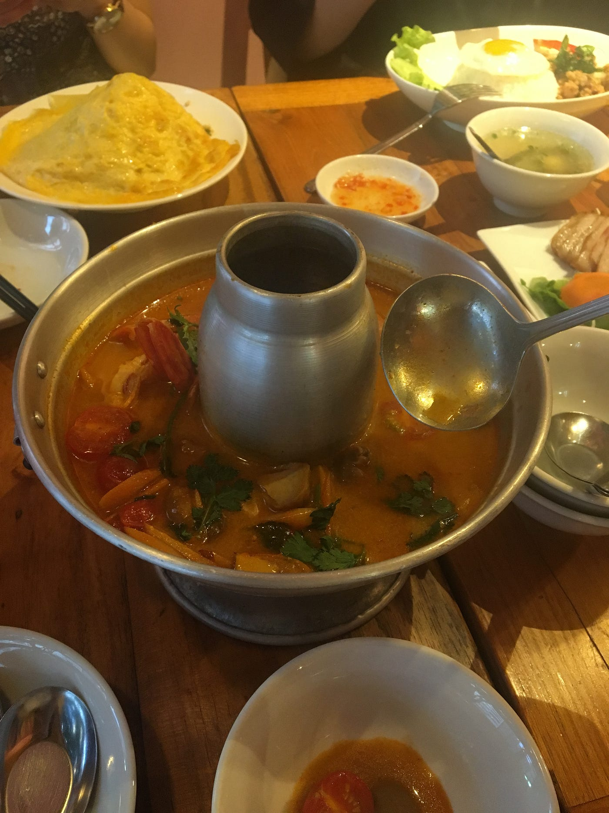

### TEDxAoyamaGakuinU再始動！！

今週のブログはTEDxAoyamaGakuinUの状況について書いていきます！

そもそも再始動というのはどういうことなのかと申しますと、
実は昨年から準備を進めていたTEDxAoyamaGakuinUなのですが
前々回のブログで述べたライセンスの関係で昨年は開催ができませんでした。
同時に中心で活動していたメンバーが全員就職活動に専念しなければならなくなり、年明けあたりから活動そのものが実質おやすみ状態が続いていました。

しかし今年度に入り、意欲的な後輩たちが入ってきてくれたことも含めて活動を再開していきました。
そして先週、初めて新メンバーも加えたミーティング、ご飯会を行いました！

ちなみに上記の写真はミーティング後にみんなでどうしても食べにいきたかったタイ料理です。

このごはん会、ただのお楽しみ会に思えるでしょう？（実際ただのお楽しみ会なのは否まないのですが）
これも立派なルールの一つなのです。
というのも、TEDxのルールの中には「チームのメンバーでポットラックパーティを開き、交流を深めましょう」というものもあります。
こうして私たちは新メンバーを迎え、日々ルールに乗っ取り仲良く準備を進めていく予定です！！

そして今回のミーティングで決まったことの一番重要部分が日程。
１２月の初旬~中旬の土日どちらかに開催します。（より詳しい日程、時間は来週のブログまでに記入できるようにしていきます）
この日程でTEDxのホームページの方も更新してまいりますので、日程調整はぜひみなさん、お願いいたします！！

とりあえず決定事項の早期共有をこちらで。
ということで今週は短い内容ですがここで失礼いたします。
