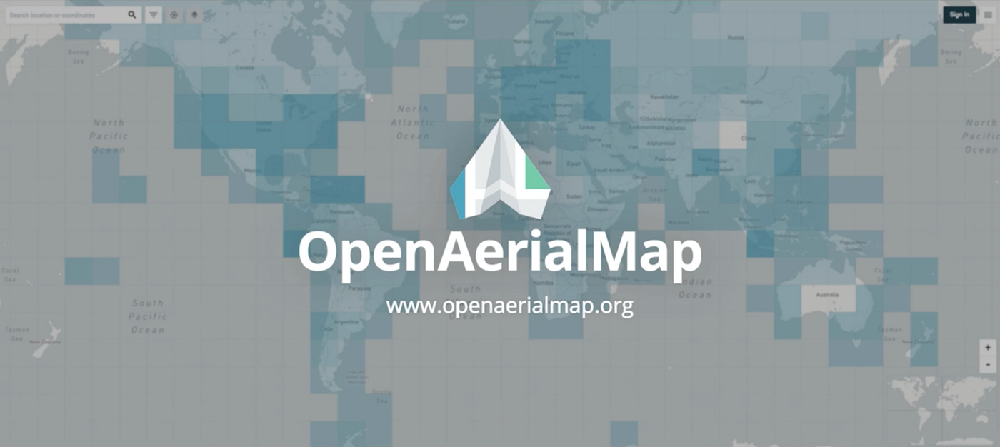
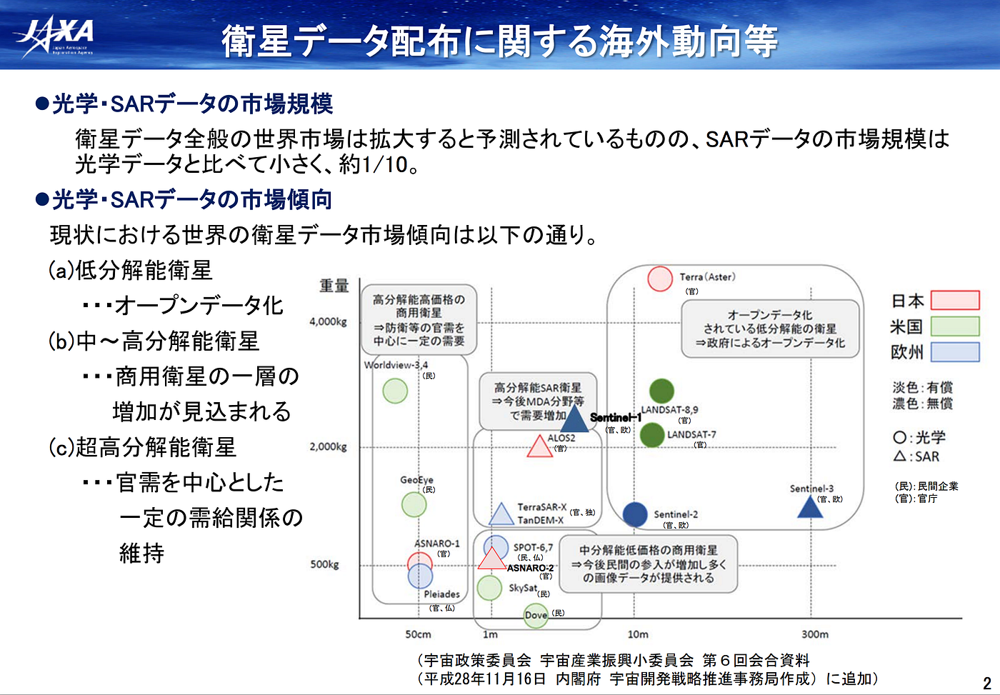
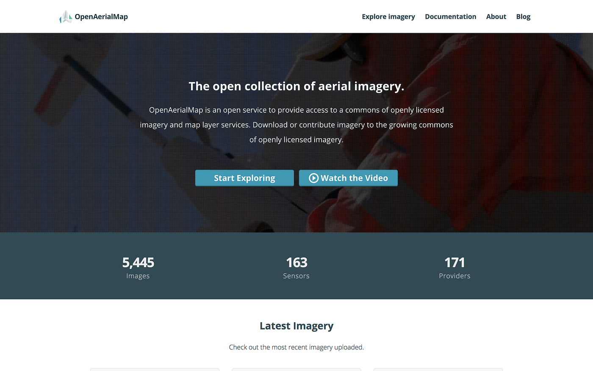
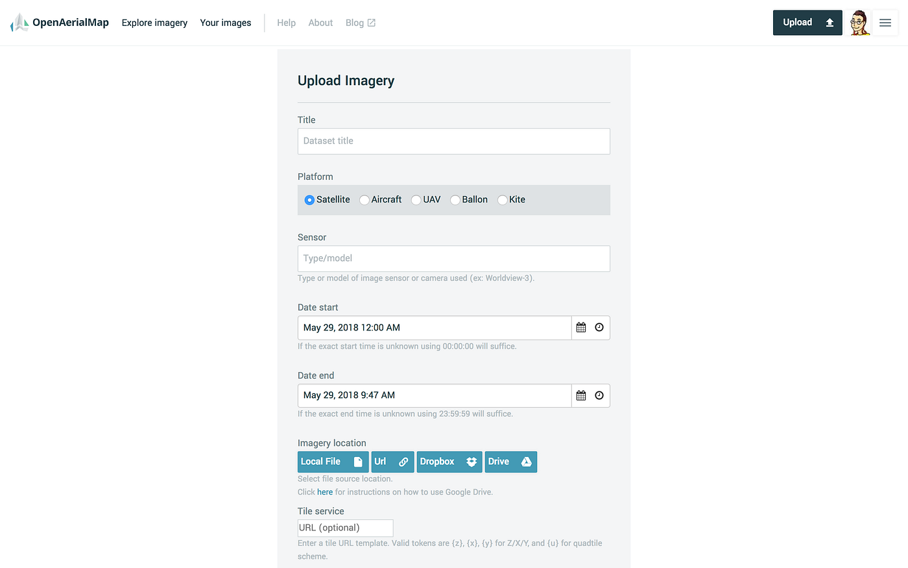
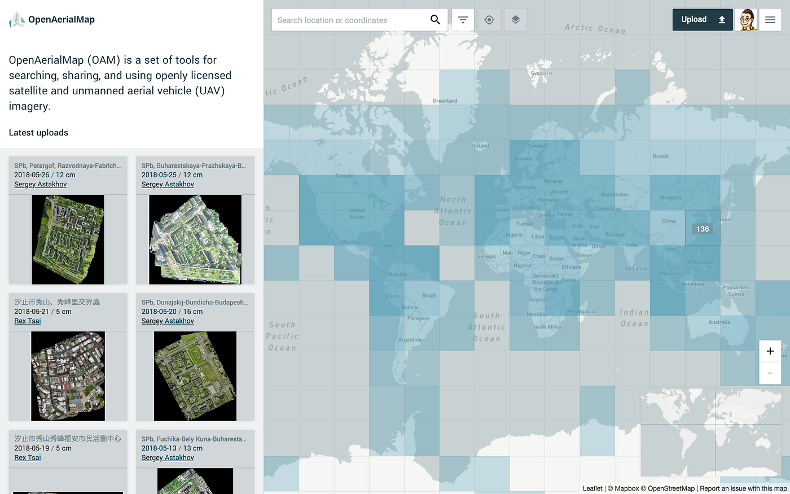
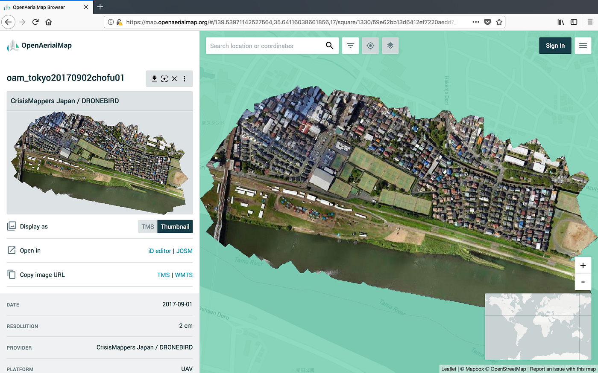
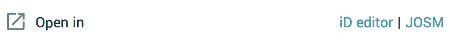
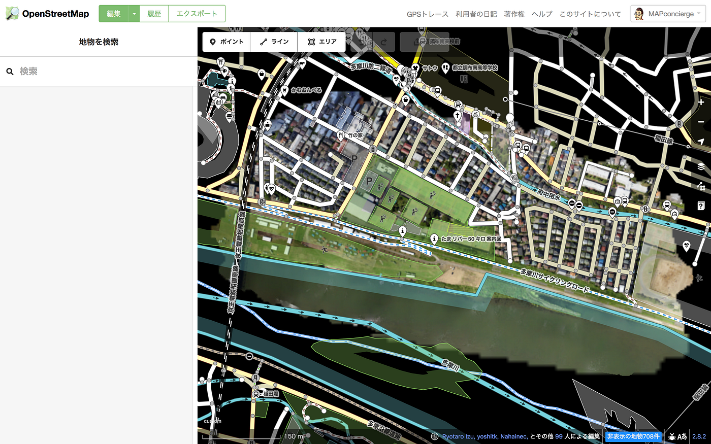
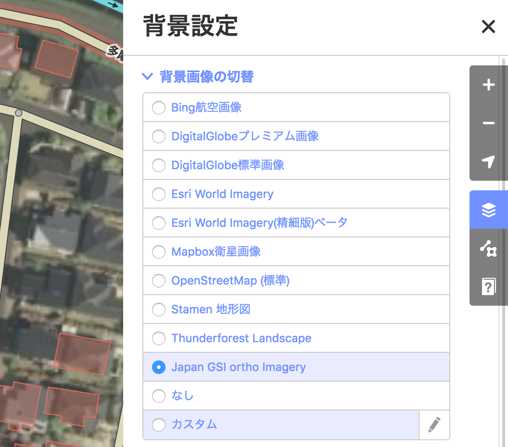
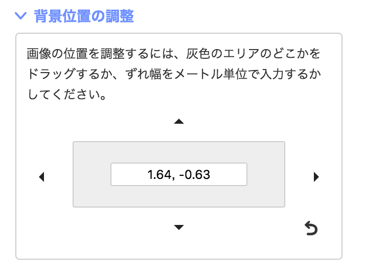

### OpenAerialMapのススメ

ドローンによる空撮画像を世界中の人々と共有する。
そこから世界が変わっていく。

### **# 2020年の実現を目指す Society 5.0 な社会**

日本の政府がすすめている [Society 5.0](http://www8.cao.go.jp/cstp/society5_0/index.html) という考え方がある。狩猟社会をSociety 1.0、農耕社会をSociety 2.0と見立てて、工業社会（Society 3.0）、情報社会（Society 4.0）に続く新たな社会を指すものとして、政府曰く

> “サイバー空間（仮想空間）とフィジカル空間（現実空間）を高度に融合させたシステムにより、経済発展と社会的課題の解決を両立する、人間中心の社会（Society）” — Society 5.0｜内閣府 ウェブサイトより

といったビット(情報)とアトム(物質)が融合した世の中を目指している。このイメージ図には具体例として大きくドローンが描かれており、政府の目指す方向を意識するしないに関わらず、様々なプレイヤーが東京オリンピックが開催される2020年度までの目標としてこの新しい社会を実現しようと切磋琢磨している。もちろん、この方向性は日本だけではない。例えばドイツでは同様の考え方を４度目の産業革命として [Industory 4.0](https://ja.wikipedia.org/wiki/%E3%82%A4%E3%83%B3%E3%83%80%E3%82%B9%E3%83%88%E3%83%AA%E3%83%BC4.0) と位置づけたり、米国のゼネラル・エレクトリック社は[Industrial Internet](https://ja.wikipedia.org/wiki/%E3%82%A4%E3%83%B3%E3%83%80%E3%82%B9%E3%83%88%E3%83%AA%E3%82%A2%E3%83%AB%E3%82%A4%E3%83%B3%E3%82%BF%E3%83%BC%E3%83%8D%E3%83%83%E3%83%88)という概念で新しい産業のあり方が国内外で提案され、その社会実装がすすんでいる。

### **# オープン化のすすむ衛星画像データ**

新しい産業の創出を大きく支えているのが商用利用可能で許諾不要なオープンな技術と情報である。UNIX, Linuxしかり、Wikipediaしかり、GPSしかり。そして宇宙空間から地球表面を撮影した衛星画像もまたオープン化が徐々に進んでいる。歴史的には米国NASAが1970年代からデータ公開しているLANDSATシリーズ、欧州もSentinelシリーズがオープン化され、Google Earth Engine も含め様々な仕組みでこれらのデータが非常に使いやすい形で提供されている。

日本のJAXAも徐々にオープン化がすすみ、2018年には[地球観測衛星だいち１号機（ALOS-1）のマルチスペクトルセンサーAVNIR2データ公開](http://www.eorc.jaxa.jp/ALOS/alos-ori/index.html)が始まった。

いずれにしても、宙から地球を観るコストは データソースと手法をうまく組み合わせるによっては劇的にコストダウンして行うことができるようになった。

### **# 高分解能はドローンの出番**

空間分解能数10ｍ前後の低分解能から数m前後の中分解能衛星はオープン化が進みつつあるが、高分解能画像はOpenStreetMapなどのマッピング目的に限定した形でのDigitalGlobe社の取り組みやBing Maps によるホスティングは存在するものの、当分商用サービスとしてのデータ提供については急激に変わるとは考えにくい。

そこでドローンの出番である。

現状のドローンと搭載されているカメラの標準的なスペックから想定すると、上空100m前後から一般的な空撮を行うと、空間分解能数cmの超高分解能画像が取得できる。

もちろん、[OpenDroneMap](https://github.com/OpenDroneMap) や [PhotoScan](http://www.agisoft.com/)、[Pix4D](https://pix4d.com/) などのSfM処理を行うことで、特徴点抽出から視差による三次元モデル生成、正射投影画像としてのオルソモザイクデータの生成までをほぼシームレスに実施し、実行者のスキルに依存することなく高品質で地図にそのまま重ねることができる航空写真を作れるようになったのだ。

### **# 空撮したらOpenAerialMapで共有しよう**

ドローンで空撮した写真をどこに公開するか。これはかなり重要である。何しろ超高分解能でデータ容量も数100MBから場合によっては数GBサイズとなってもおかしくない。Google DriveやDropbox のようなクラウドストレージでも良いかもしれないが、無料アカウントではあっという間に容量制限を超えるだろう。一方でDroneDeployやSkyPixelといったデータ共有サービスはあるものの、そのほとんどが Copyrights All Reserved のライセンスとして、そこで公開されている空撮データは商用利用可能でも許諾不要でもないクローズドなライセンスである。

そこで、[OpenAerialMap](https://openaerialmap.org/)の出番である。ライセンスはCC BY 4.0+OSM Trasable としてオープンデータが原則となる。

### **# GeoTIFFファイルをアップロード**

オルソモザイク画像を生成したら、まずGeoTIFFファイルとして手元に用意しておこう。座標系はWGS84/緯度経度座標系(EPSG:4326)をおすすめする。これをUploadフォームに必要情報とセットで入力してアップロードするだけ。アップロード後には自動的に XYZタイル画像データセットを作ってくれる。もちろんアップロードには事前にアカウントを作成しておく必要はある。

### **# 使いたい画像をプレビューし、即マッピング**

OpenAerialMapに登録された様々な空撮画像を眺めてみよう。トップページから[**Start Exploring]** ボタンをクリックすることで以下のような地図表示になる。青いメッシュの色が濃いエリアが登録された空撮画像の多い場所だ。メッシュをクリックすると、そのエリア内の画像リストが左側に絞り込まれる。

例えば、2017年の秋に東京都・調布市合同総合防災訓練にて我々がデモ飛行を行った際の空撮データはこのようにOpenAerialMapに表示される。左側の **Zoom to fit imagery on screen ボタン**をクリックすると、地図も撮影エリアに移動しする。

サムネイル画像などを表示させるには **[ TMS | Thumbnail ] ボタン**で切り替えも可能である。

問題がなければ、Open in iD editor のリンクをクリックすることで OpenStreetMap のウェブブラウザ用エディタ iD が起動する。

OpenStreetMap のアカウントでログインすれば、しばらく待つとこのように表示されるだろう。あとはいつものようにマッピングするだけ！

### # ちょっと待て！その空撮データの位置精度は正確だろうか？

最後にひとつだけ重要な確認作業を行ってほしい。それは空撮画像の位置精度のチェックだ。

まず、背景画像を国土地理院のオルソ画像 **[Japan GSI ortho Imagery]** レイヤに切り替える(海外であれば Digital Globe プレミアム/標準画像を推奨する)。そして、既存の道路位置などが正確か比較し、ずれているようであれば道路位置を修正する。

続いて、背景画像の**[カスタム] **レイヤに戻し、道路との位置に合わせて背景位置の調整を行う。▲ アイコンをクリックすることで微調整ができるので、必ずこの調整を行い、できればその修正値をメモしておくと良い。

いずれにしても、このような手順のもとで、自由に衛星画像から自分達で撮影したドローンによる空撮画像を公開し、マッピングに利用することができる。

It’s time to fly with your drone!!
Happy Mapping
