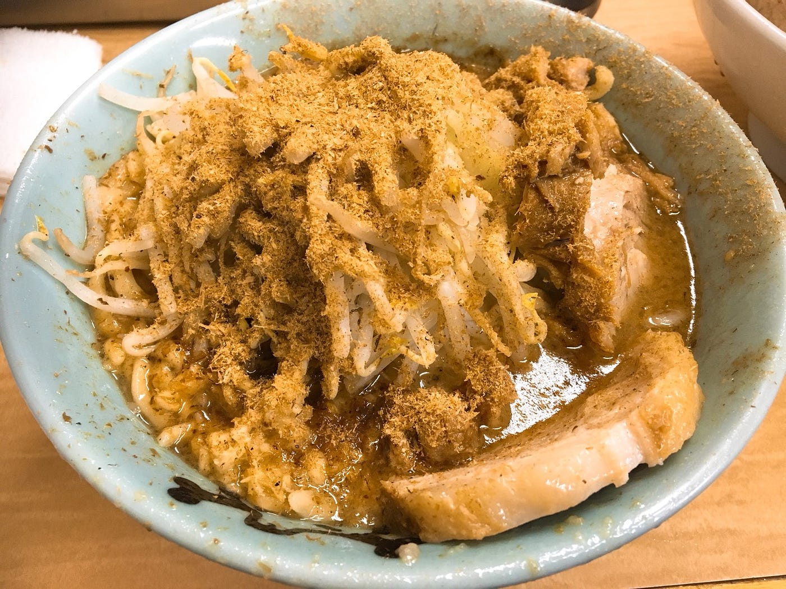

### Pokemon Goに今更

ハマってしまいました・・・

ポケモンGOがリリースされた当時は、私は早くやりたすぎてアメリカ用のapple IDを作り、日本のリリース日よりも早くインストールして遊んでいました笑

しかし飽きてしまって、iphoneにはアプリはあるもののアプリを開かない日々

そんなこんなで２年ぐらいたったこの前、古橋ゼミでこの動画を見ました。

2015年の9月にアップされた動画なのですが、改めて見てみて、すごく感動してしまいました！

それに加えて、私が一番ポケモンに夢中になっていたアドバンスジェネレーション時代のポケモンも追加され、アドベンチャーウィークが始まったこともあり、またポケモンGOを常に開く日々が始まってしまいました。

私の家は上野にあるので、家の周りもポケストップだらけなんです、まだ回ったことのない場所がたくさんあったので、アドベンチャーウィークを利用してたくさん探検しています！（5/25~6/5,初めて訪れるポケストップやジムを回るといつもの１０倍の経験値がもらえるのです！）

レイドバトルが近くの公園で開催されると、携帯を持った人が集まって来てみんなでポケモンを倒すの、なんだか楽しいですね！まだまだ探検していきたいと思います！

今週のラーメン

今週のラーメンは「ラーメン二郎新小金井街道店」です！

ここの二郎は5月27日に一時閉店してしまうとのことだったので、急遽行って来ました！この前紹介した野猿二郎の父母さんがやっているお店です（父母さんが引退のため休止とのことです）。15時から整理券配布で私たちは17時についたのですが、結局20時の整理券をもらい、食べられたのは20:30でした・・・小金井二郎の人気おそるべし。 ここも野猿二郎と同じく、テーブル席があったりミニラーメンがあったりなど、ジロリアンじゃない人にもおすすめできる二郎です！味も比較的マイルドなので、食べやすいかと思います！ 私が今まで食べた二郎の中でトップ３に入るぐらい好きなので、一時閉店はとても悲しいです・・・早く復活を願います！新しい店長が誰になるのか見どころです！
