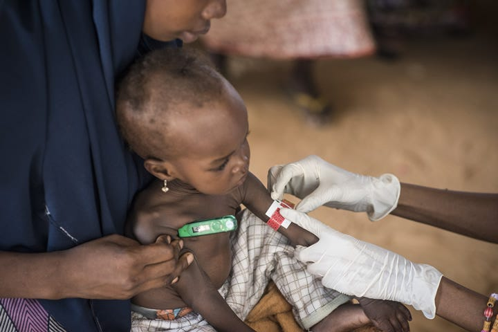
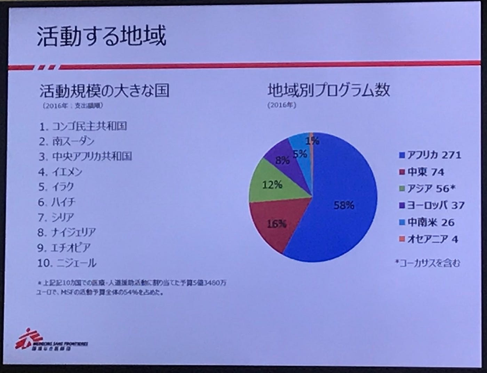

### Je soutiens Médecins Sans Frontières

タイトルの意味：私は国境なき医師団を支持する。
国境なき医師団の早稲田にあるオフィスで聞いた様々なこと。

国境なき医師団とは1971年にフランスで設立された、独立・中立・公平な立場で医療・人道援助活動を行う民間・非営利の国際団体である。”Médecins Sans Frontières” とはフランス語で国境なき医師団を意味する。フランスで設立されたことから、国境なき医師団の正式名署はこの ”Médecins Sans Frontières” だ。

#### みんなは国境なき医師団と聞いて何を想像する？

私の場合は、医師たちがアフリカでまさに危機的状況で現地の人々に医療を無償で提供している情景が眼に浮んだ。そしてこの想像は現実社会において全く同じように作用していた。

活動地は紛争地、難民キャンプ、被災地、感染症の流行地や病院がない地域で診断、治療、病気の予防や支援など様々な活動を行なっている。

それは一体具体的にどこらへんでの活動が多いのか、さっき私は想像した時にアフリカと言ったがアフリカのどこなのか、ぜひ紹介したい。

コンゴはエボラ出血熱発祥地として、日本国内でも認知度が高い。

それに対して南スーダンや中央アフリカ共和国、イエメン、イラクはどうだろうか。

#### 原因は内戦だ

ヨーロッパの活動が８％な理由も難民だ。

.

人が人を壊すということは非常に悲しい現実であると改めて痛感する。

そんなまさに人の命に関わる最前線で、世界的に活躍する国境なき医師団では大切にしていることがある。

それは、、

### ” ” ” ” ” ” “ “ 100％民間の団体であること ” “ ” ” ” ” ”

それはつまり、独立・中立・公平な立場で活動を行うということ。

具体的には国境なき医師団の活動は、ほぼすべて民間からの寄付で成り立っている。私たちのような一般の市民の寄付によって、世界的な活動が行わているのだ。また彼らは活動地の現状報告や患者の方々の声を届ける証言・広報活動も重視している。

そもそも国境なき医師団は医師とジャーナリストが協力して作られたという経緯がある。危機的状況下で苦しむ人々の情報を世に発信する。

また国境なき医師団は世界各地に29事務局(28カ国)を設置している。そしてその全ての事務局は公平な扱いで、みんなで話し合って物事を決める。
現在約４万人の海外派遣スタッフと現地スタッフがいて、約70の国と地域で活動している。ちなみに日本の事務局は1992年に設立された。

まさに現場で、時には大きなリスクを背負って人道支援を行なっている彼らの姿は勇ましく、私は今回、本気で寄与したいと強く思った。

まずは日本のメディアではあまり報道されないような、海外の危機的状況下にもっと目を向けて学ぶこと。他者に広めること。寄付をすること。
そして私は医者にはなれないが、いつの日か違う形で活動に貢献したいと、今日、日本事務局の小林さんにお話を聞いて胸が高ぶっている。

[TOP | 国境なき医師団日本
国境なき医師団（MSF）は、医療・人道援助を行っている民間の国際NGOです。1999年にノーベル平和賞を受賞しました。寄付、活動地への派遣、証言・広報を中心に活動しています。www.msf.or.jp](http://www.msf.or.jp/)
