### ３分でちょちょいと編集できる！【iMovieの使い方（基礎）】

予めマックに入ってるツール、使ってますか？iBooks、Pages、GarageBand…無料で簡単につくりたいものがつくれる時代に生まれてよかった！と思ってしまいますね。

今回は動画編集、iMovieの使い方をさらっと、自分のメモ用にも載せておこうと思います。先日のTasking Maneger紹介動画作成時に使用したものを中心にご紹介。

# 動画・写真を載っけよう

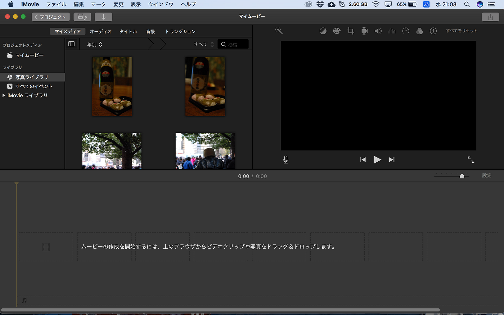

まずは映像の土台となる、写真か動画を挿入してみます。まあ親切にも書いてくれてあるので、説明するほどでもないのですが、**ドラッグ&ドロップ**ですぐアップできます。

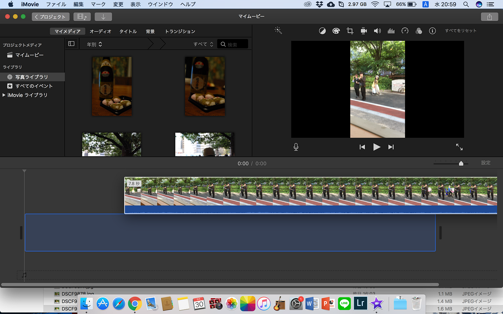

こんな感じ。超簡単。

「マイメディア」はおそらく「写真」内のデータが出てきます。そこから写真データを引っ張ってこれますし、違うウィンドウからも持ってこれます。

# 文字、タイトルを入れよう

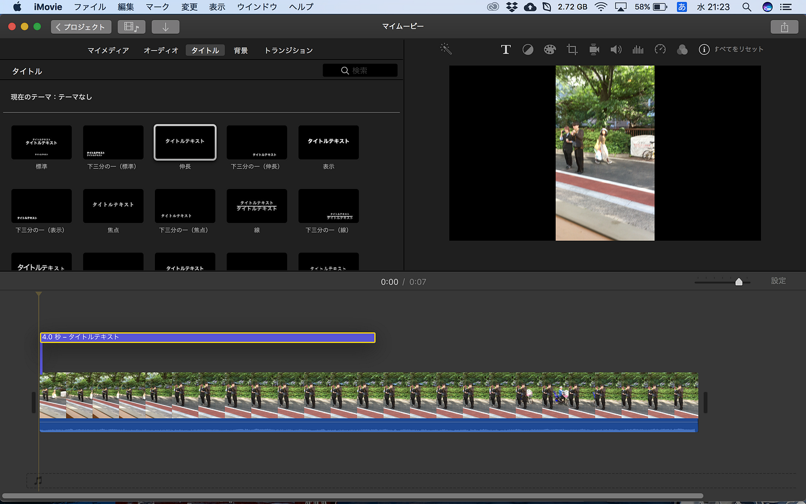

「タイトル」からいろんなタイプのタイトルが入れられます。画像データの上部にドラッグ&ドロップします。

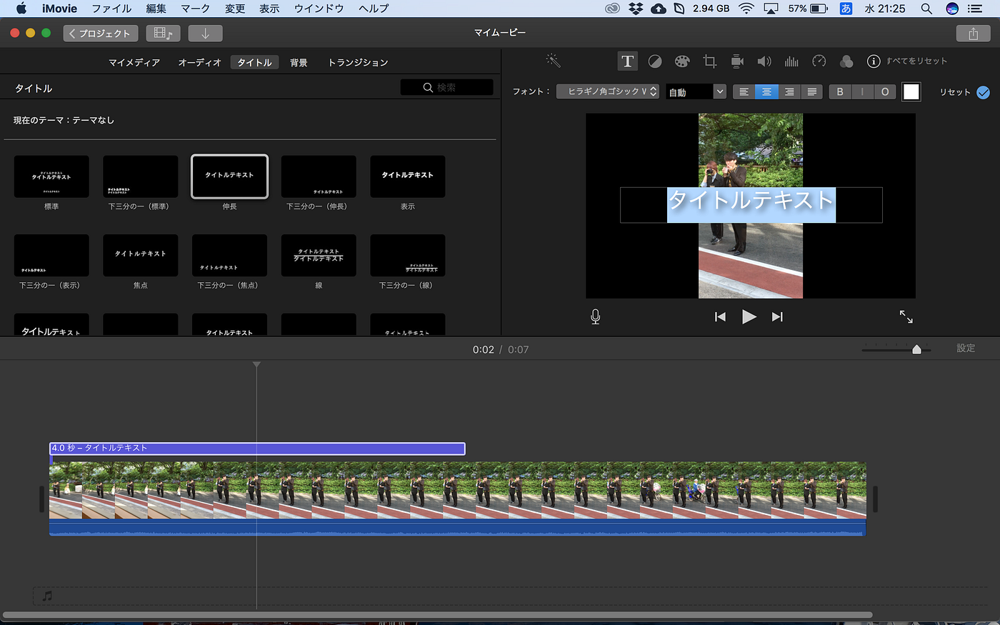

フォントや太さ、位置などもいじることができます。ただ図形とかは入れられないようで少し不便さは残りますね…。

動画内にテロップとして入れることも、タイトルとして動画の間に入れることもできます。

# 動画をもっとスムーズにスタイリッシュに見せるぜ

このあたりから動画をプレビューしちょこちょこ確認し始めますよね。

動画の再生は**スペースキー**で基本いけます。止めるのもこのキーです。動画再生をどこからするかはカーソルで合わせます。

- 動画フェードイン&フェードアウト

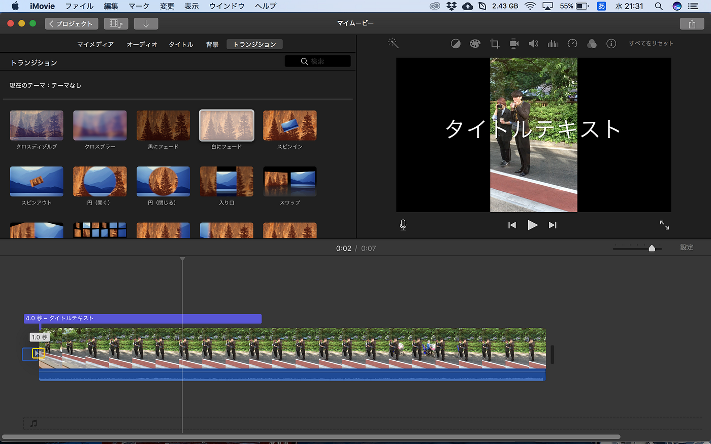

「トランジション」から動画のフェードイン・アウトの細部が決められます。真っ白な状態からだんだん動画が始まったり、ドアが閉まって動画が終わったりテンプレがあります。

- 動画切り取り

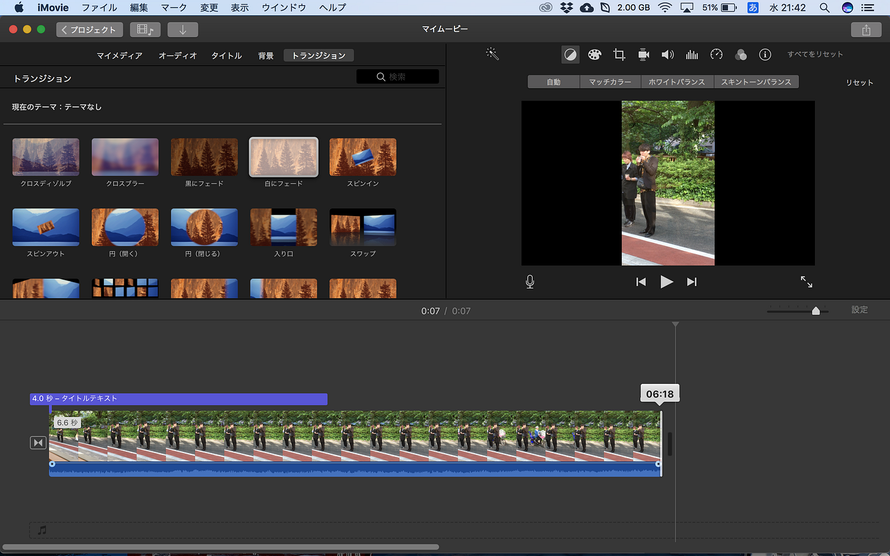

動画が長すぎ！ここ要らない！ってときにはカットしましょう。動画の始めか終わりを動かせばできちゃいます。楽♪

- 動画音声音量

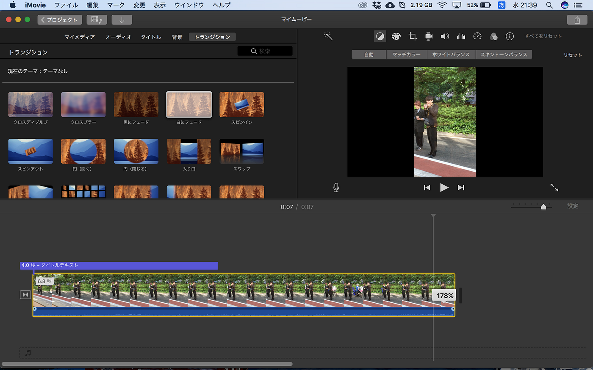

動画の真下、青いゾーンは動画内の音声です。音量調整するには動画と青ゾーンの境目にカーソルを合わせて上げ下げしましょう。

- 動画音声入り終わり

その音声をフェードイン&アウトするには青ゾーンの丸ポチありますよね？こいつを左右にいじります。

- スローモーション&早送り

_**ここで注意しておきたいのは、動画や音楽データ選択しているときは黄色枠が出ていることをちゃんと確認してから編集することです！_**

さて、編集したい動画データを選択したら今度は速さをいじくってみましょう。

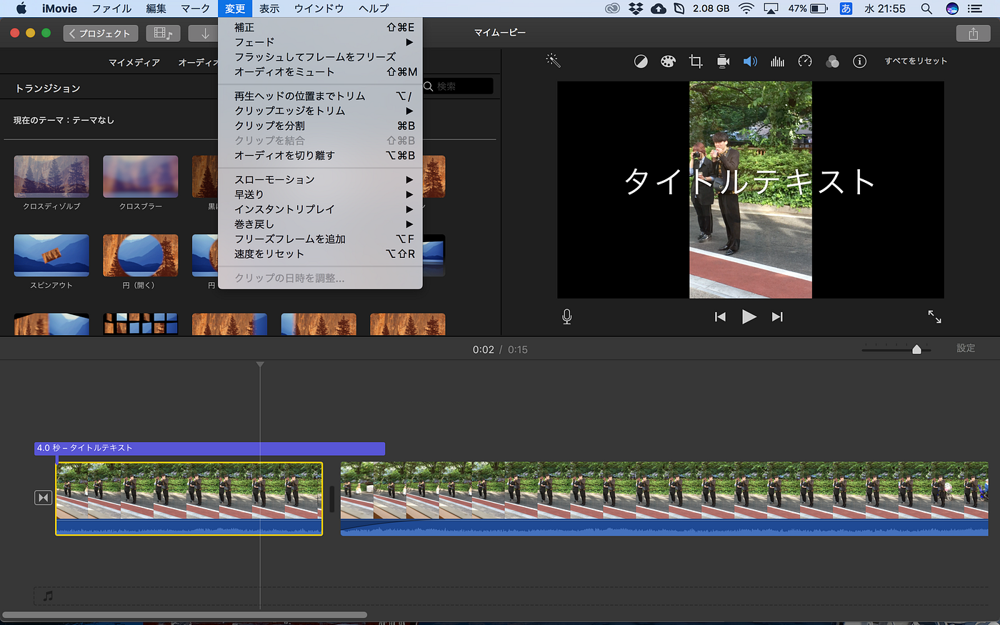

「変更」からスローモーションや早送り、またその倍率なんかを選択できます。

それ以外の倍率にしたい！とわがままをおっしゃるのならば、一度何かしらの倍率を選択してから修正しましょう。

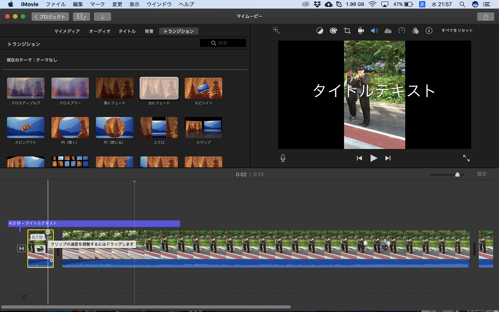

動画を**早送りにするとうさぎマーク**、**スローにするとかめマーク**が出ます。

かわいいっすね。

その上の丸ポチを左右すればもっと速くなったり間延びしたりできます。

- 動画分割

同じ動画を使いたいけど途中からエフェクトを変えたい！速度を変えたい！という方はまず動画分割しちゃいましょう。分割したい位置にカーソルを合わせて、

**command ＋ V**

で可能です。

基本と少し応用を説明しました。ほかもどんどんいじってみましょう。作業間違えて、ひとつ戻したいときには

**command ＋ Z**

で怖いもの知らず！

# BGMをつけよう

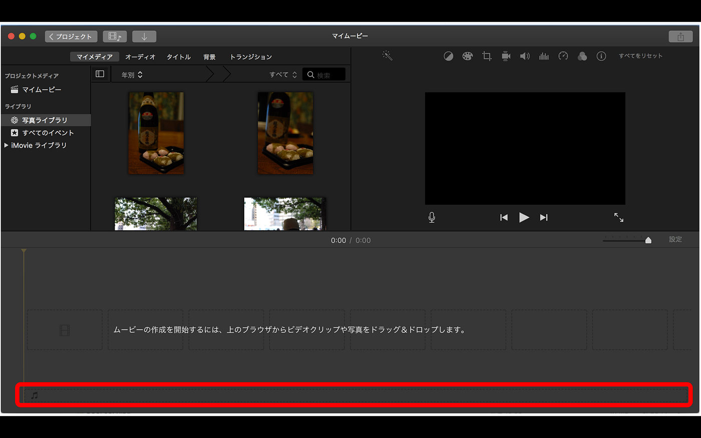

これもやはり簡単。ここにドラッグ&ドロップ！です。

「オーディオ」内に自分のiTunesデータや「サウンドエフェクト」（既存のBGMデータ）が入ってます。

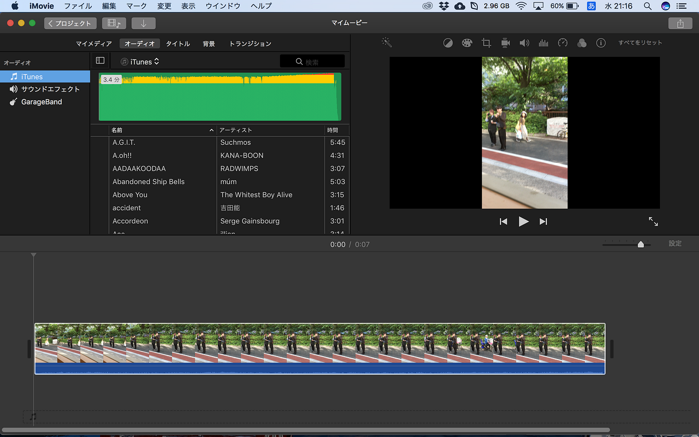

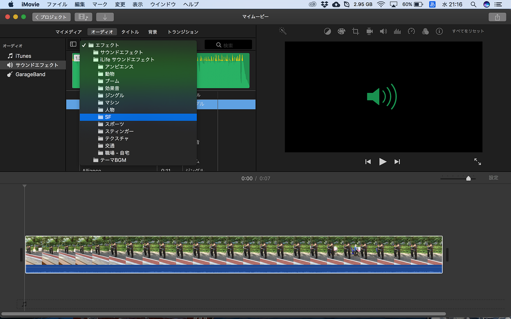

「サウンドエフェクト」内にはいろんな音が入ってます。GarageBand利用者にはお馴染みのデータですね。UFOやらラジオジングル、クラクションの音とか豊富に入ってます。

基本的な操作はこんな感じになります。最初は15秒くらいの短い動画を作って練習するのもありですね！

基本、自動保存してくれます。でもプロジェクトをひとつ作成したら閉じる前には名前をつけておきましょう。最後動画が完成したら、

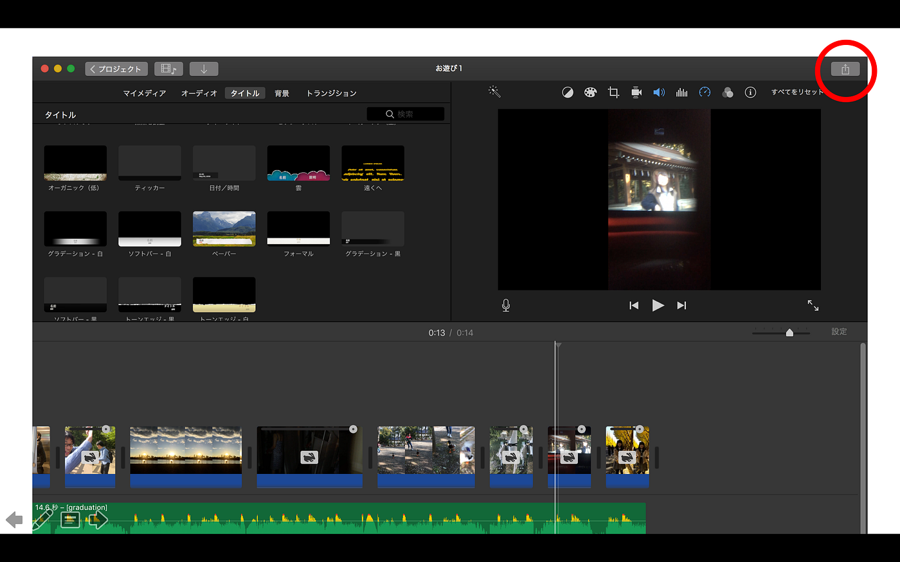

右上のこのマークをクリックして共有しましょう。

まあざっとこれが主な動画編集プロセスです。試しにスマホで撮った写真や動画を組み合わせて作ってみましょう。どんどん楽しくなってきますよ〜！

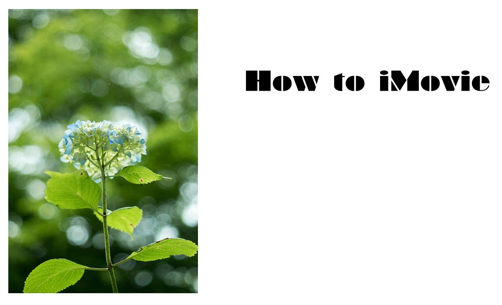

テンションのおかしい安藤でした。
