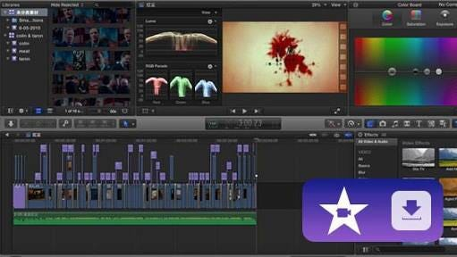
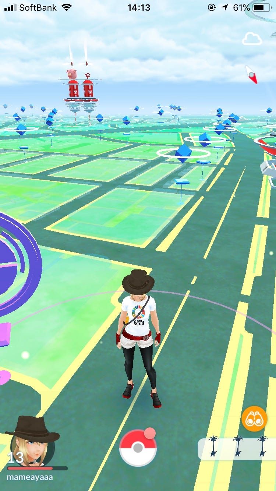
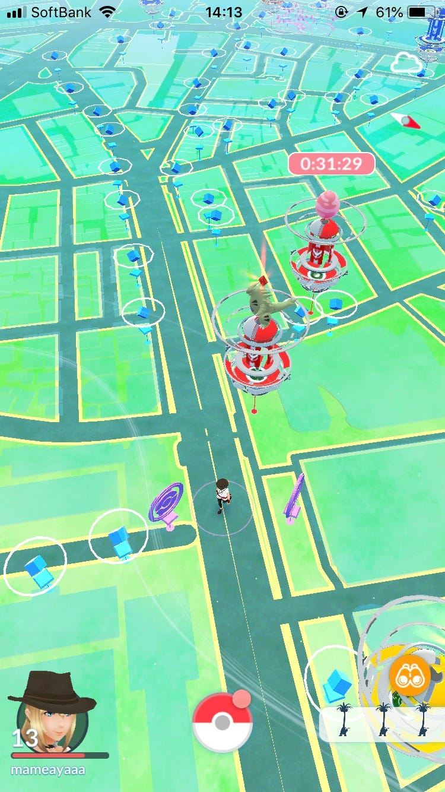

### 今週のおまめ

今週は番外編！ということで、私達が日頃ゼミで活動している内容についてざっくりご紹介できればと思います〜

まず、直近ではiMovieを使ってマッピングの方法を説明する動画制作を行いました！私自身、高校生の時からiMovieを使って動画を作る経験をしていましたが、今回のようによりわかりやすく、みやすくまとめるというものは初めてだったので、わからないことだらけでした。

みんなの作品をみて学ぶことが多く、知らなかったツールや見せ方についても知ることができました！動画だけでなく、文字入れや音楽の入れ方やタイミングが重要だと！！

あとはポケモンGoをレベル20にしなければならないんですね〜、まあ20に達していないのは私だけでして泣わたしはまだ13の甘ちゃんですが、他のゼミ生（もちろん先生はプロオブプロです）は色んな攻略法を教えてくれるので、何も分からなかった私も最近掴めてきました！みんないつも助けてくれてありがとう！！

ポケモンGoは位置情報ゲームとしてやっぱり進んでいて、とても良いものだと思います。こないだ授業でポケモンGoの将来を描いた動画をみたのですが、もっともっとすごくなりそう、とてもワクワクしました！

分野は違えど位置情報を利用して新たな試みを多くしているポケモンGoにはこれからも注目していくべきだと思っています。もちろん位置情報広告にも繋がる部分、学べる部分はたくさんあると思うので。
