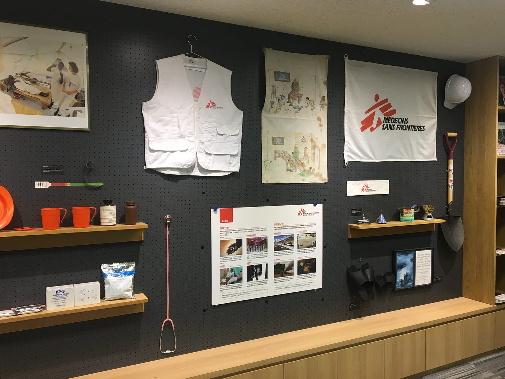
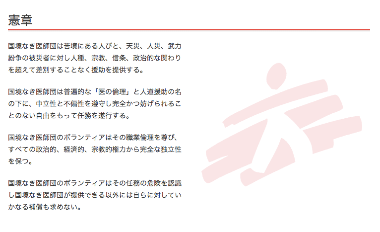
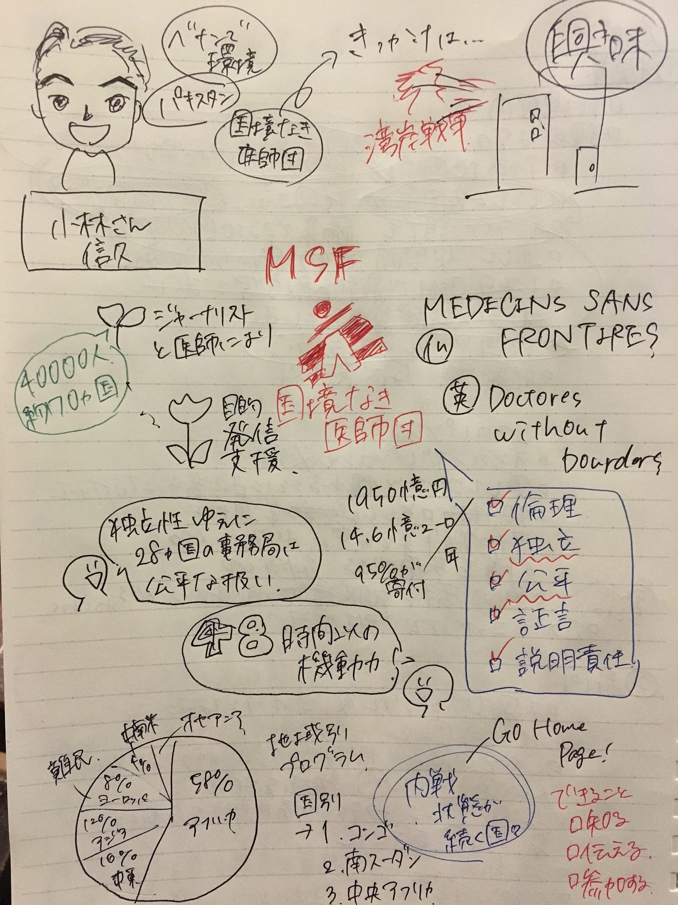

### 私たちができる「伝える」こと

その一つにこのブログでの発信という形があると思います。

私たちは普段生活をしていて何気なく触れるニュースは日本国内のこと、身近なアジアのこと、何かと気になるアメリカ大統領のこと、、、

しかし一方で世界はもっと広く、もっと全然違う問題に苦しんでいる人たちがいる。
違う場所に住み全く違う生活を送っている私たちが普段から心がけてできることは無いように思える。

だからこそ、**まずは情報を知る、そして知ったことを人に伝えていく、そして参加してみる。
**小さなことでも一人一人の認識で世界が変わっていくことを願って。

### **国境なき医師団日本事務所に訪問しました！**

とまあ、冒頭で大きなことをほざきましたが、
私は実際この訪問でお話を聞くまで「ベナン共和国ってあれか、アフリカの東南にあるブロッコリーみたいな形をしたあの国か」
くらいの認識しか持っていませんでした。（すみません）

しかし今回古橋ゼミの活動として訪問した国境なき医師団の小林さんのお話を聞きその認識は大きく変わったので、より多くの人にこのブログを通して伝えたいと思います。

### **MEDICIN SANS FRONTIRES**

[国境なき医師団](http://www.msf.or.jp/)とは、もともと1971年にフランスで設立され、フランス語名で「MEDICINS SANS FRONTIRES」、また英語名で「Doctors Without Borders」です。

MSF Japan 公式ホームページより

名前の通り、国や政府関係なく、**完全民間・非営利の国際団体**として活動しています。
その活動範囲は多岐に渡り、自然災害や紛争、貧困など様々な場面で緊急性の高い医療ニーズに応えることを目的としています。
現在は4万人の人々が、約70ヶ国で活動している中の医療関係者、非医療関係者の割合はだいたい半分ずつ、医者や看護師が医療に専念できるように強いチームワークが保たれています。

キーワードは５つ。
１倫理性
２独立性
３公平性
４証言
５説明責任

中でも特にこの２と３、独立性と公平性を保つことはとても大事。
というのも、紛争地帯などでどちらかの勢力に加担することなく常にどんな人でも医療行為のみに従事することが絶対なのです。
そのために、現地で医療行為を行う前には必ずその国の各団体に了承を得ること、そして資金工面や情報発信にも細心の注意が必要です。
例えば、資金のおよそ90％を民間からの寄付でまかなっている医療活動でも、パキスタンでの医療活動においてはアメリカからの寄付が含まれていてはいけないそう。

またこの独立性ゆえに28ヶ国にある事務局はどこも公平な立場であり、その他国にまたがる行動拠点ゆえに、緊急事態においても48時間以内には現地へ赴きます。
その移動手段もさまざま、なんと車もバイクも自転車も無理ならロバやラクダまで使うのだとか！！
そして最近ではドローンでの運搬も試験的に導入されています。

MSF Japan 公式ホームページ 患者のもとへ駆けつける10の方法 こんな意外な動物で？より

こうして主な活動範囲であるアフリカや近年難民が増えている欧州でも、どこでも駆けつけることができます。
活動範囲において特にアフリカは、地域別プログラムのおよそ58％を占めており、コンゴや南スーダン、中央アフリカにおいて、内戦の被害にあった方や流行病の被害にあった方々を助けています。

### **今後は、、、**

誰しも参加できる寄付活動はもちろん、
身近でできる国境なき医師団主催のボランティア活動や、より多くの人に活動を知ってもらうための講座開催なども予定しています。
そしてSNS発信などにも注力しているのでぜひポチッとワンクリック。

[Doctors Without Borders Japan
Doctors Without Borders Japan, 東京都 新宿区. 224K likes. 国境なき医師団(MSF)は、非営利で国際的な民間の医療・人道援助団体です。www.facebook.com](https://www.facebook.com/msf.japan)

[国境なき医師団日本 (@MSFJapan) | Twitter
The latest Tweets from 国境なき医師団日本 (@MSFJapan). 国境なき医師団(MSF)日本の公式アカウントです。 MSFは、非営利・民間の国際的な医療・人道援助団体です。…twitter.com](https://twitter.com/MSFJapan)

[国境なき医師団 (@msf_japan) * Instagram photos and videos
5,143 Followers, 110 Following, 133 Posts - See Instagram photos and videos from 国境なき医師団 (@msf_japan)www.instagram.com](https://www.instagram.com/msf_japan/)

### **きっかけのたねまき**

私は今自分の入学したこの青山学院大学で、このような世の中の様々なことを学べる環境にとても充実感を感じ、感謝し、もっと知りたいもっと実際に携わりたいと思っています。

同時に私がこの大学で学び、もっと知る、行動を起こすきっかけをもらったのと同様に、より多くの人にきっかけのたねまきができる方法を考えています。

このブログもそうですし、古橋ゼミで教わった動画の編集やグラレコ、
そして私が今行おうとしているTEDxAoyamaGakuinUをそうした多くの人の行動のきっかけが生まれる場所にしていきたいです。

今回訪問した国境なき医師団の日本事務局の方々は、「みなさんができることは、まず知ること、人にそれを伝えること、そして参加すること」とおっしゃっていました。
私もこの伝えることの次は、実際にボランティアに参加してみようと思います。

最後に今回のお絵かきを少し晒して終わり〜。

