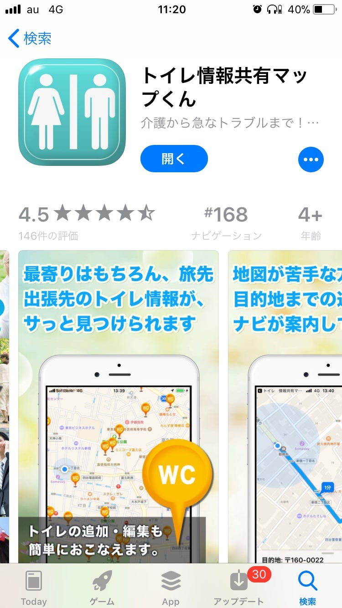
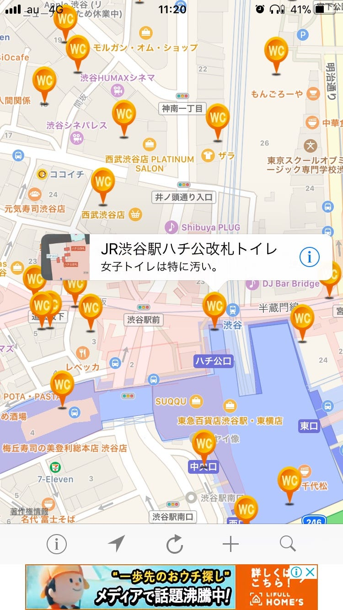

### 今日のアプリ

卒論パンフレットに載せたい便利アプリ、今日から色々使ってみることにしました。

まずは、個人的に気になっていた「トイレ情報共有マップくん」

地震だとトイレ流せなくなったりとかもあると思いますが、普段でもトイレ見つからないと大変ですよね…

私は何回か渋谷で見つからず大変なこともありました。

でも渋谷ってどれいくか迷うくらいいっぱいありましたよ！！

位置情報なしでも場所はでるので、使えるのでは？

場所によっては一言コメントもでるようですね。

実際全部使えるのかはわからないですが、確認はしてみたいと思います！(たくさんあるので全部は大変)

ではみなさん、是非使ってみてね！
