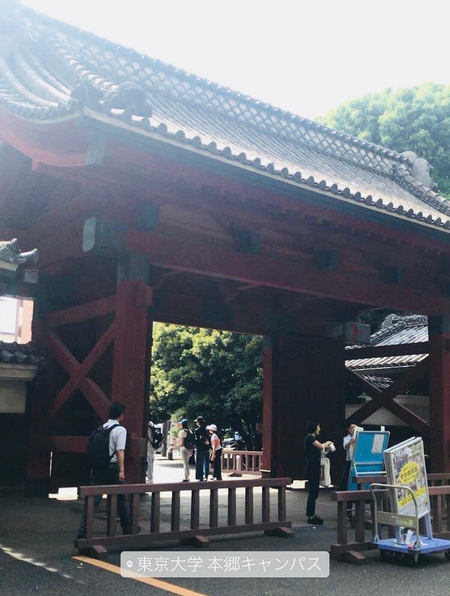
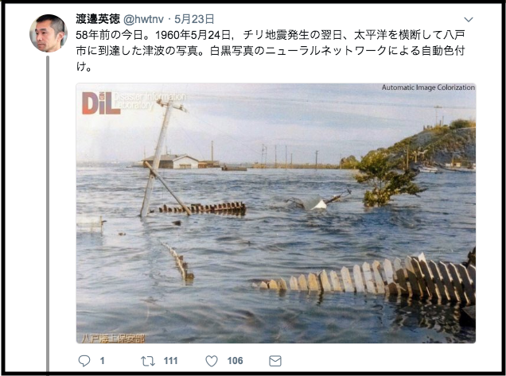
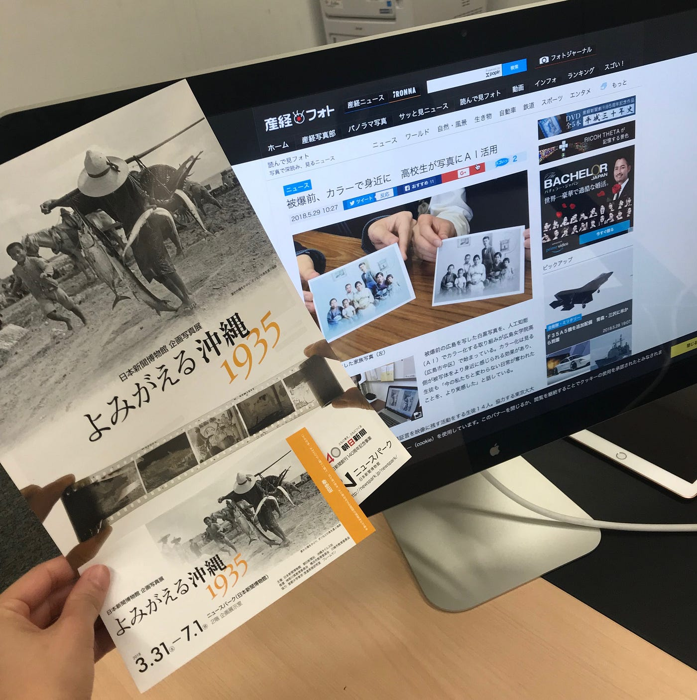
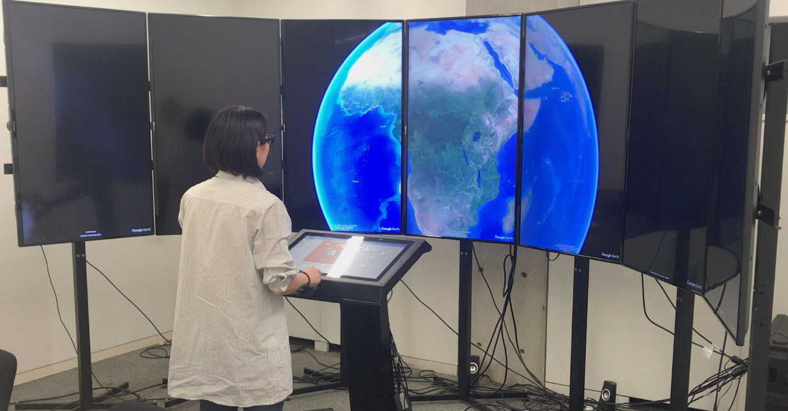
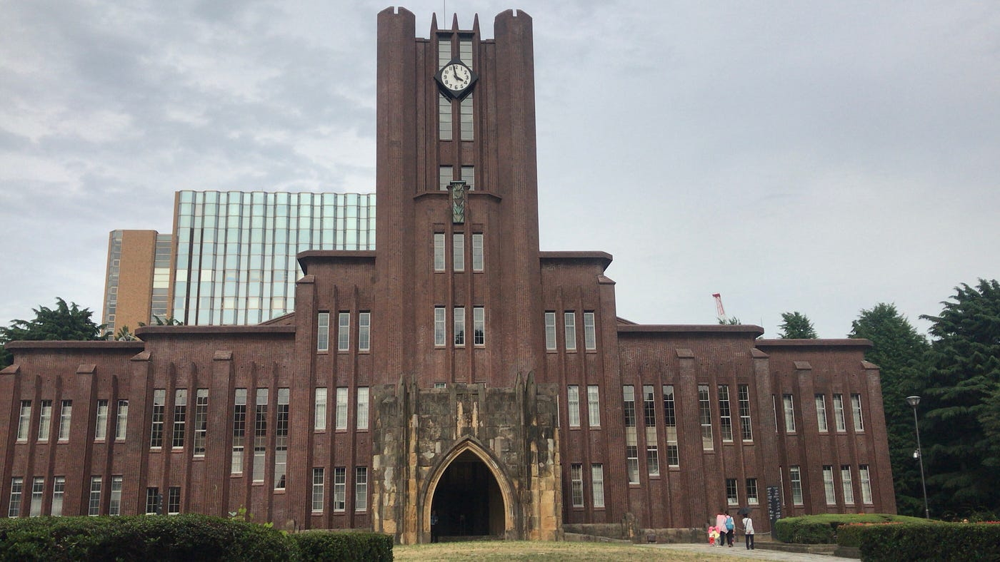

### 東大、渡邉研究室訪問記

たむけん先輩(田村さん)に招待していただき、今年度に首都東京大学から東京大学に移動した渡邉研究室の見学に行ってきた！

渡邉英徳教授のことは古橋教授や田村先輩からお話を聞いたり、ジオ系のイベントで渡邉研究室の学生と会ったりというところから興味を持ち、渡邉英徳さんが書いた「データを紡いで社会につなぐ デジタルアーカイブのつくり方」を読んでみたり、ツイッターのアカウントをフォローしてみたりしていた。

[About Us
東京大学大学院 情報学環 渡邉英徳研究室のブログです。首都大学東京 渡邉英徳研究室（2008〜2017年度）のブログを継承しています。labo.wtnv.jp](http://labo.wtnv.jp/p/about-us_23.html)

↑ こちら渡邉研究室のホームページ。

渡邉教授はデジタルアーカイブ、ヒロシマアーカイブで(私の中で)有名であった。しかーし！！最近の渡邉教授のツイッターで流れてくるのは全く違うことについて。
それは

**AIを使って昔の白黒写真をカラーにして表現すること。**

渡邉教授はこのような表現方法を”記憶の解凍”をテーマ付けしている。

自身のツイッターでは昔の今日の日付の画像を載っけていたり、戦前の幸せそうな人々の写真を載っけている。

渡邉教授は昔の出来事をこの自動色付けをした画像を元に、ツイッター上で現代の出来事と比べての議論だったり、交互に対立する意見のやり取りを見るのことがおもしろいとおっしゃっていた。

確かにそれはおもしろいと私も思った。渡邉教授のアカウントはフォローしていたがツイートは見ていても、コメントやリプライまでは見ていなかった！！

渡邉教授が行なっている広島でのコミュニティのお話や、公にしていない作品だったりたくさん聞かせていただいた！

そして！！！渡邉研究室と言えば！！
現在まだ日本に3台しかないあれ！！あれをいじらせてもらった！

### リキッドギャラクシー([Liquid Galaxy](https://liquidgalaxy.endpoint.com/))

とてもダイナミックで視界のほとんどにスクリーンの映像が入るので、個人的にはドローンをVRで操縦する時よりも酔っていた。完全に脳が騙されていた！家にあったらずっと遊んでいられるぐらい楽しかった。。

リキッドギャラクシーで先輩方の研究中の題材を見せてもらったり、データアーカイブを見たり。リキッドギャラクシーすごかった！！

そしてたむけん先輩の大学院の哲学を教えてもらいつつ、東大を案内してもらった。建物の外を歩いている人の半数以上が観光客だったのはさすがに驚いた。東大すげええ。赤門の前にもめっちゃいたし。

東大、本郷キャンパスは多様性が豊かな場所だった。たむけん先輩曰く、その多様性が新たな気づきと議論が生まれるそうだ。
アカデミアな議論っておもしろいよね。好きです。しかし私はおそらく大学院には行かない。向いていない。でも非常に楽しかった！少し行きたいとも思った！笑 「来ちゃいなよ〜」とにやにやするたむけん先輩の今後の活動や思考を遠くから見守りたいと思う。
