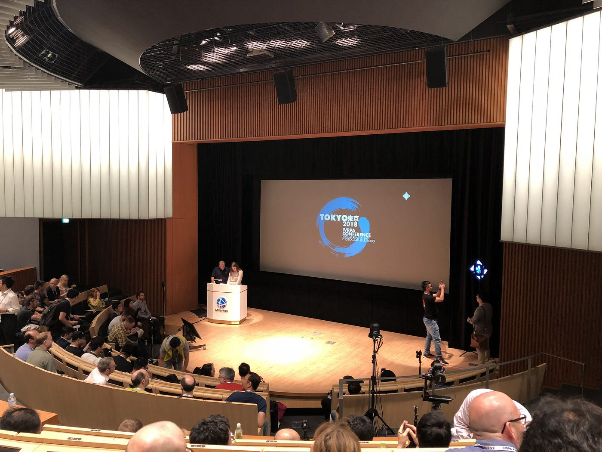
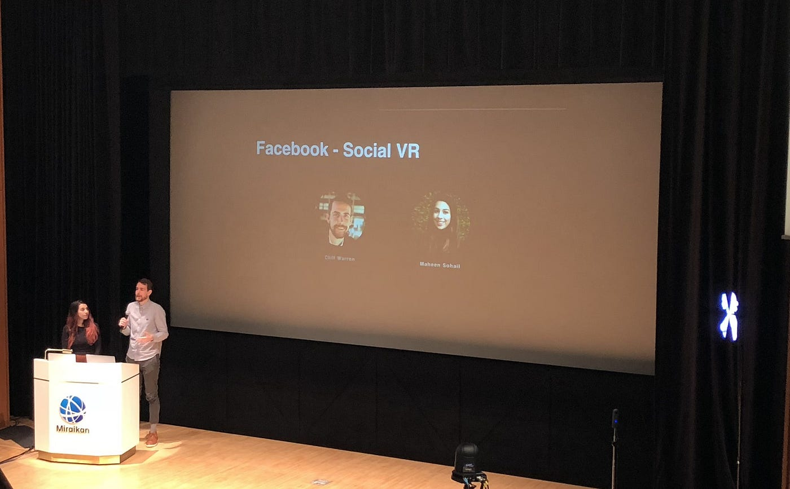
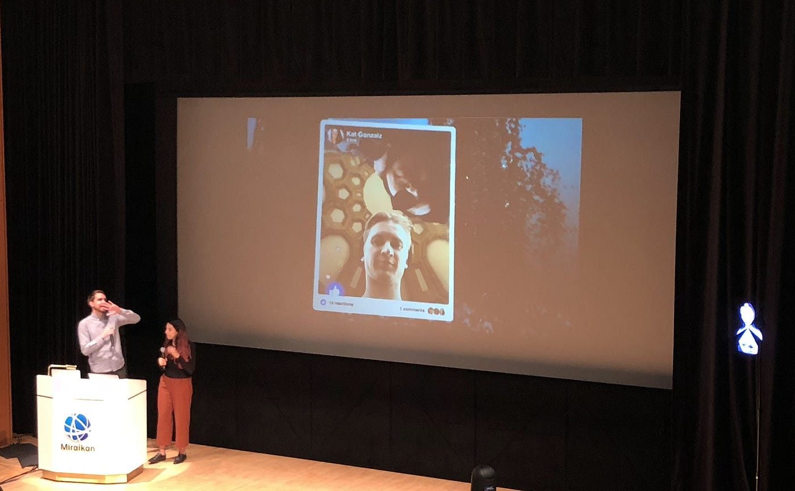
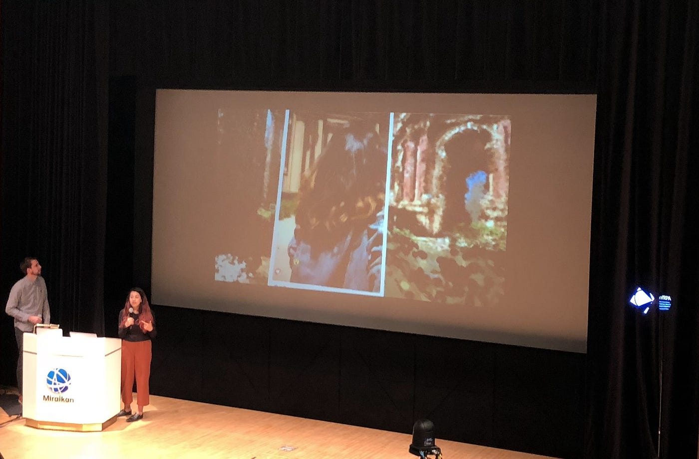
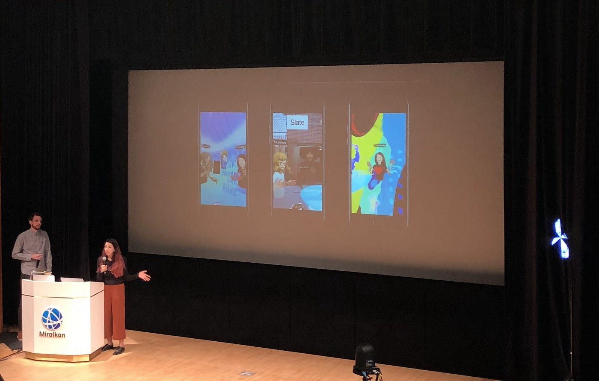

### IVRPA Tokyo 2018 に参加してきました

#### 技術の進歩がもたらす新しいコミュニケーションの形、とは。

### # 前書き

皆様初めまして、初投稿となります古橋ゼミ三年の武末です。

空間情報の魅力に惹かれ、もっと多くの情報共有方法を学んでみたいと思い入ゼミしました。まだまだ技術のないひよっこではありますが、全力で活動していきたいと思っていますのでよろしくお願いします。

さて、簡単な前書きが終わったところで本題に移ります。

### # 皆さんは「[IVRPA](http://ivrpa.org/)」という団体をご存じでしょうか？

[IVRPA - International Virtual Reality Photography Association
IVRPA - International Virtual Reality Photography Association. 7,759 likes · 571 talking about this. The IVRPA is the…www.facebook.com](https://www.facebook.com/ivrpa/)

聞いたことない、よくわからない、という方のために簡単な説明を。

IVRPA、正確には**International Virtual Reality Photography Association**と言います。簡単に訳すと「**国際仮想現実写真学会**」といった所でしょうか。

主な活動内容に関しては、公式ページの[about](http://ivrpa.org/about-ivrpa/)を参照して頂きたいのですが、かいつまんで説明すると、

> ・360度写真や動画を制作する国際学会

> ・プロの写真家やエンジニアが世界中から参加している

> ・今後のVRの発展やビジネスチャンスを支えるために作られた

といった感じですね。私も参加するまでは存じ上げませんでした。

今回はこちらの学会が主催するカンファレンス、

「**IVRPA Tokyo 2018**」に参加させていただきました。

１日目のみの参加、及び8時間にも及ぶ長いカンファレンスのため、私が最も皆様にお伝えしたい！と思う所だけ今回は説明したいと思います。

他の日程も気になるよ！という方はYoutubeにて[公式チャンネル](https://www.youtube.com/channel/UClYxlgOLi0-CqeqKt6r_v6w)があり、そこで主な発表のミラーがアップされてますのでそちらをご確認ください。

### # Facebook Social VR

28日の発表の中で私が紹介したいのは、 新しいサービス、「**Social VR**」です。

二人はこのワークショップの中で新しいSNSの形として、現実とVRの融合、すなわち「**MR**」のサービスデモの紹介を行いました。

### **# 新技術「MR」とはなにか**

皆さんの中には「MR」（複合現実）と聞いてどんな物か想像できない方もいると思います。そもそもこの技術は、「AR」（拡張現実）「VR」（仮想現実）という言葉が生まれた後にできたキーワードです。

辞書で引いてみますと、

> **”複合現実**とは、現実世界と仮想現実（VR）を融合させ、現実と虚構のどちらにも区分できない（双方の入り交じった）新たな空間表現を実現する映像技術の総称である。” _｜_**[IT用語辞典バイナリ](https://www.weblio.jp/cat/computer/binit) **より

簡単に説明すると、現実世界に仮想の物体や情報を表示し、それを空間上で干渉、及び操作できる技術のことです。

### # MRを使った新しいコミュニケーションを実現

近年VRブームが過熱しています。その背景には一昔まで高価だったVRディスプレイや360度カメラが安価に購入できるようになったり、様々な用途に合わせて種類を選ぶことができるようになったことがあげられます。

それに併せて、新サービスとして360度写真や動画の投稿に対応する意向を示しました。自由に角度を変えたり、[Daydream View](https://vr.google.com/intl/ja_jp/daydream/smartphonevr/) のようなVRゴーグルを持っている場合はまるで自分がその場所にいるような体験をすることができる、というものです。

しかし、やはり今回大きな発表は、VRディスプレイを使用した新しいSNSの形です。次の画像をご覧ください。

このように現実の空間に投稿された写真や動画が浮かび上がっています。この投稿はその場所に近づくと表示、再生されます。このように現実世界を新しいSNSの形にしてしまう、というのがMRの技術なのです。

こちらでは同じ場所の写真が表示されています。位置情報との連携で、過去と現在が融合するまったく新しい共有の方法です。

今回私が最も面白い！と思ったのがこちら。よくみると画面に３Dのアバターが何人か映し出されてるのがわかりますでしょうか。

これはVRディスプレイを使用しているフレンド同士で、まるで目の前にその友達がいるかのようにコミュニケーションを楽しむことができる新サービスです。VRディスプレイには顔が向いている方向のトラッキングができるので顔を合わせてお話できたり、コントローラがあれば手の動きもシュミレート出来たりします。お話する場所は現実で。でも目の前の友達は仮想現実で。このように今までのSNSという概念を大きく覆すサービスが検討されていることは素晴らしいですね。

### # まとめ

VRの技術は日々進歩しています。私達が小説やアニメでみたような近未来な社会の到来も、もはや目前まで来ていると言えるでしょう。今回のカンファレンスでは現実と仮想世界の垣根を壊す、新しい技術を間近で見せていただきました。このような技術革新に乗り遅れないように、常に最新の情報をリサーチする必要がある、と痛感しました。今後のVR技術はどのように変化していくのか、目が離せません。
