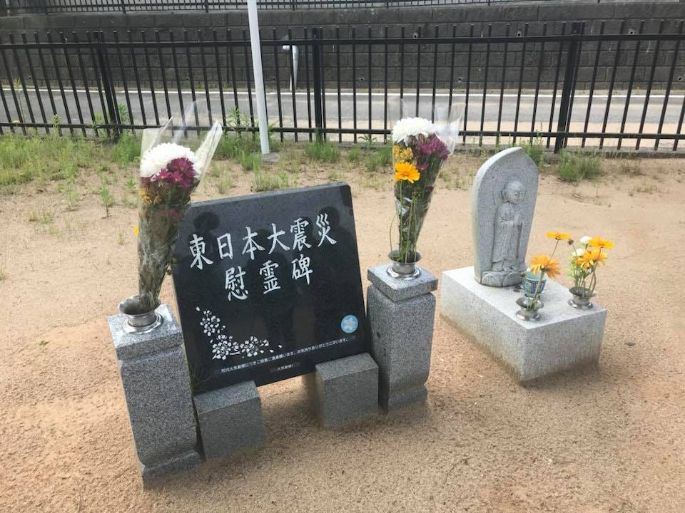
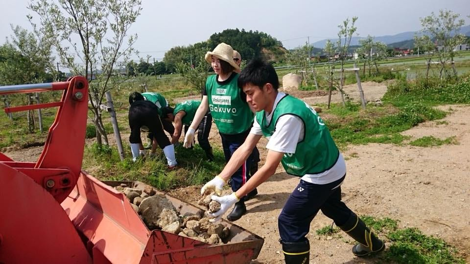

### 100%の復興は絶対にない 3.11

「100%の復興は絶対に実現しない」この言葉は私が福島県いわき市を先週末に訪れた時に聞いた、現地の生の声だった。もちろん復興を目標に掲げ一生懸命な人もいる。それらを無駄と言っている訳では決してない。

福島県いわき市、そこは3.11による地震の被害、津波の被害、原子力発電所の事故被害に見舞われた場所。そこは少子高齢化が年々進み、利用されていない農地が増加している場所。

え、いわき市って原発事故の避難区じゃないよね？と、それについて詳しい人は疑問に思うかもしれない。しかしその裏に隠されている影響に苦しまされているのは、まぎれもなくいわき市の住人も該当するのだ。

[公示地価 福島県いわき市、上昇率トップ１０独占 被災者流入で住宅需要増加
住宅地の上昇率で全国上位１０地点を独占した福島県いわき市。東京電力福島第１原発事故で同じ浜通り地方の相双地区にある避難区域から移り住んだ約２万４千人が仮設住宅や...www.sankei.com](https://www.sankei.com/economy/news/150319/ecn1503190013-n1.html)

上記のニュースからも見てわかる通り、いわき市は原発の事故の後、人口流動により**急激に地価が上昇した**のだ。帰還困難区域に住む人々は、自分の家を失い、故郷を奪われた思いだろう。

しかし彼らに渡された膨大な政府からの助成金の存在を皆さんは知っているだろうか。

急に大量のお金が入り、移住をし、豪邸を作り、いわき市の地価上昇率は類を見ないスピードで上がり、お金遣いがあらい移住者と、元から暮らしていたいわき市の住民の間に広がる亀裂は想像以上に簡単に発生するだろう。

もちろん皆んなが絶対なんてことはありえない。だが、この実態が現在のいわき市に混乱を招いているのは確かだ。

話はかわり今度は復興のために必死に頑張る人たちの一部を紹介したい。

私は先週末2泊3日で福島県いわき市に、日本財団率いるGakuvoという団体の「ながぐつプロジェクト180陣」で派遣させていただいた。今回のプログラムではいわきオリーブプロジャクトのお手伝いをさせていただいた。

オリーブは油を多く含んでいるため、水性である放射性セシウム等を弾きやすいという性質がある。加えてオリーブには平和の意味合いがあるため、福島県の復興の象徴になりたいと言う思いでこの活動を始めた。また、始めに述べた利用されていない農地が増加している点においても是正を促すプロジェクトだ。

まだまだ人手不足だったり、やっと土俵が肥えてきたといったところだが、ぜひ応援してあげてほしい。

[NPO法人 いわきオリーブプロジェクト
いわき市のグルメなランチ、求人や美容室・エステ・ネイルサロン、居酒屋の情報満載のポータルサイトです。iwaki-olive.com](http://iwaki-olive.com/)

ここのオリーブ麺はめちゃめちゃおいしいのでぜひ！！！
お土産に買って帰ったら母さんうまいって喜んでいました！

いわきオリーブプロジャクトのふにゅうさんに頼まれて慣れない空撮もしてきた。ドローンのカメラの角度を変更する作業は、日頃飛ばしているドローンにはない機能なのでまだまだ練習が必要だと痛感するばかりっす。

津波の影響の残る地域や、町の英雄の痕跡、地震によりいまだひび割れがたくさん見られたり、帰還困難区域に放置されたゴミの問題やその廃棄の問題についてなど様々な所に行き、様々なことを知った。
一緒に行った、仲間たちともたくさん話して考えを共有した。
ストリートビューも2000枚以上アップロードした。
その成果物を誰かが見て、活用してくれると信じつつ、自分のデータアーカイブとして今後も活用したい。

[https://www.skypixel.com/users/a-13e-pon](https://www.skypixel.com/users/a-13e-pon)
[https://www.mapillary.com/app/…](https://www.mapillary.com/app/?lat=37.14182583875076&lng=141.00120210713874&z=16.58675396609653&username%5B%5D=ayame&pKey=uC1wbsi8uCyYqH0ku3Cjbg)
