### IVRPA レポート ２８日

これが今回の会場となる日本科学未来館です。最寄り駅はテレコムセンターで徒歩5分から10分ほどで到着できます。

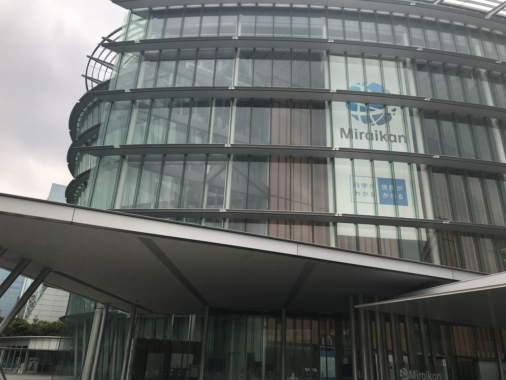

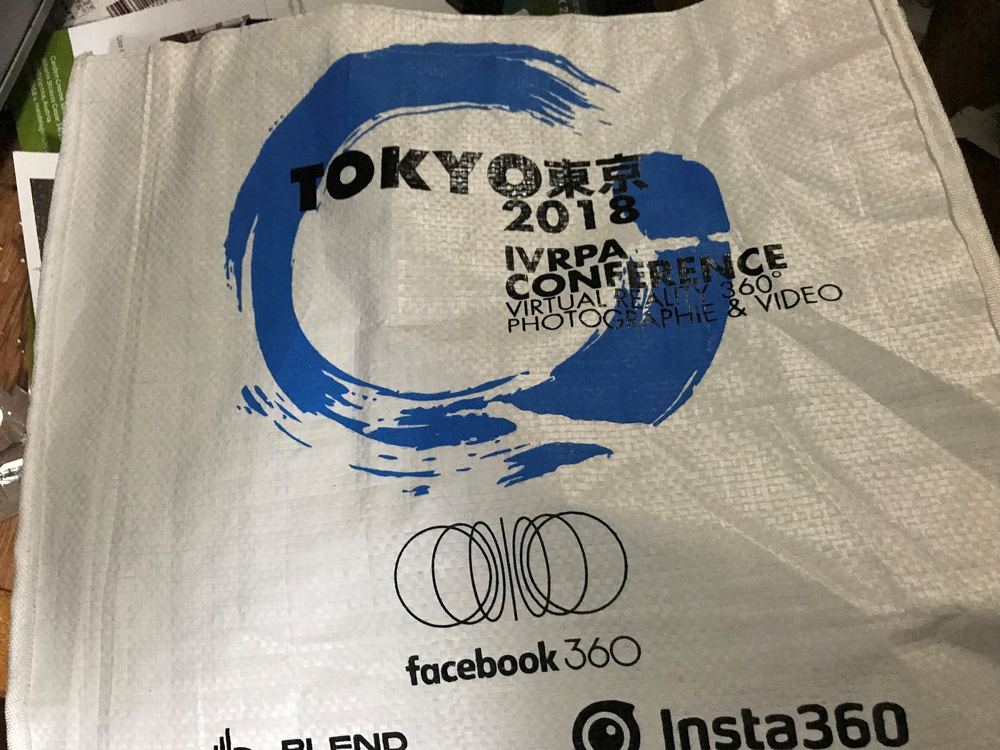

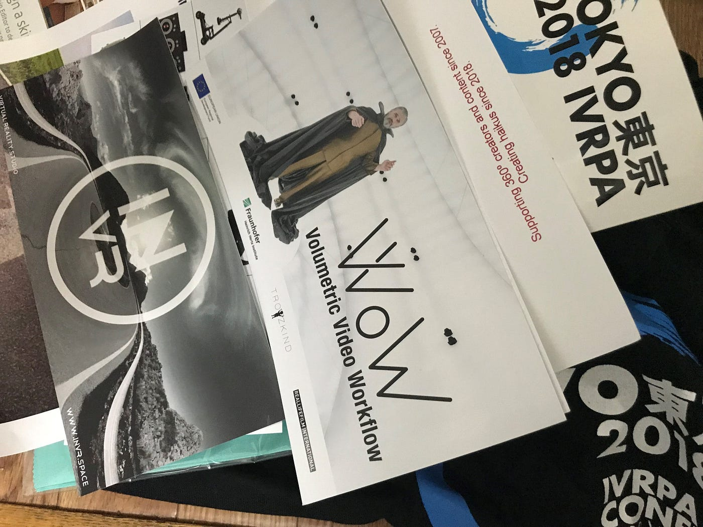

会場は7階にあり受付で上の画像にあるようなものがもらえます。内容としてはＴシャツ、クリーナー、ピンバッジ、シールそしてレンズやカメラといったものの広告です。70万もする双眼鏡屋10万もするポールなどほとんどの物が一般的な学生は関係のない代物のように思える。

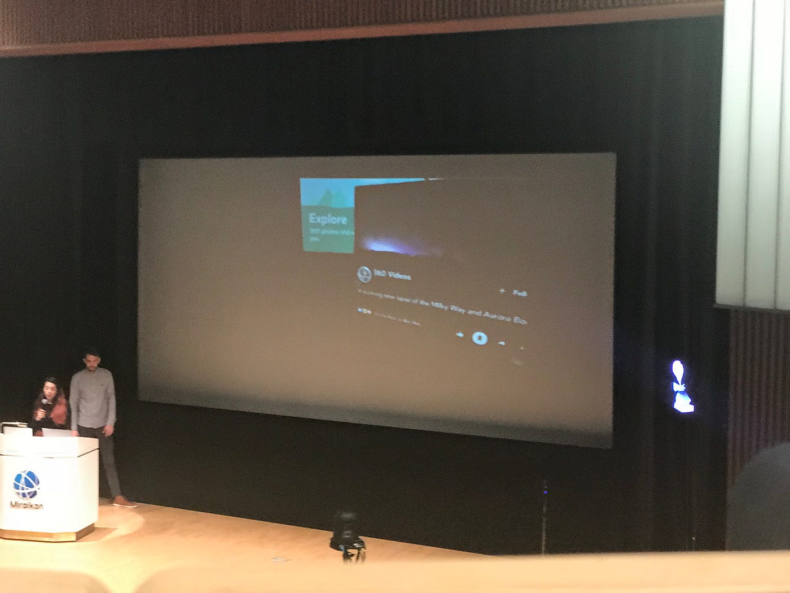

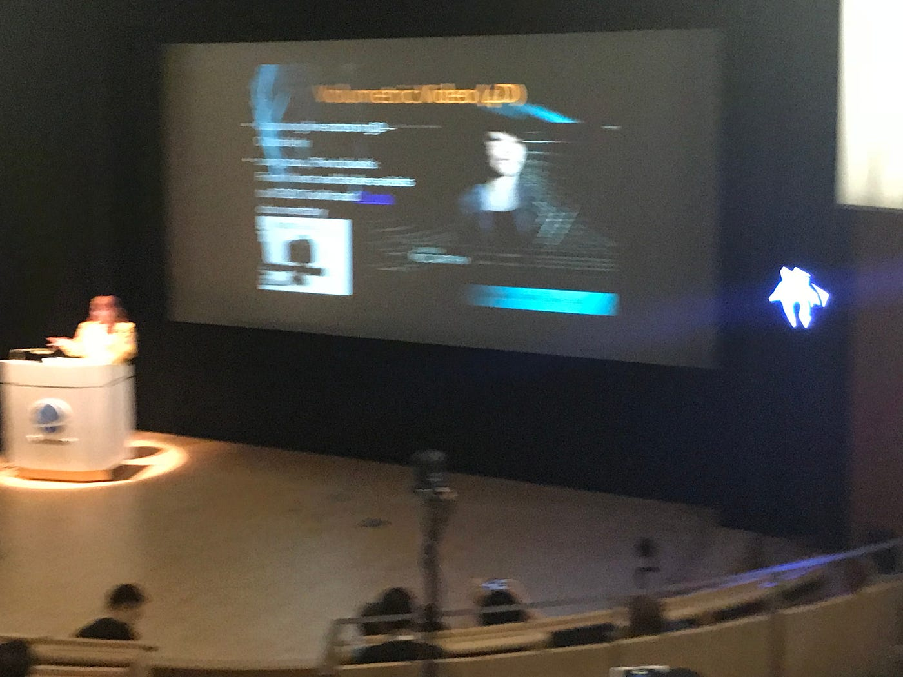

基本的にこのようにスクリーンにパワーポイントなどで作った資料を映してプレゼンをやっていく形式になっていました。参加者の層としては日本人はスタッフを除くと少数であり、いても中年もしくは年配のかたばかりだったように思えます。日本人の学生はほぼいなかったように思えます。ヨーロッパ方面だけでなくアジア系の人も多かったように思えます。また発表者の中には唯一の日本人である写真家の染瀬直人さんという方もいらしていました。

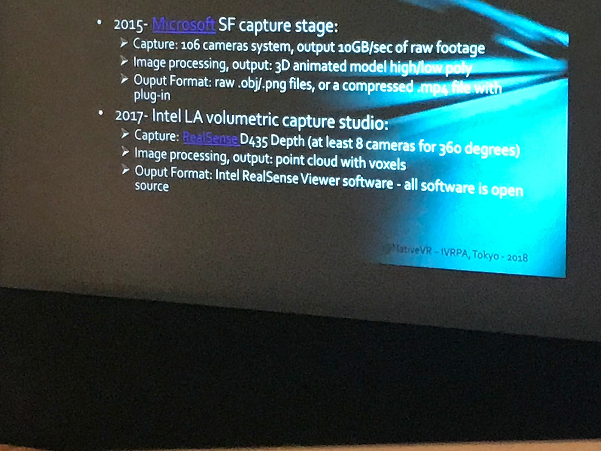

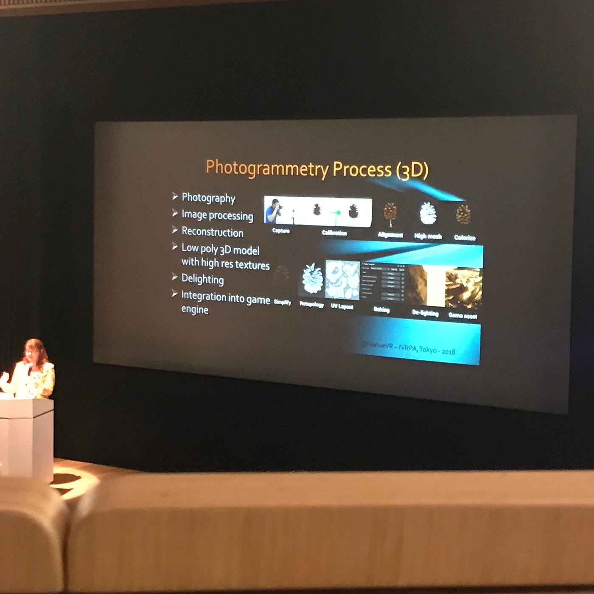

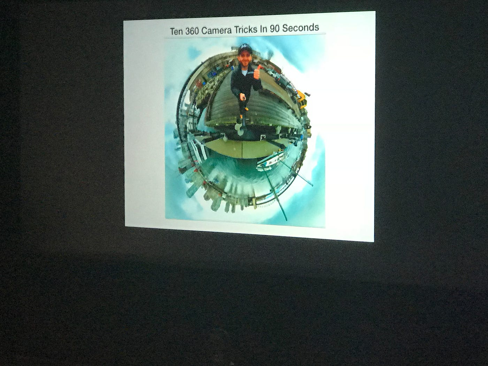

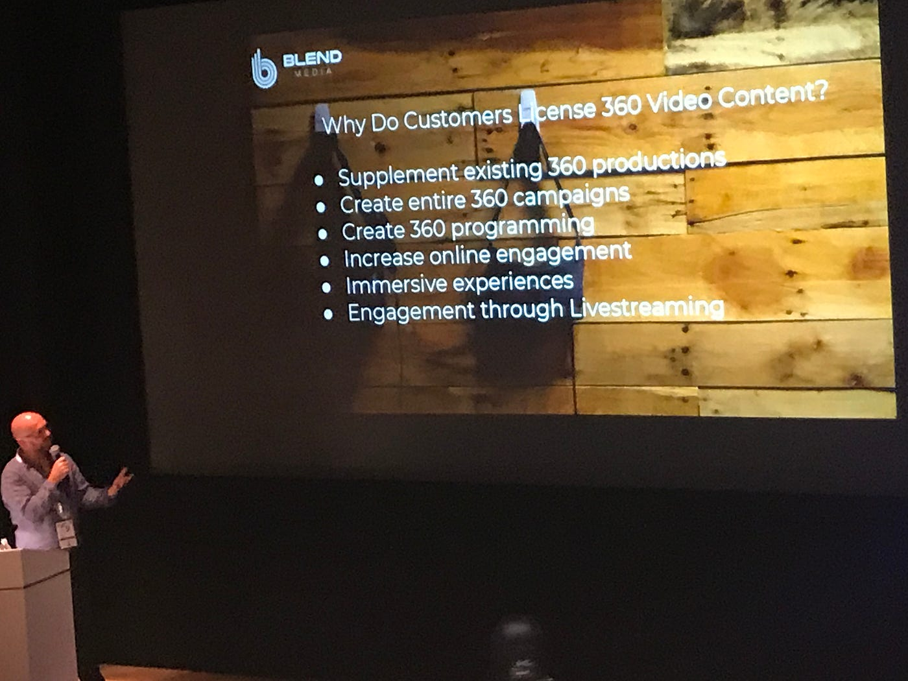

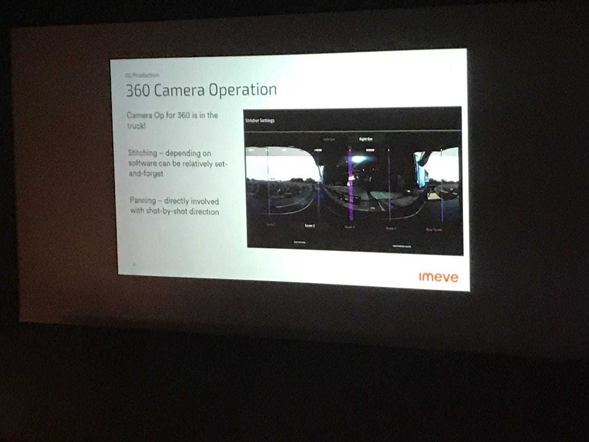

画像にもあるようにどこの企業もＶＲのための360度カメラや3Ｄカメラの導入や開発に力を入れてるのがわかる。

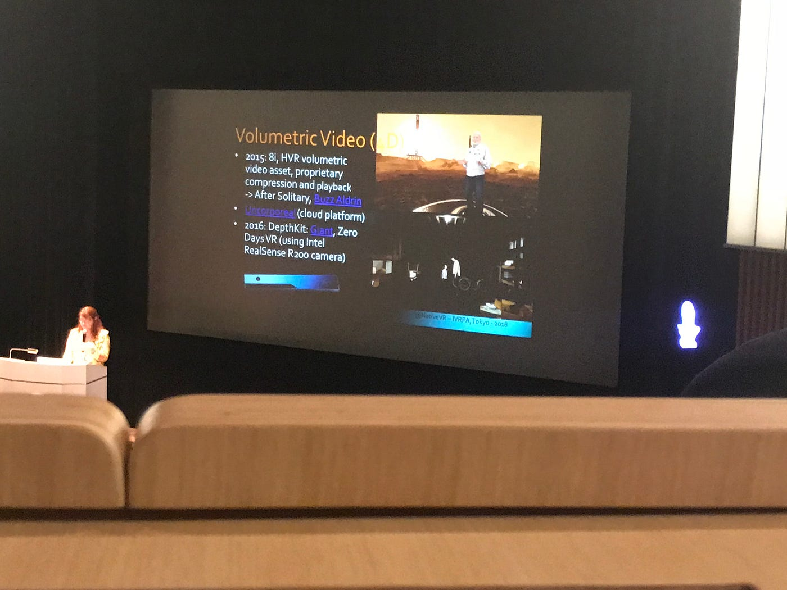

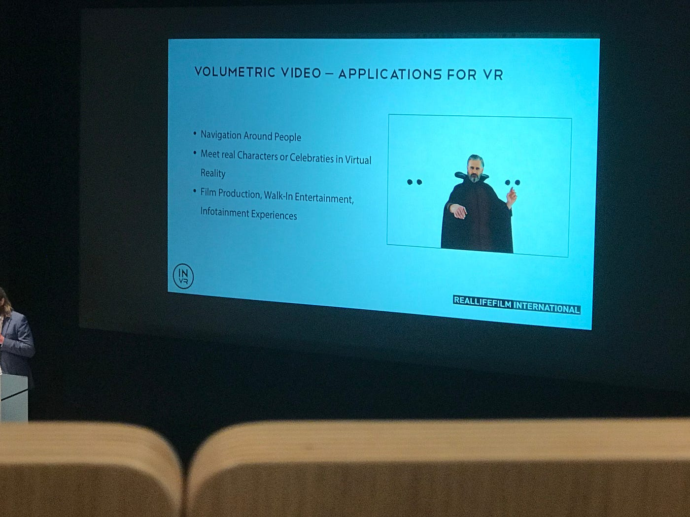

volumetric videoというものも重要なようである。これは ＶＲ空間上に3Ｄの物体を映像にして表示する技術だそうです。 ある物体や人を360度方向から撮影して立体的な映像を作ります。人や物体一つ一つを個別に撮影することにより様々な角度から鑑賞が行えるそうです。さきほどの3Ｄカメラについてもこの技術と密接な関係があるようです。

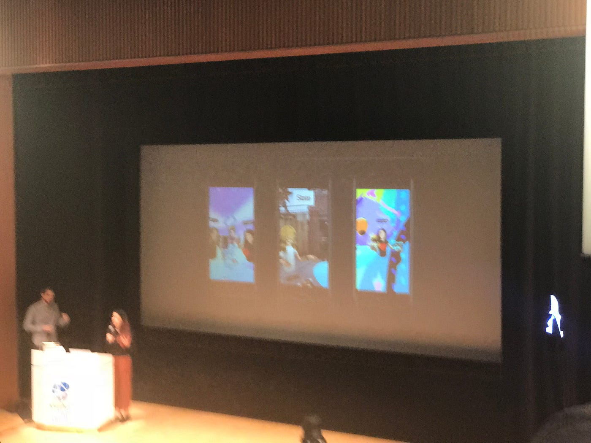

またＶＲ空間に自分のアバターをつくり装置をつけることでアバターどうしで会話するＶＲチャットのようなものもあるそうです。背景をリアル空間と同じもののようにもできるようだ。

今回のカンファレンスではすべてスクリーン上で行われており、実物を目にしたり、体験したりといったことができないのは残念でした。
