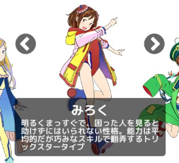
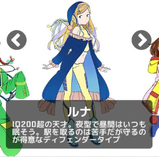
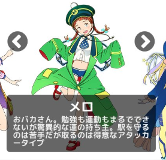
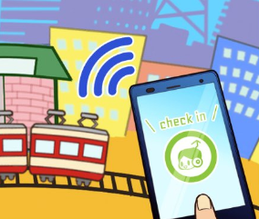
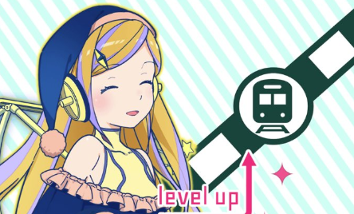
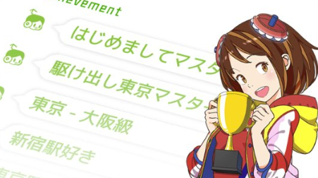
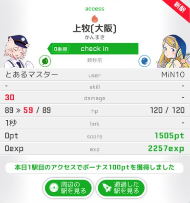
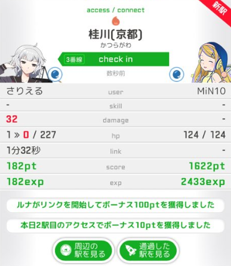
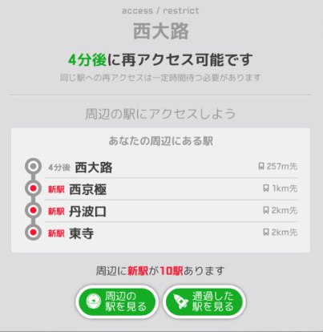

### 駅メモ！

さて、今週は「駅メモ！」をみていきましょう。
「ステーションメモリーズ！」略して「駅メモ！」も、もちろん位置情報を利用したゲームです。GPS機能をONにして始めましょう！

1. ストーリー

未来の世界では鉄道が存続の危機に瀕している。

奪取er協会は鉄道の未来を救うため、独立思考型駅情報収集ヒューマノイドDENCO(H)「でんこ」を開発した。

しかし、でんこにはパートナーとなる「ステーションマスター」が必要である。「あなた」はステーションマスターとして、でんこと共に出掛け、駅の思い出を集めることで未来の駅を守るのだ。

2. 遊び方
遊び方は簡単！移動して「チェックイン」をタップするだけです。
以下で詳しくみていきましょう。

a. はじめに好きなでんこを選んでスタート！

最初に選べるのはこの３人です。トリッカー、ディフェンダー、アタッカーとタイプ分けされていますね。ゲームを進めていくと別のでんこも選べるようになります。

b. 「チェックイン」と「思い出集め」
 チェックインをすると、自分が今いる場所から一番近い駅に「アクセス」します。

アクセス＝「思い出集め」になります。
「思い出」が集まると、経験値とスコアがもらえます。この経験値はでんこたちがレベルアップするために必要なものです。

ちなみに、たくさん移動してチェックインをすると、称号がもらえます。

3. プレイしてみて
実際にプレイしてみました！
まずは、速度制限やチェックインの有効範囲はどれくらいなのかをみてみましたが、特に規制はありませんでした。

今回は動いている新幹線の中からチェックインしてみました。

連続アクセスは４分待たないとできません。この辺はIngressと同様ですね。びっくりしたのは、257mも離れている駅にアクセスできたこと。これって、一定間隔字間おけば家から一歩も出なくても最寄り駅に何度もアクセスできちゃいますよね。

3. まとめ
駅メモでアクセスできる駅は全国に9000以上あります。
通勤・通学途中に、旅の記録に、称号集めに、プレイヤーは各々の目的をもってプレイしているようです。

「外に出なくてもできちゃうけどいいの？」なんて思っちゃいましたが、ポイントは目的の違いですね。「Ingress」は歩いてその場所に行かせることを目的としているのに対して、「駅メモ！」は駅を記録することが目的。何も歩いてそばに行かなければならないわけではありません。電車に揺られながら、泊まった駅にアクセスして記録していく。そう考えると、各々のゲームに合った規制というものが設けられているのだなとしみじみ思いました。

ちなみに詳しい遊び方はこちら→[http://ch.nicovideo.jp/minilla/blomaga/ar835142](http://ch.nicovideo.jp/minilla/blomaga/ar835142)
