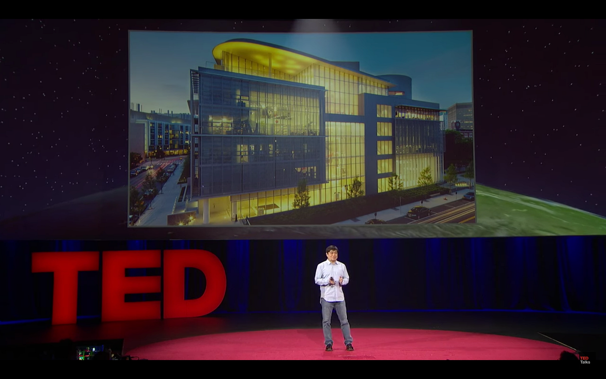
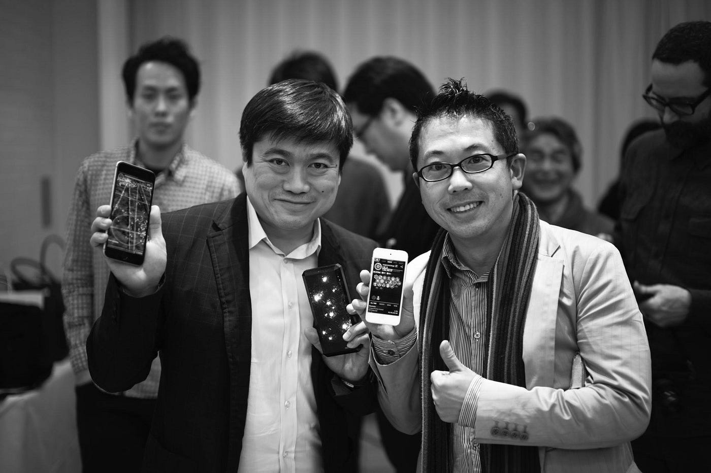

### “Publish or Die”

**“ 公開(Publish)するか、さもなければ死を。”**

[古橋研究室のモットー](https://github.com/furuhashilab/README)として掲げたこのコピーは[MIT media lab.](https://www.media.mit.edu/) から言葉を借りている。

思えば学生時代から [Being Digital](https://amzn.to/2xGLIyp) の [Atoms to Bits](https://en.wikipedia.org/wiki/Being_Digital) という示唆を得てから、[OLPC](http://one.laptop.org/)や[FabLab](http://fablab.org/)など、その都度 MIT media lab が世に放つ様々な技術と社会の考え方を自分なりに理解し、専門分野である空間情報との接点を模索してきた。

彼らが2015年に公開した “9 MIT MEDIA LAB INNOVATIONS THAT CHANGED THE FUTURE” の中でも GPSが取り上げられ、実空間と技術との接点の中で位置を扱うことは MIT media lab. の中でも重要なアプローチとされている。

[9 MIT Media Lab Innovations that Changed the Future
From touchscreens to E ink and GPS to Guitar Hero, some of today’s most popular technologies all originated from the…video.wired.com](http://video.wired.com/watch/9-mit-media-lab-innovations-that-changed-the-future)

さて[ Being Digital](https://amzn.to/2xGLIyp) の著者でもある初代センター長 [Nicholas Negroponte](https://ja.wikipedia.org/wiki/%E3%83%8B%E3%82%B3%E3%83%A9%E3%82%B9%E3%83%BB%E3%83%8D%E3%82%B0%E3%83%AD%E3%83%9D%E3%83%B3%E3%83%86) 氏は “**Demo or Die**” 、現センター長である [Joi Ito](https://ja.wikipedia.org/wiki/%E4%BC%8A%E8%97%A4%E7%A9%B0%E4%B8%80) 氏の “**Deploy or Die**” とアウトプットをどのレベルまで行うべきかの線引きについて定義され、引き継がれてきた MIT media lab.の評価姿勢は共感するものの、そのままでは古橋研究室が所属している文系学部としての地球社会共生学部が目指しているアウトプットとしては理系的な要素が強いため、”Demo”や”Deploy”という意味よりも”Publish”のほうが向いていると判断し、その表現を使わせてもらっている。

大事なことなので繰り返すが** “Publish or Die”** 。これが今の古橋研究室の行動規範である。

Joi Ito: Want to innovate? Become a “now-ist” © TED, CC BY-NC-ND 4.0

### **# 公開(Publish)するには覚悟が必要だ**

この10年、OSGeoやOpenStreetMapなど、オープンなコミュニティに所属してきて学んだことの一つに、誰もがアクセス可能な状態で公開しないと誰にも気づかれないということだ。学生時代だった約20年前に、指導教官だった[野上道男教授](https://ja.wikipedia.org/wiki/%E9%87%8E%E4%B8%8A%E9%81%93%E7%94%B7)が授業やゼミで、当時ようやく普及してきたウェブの技術について少し興奮気味に「インターネットによって、ある種の超平等社会が到来する」と語っていたが、ドメイン格差やプラットフォーム依存などの問題はあるにせよ、誰もがTwitterでつぶやき、Facebookで議論し、ブログを公開することは、やる気があればいつでもできる時代となった。

一方で、大量の考え方や意見が飛び交う情報の塊の中から、それらを咀嚼し、自分のものにする際に、クローズドな状態にある情報源には相応の価値が保証されていない限り取りに行かなくなる。”とりあえず Wikipedia” という振る舞いはもはや当たり前の光景だ。

つまり情報を発信する側からみても、まずは 公開(Publish)しないと、大量の情報の塊にそもそも入り込めず、誰も見向きもしないだろう。とにかく公開し、自分なりにその情報を読み返し、ブラッシュアップし、価値あるものに変えていく。そして何より、第三者の目が入るというプレッシャーの中で、ある意味炎上のリスクを抱えた覚悟の中で、自分が発信する情報の意味や確度をじっくり吟味し、言葉として綴る。

運良く第三者の目に触れられたら、それは幸運である。自分の意見や考え方に賛同する人は多くの場合少数で、人によってはコメントや批評がされるかもしれない。それを怖がらずに、多様な視点が世の中にはあること、得られたコメントの中で自分が知らなかった知識や、考え方、表現方法を吸収すること。これが Publish する最大のメリットでもある。

### **# **完璧を目指すよりまず終わらせろ

Facebookの壁に貼っていると言われている言葉、

> “完璧を目指すよりまず終わらせろ — Done is better than perfect — ”

ではないけれど、どんなに時間をかけても完璧なアウトプットを出すことは非常に難しい。むしろ80%程度の完成度を目指してすばやくPublishし、できるだけ多くの人の目に触れてもらい、フィードバックをもらったほうが、自分の気づきも大きい。

2018年度より卒論生達には、毎週日曜日の23:59:59JSTまでに、その週に取り組んだこと、新しく学んだことをこの研究室ブログに掲載する課題を出した。また3年生には、毎月あちこちで企画しているフィールドワークのレポートをブログに掲載するようにも指導している。

覚悟を決めて、怖がらずに、けれど慎重に言葉を紡ぎ、
ひきつづき情報をPublishする姿勢を維持してほしい。

そして、自戒を込めて言うと** “締切は守ろう！”**

以上。

