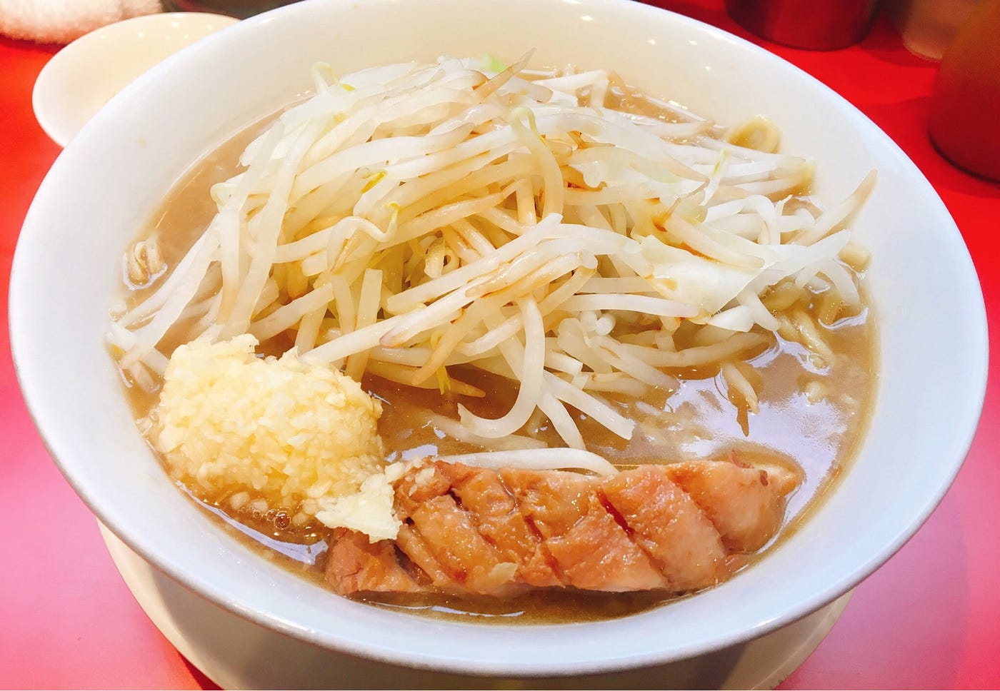

### 卒業制作進捗

卒業制作について全く書いてないまま数週間がたってしまいました、ので！今回は卒業制作についての進捗について書きたいと思います！

**「ラーメン✖️地域性」**を基本系として、それにプラスして「**二郎系**」というテーマを取り入れたいと思っていましたが、二郎と地域性がどうしても結びつかなくて悩んでいました（ラーメン二郎は暖簾分けシステムなので、味は地域によってではなく店主によって変わるからです。）

そこで、古橋さんにアドバイスをいただいたところ、

**「二郎インスパイアなら地域性がでるのでは？」**

といアドバイスをいただきました！

例えば、関西の二郎系は関東と比べて薄味なのか、北海道は味噌系の二郎系は多いのか などなど・・・

二郎直系ではない場合は地域に合わせた味を作るのでは？という考え方です。

それに加えて、日本の食文化を大きく変えたとも言える安藤百福さんが書いた、「麺ロードを行く」という本も購入してみました！ 読み次第ここに感想を書いて行きたいと思います。

今週のラーメン

今週のラーメンは新宿歌舞伎町です！新宿には歌舞伎町と小滝橋に２箇所二郎があるのですが、歌舞伎町のほうが混んでいることが多い気がします。2016年10月ごろにリニューアルしたこの歌舞伎町二郎ですが、場所が場所なためジロリアンではない人が多く、キャバ嬢やホストが並んでいることも珍しくないという、二郎の中では不思議な客層かもしれません。 味もジロリアンではない人でも食べやすいように作られているのか、他の二郎と比べて比較的マイルドです。（二郎らしくないという人もいますが）正直特別美味しい！と言うわけではないですが、店主さんも優しいので新宿でお腹が空いた時に行ってみてはどうでしょうか！
