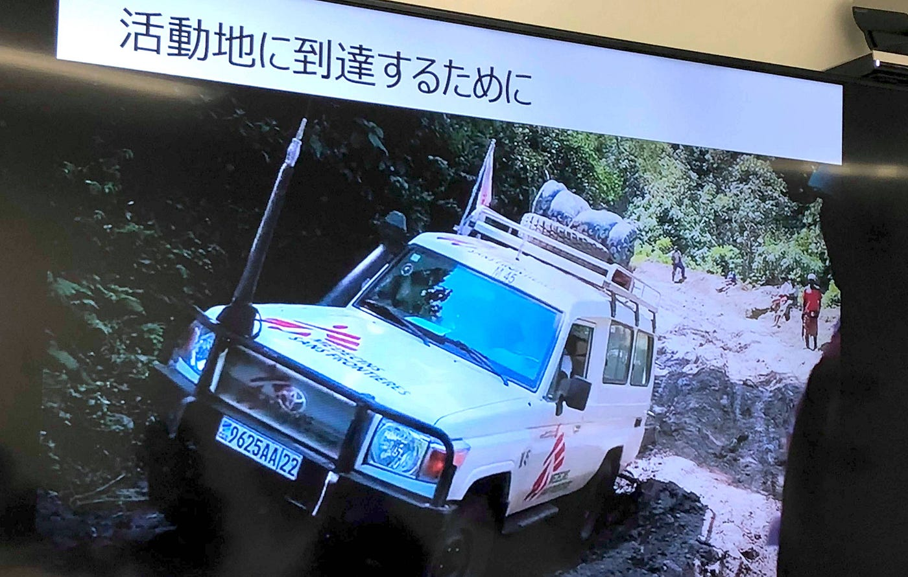
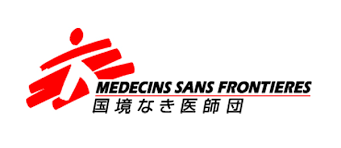

### 国境なき医師団訪問

どうも！初めまして！古橋ゼミ3年の板垣勇渡です：）

2018/5/30に、国境なき医師団の事務所へ行って参りました！
今回は、この国境なき医師団の事務所訪問をまとめさせていただきます。

> _**国境なき医師団(_MEDECINS SANS FRONTIERES=MSF)_とは?_**

> 国境なき医師団とは、1971年にフランスで設立された、特定非営利活動法人です。

> **活動原則**

> 1. Medical ethics : 医療倫理の遵守

> 2. Independence : 独立していること

> 3. Impartiality and neutrality : 公平・中立であること

> 4. Bearing witness : 証言すること

> 5. Accountability : 説明責任

上記の中でも特に、**独立**・**中立**・**公平**ということを重視している。

> **スタッフ**

スタッフの人数は約**40,000**人であり、約**７０**の国で活動をしている。

スタッフには医療スタッフと非医療スタッフが存在する。

> **特徴**

・**２８**ヶ国に事務所があり、全てが**並列**な関係である。

・**本部**がなく、話し合いで決定される。

・活動資金は**95**％が民間からの寄付である。

> _**活動地_**

国境なき医師団の主な活動地は以下のものである。

・難民キャンプ

・紛争地

・栄養失調が繰り返される地域

・自然災害の被災地

・貧困で医療が届かない地域

・途上国のへき地

> _**私たちに何ができるか。_**

・知る → 世界はどうなっているのか、どのような活動があるのかなど調べてみる。

・伝える → 調べたり、聞いたことを友達や家族と共有し、知識を広げていく。

・参加する → 興味があることに挑戦をする。

どのようなものに参加できるかは、国境なき医師団のSNSやホームページから手に入れることができる。

ex) Event Volunteer, School Caravan Volunteer

国境なき医師団ホームページ：[http://www.msf.or.jp/](http://www.msf.or.jp/)

[国境なき医師団 (@msf_japan) * Instagram photos and videos
5,186 Followers, 109 Following, 134 Posts — See Instagram photos and videos from 国境なき医師団 (@msf_japan)www.instagram.com](https://www.instagram.com/msf_japan/?grid=header)

[国境なき医師団日本 (@MSFJapan) | Twitter
The latest Tweets from 国境なき医師団日本 (@MSFJapan). 国境なき医師団(MSF)日本の公式アカウントです。 MSFは、非営利・民間の国際的な医療・人道援助団体です。…twitter.com](https://twitter.com/MSFJapan?grid=header)

> _**最後に_**

今回の訪問で、日本では考えられないような環境で生活している人たちが世界中にたくさんいるということを改めて知りました。そして一大学生である僕にもできることがあるとわかりました。ぜひ機会があれ積極的に参加をしていきたいです。
