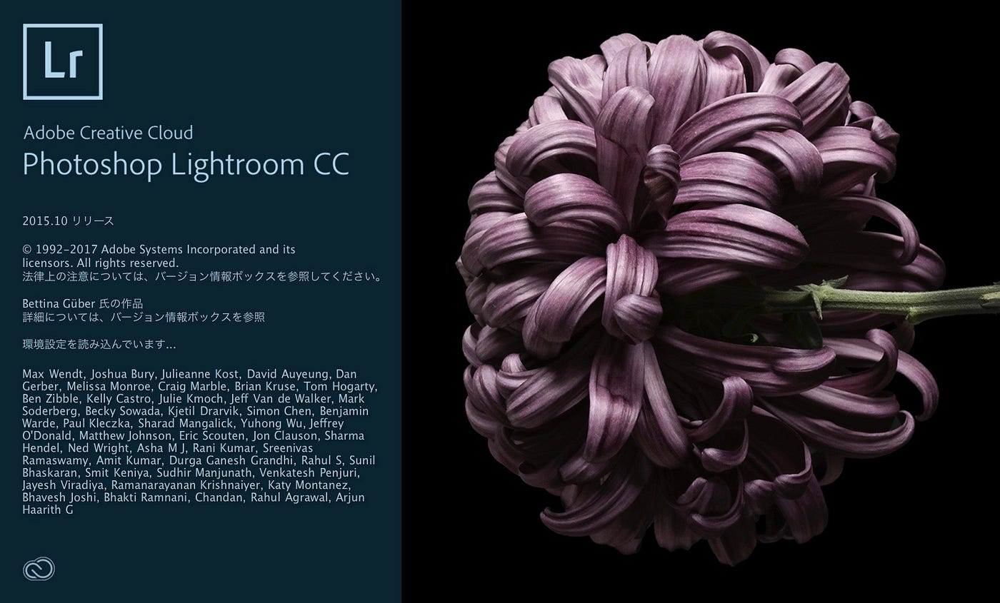
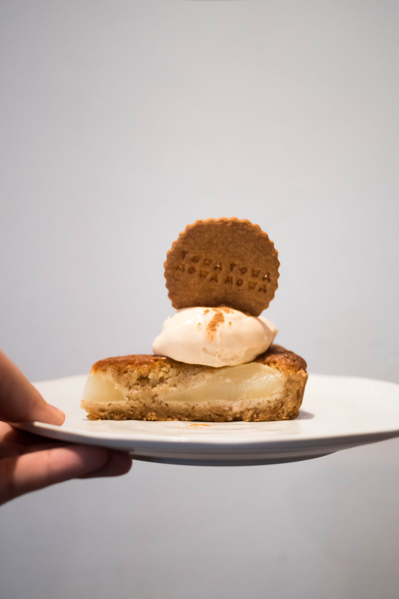

### インスタ映えを目指せ【Lightroomの使い方①】

※先週アップしたものですが、Furuhashi Labの方に上げ直しです。

若い層に人気なInstagram。特に女子が鮮やかな色のカフェごはんとか投稿しているのを鼻で笑っている天の邪鬼、安藤です。

昨今、カメラはどんどん安価にして手に入るようになって、携帯にはカメラ機能が付きどんどん高画質になっていき、写真は誰でも簡単に撮れる時代となりましたね。

そして、今はどれだけ綺麗な写真を撮れるか、いいねがもらえるか競争！みたいなことになってますね。こわいこわい…

さて、飽き性な私なのですが一番続いている趣味の一つが写真です。父の権力によって幼い頃からカメラを持たされ、アングルとかうるさく言われてきました。（今はそこから開放されていますが。）

大学生になって自分のお金でミラーレスを購入して、そこから独学でカメラ性能やレンズ、現像など学んでおります。それでも写真の世界は奥深く、私はまだまだ素人なのです。

『インスタ映え』という言葉は嫌いですが、まあはたから見れば私も『インスタ映え』を目指してるカメラ女子の一人なのでしょう。しょうがない、認めます。

Instagramを通して多くの人と交流していますが、皆さんプロばりのツールを使ってインスタ映えを目指していますね。プロばり、というか実際にプロが使っているものですね。

- PhotoShop

- Lightroom

などなど。

PhotoShopは一枚の写真を加工しまくるのに適していて、

Lightroomは大量の写真の編集に適しているというのが私なりの認識です。

PhotoShopは写り込んでしまった人を消せたり、髪の毛一本残さず切り取って背景だけ変えたりできてしまうやつです。目尻を伸ばしたり、顔を痩せさせたりもできる恐ろしいソフトなのです。

が、

しばらくはLightroomに関して紹介していきます。だってそんなことまでせんでも色味を変えるだけで写真って大きく変貌を遂げますから。

それにPhotoShopはまだ勉強中なんです…。

次回から基本的な操作の説明をしていきます。スマホに無料アプリとして入れられるので、ダウンロードしておくのも有りですよ〜

以上、安藤でした。
