### ニッポン城めぐり

今回は「ニッポン城巡り」をご紹介します！

1. 城攻め

これがホーム画面です。

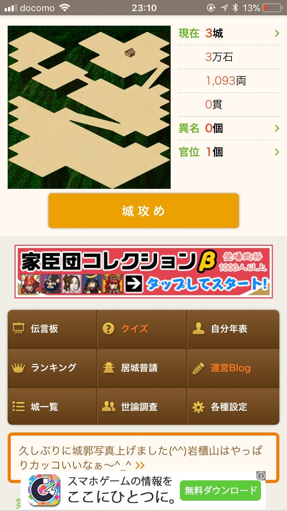

「城攻め」をタップすると、近くのお城を攻略したことになります。

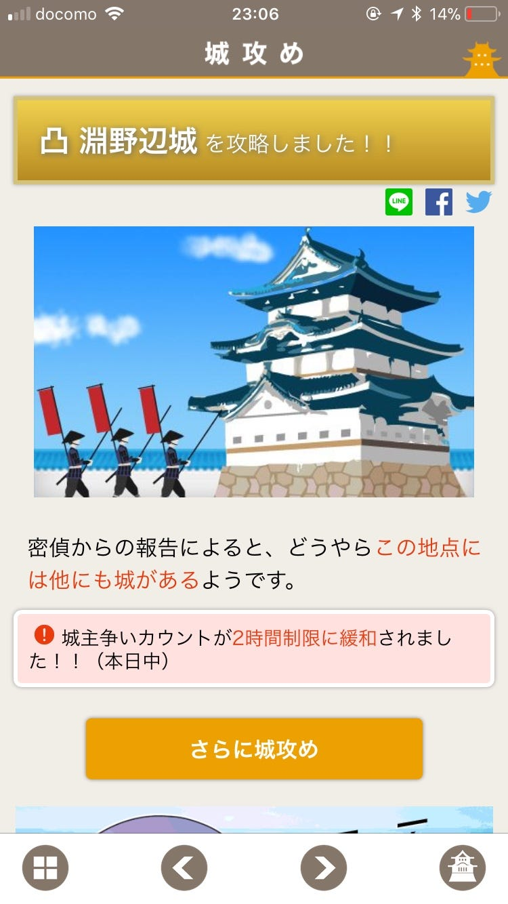

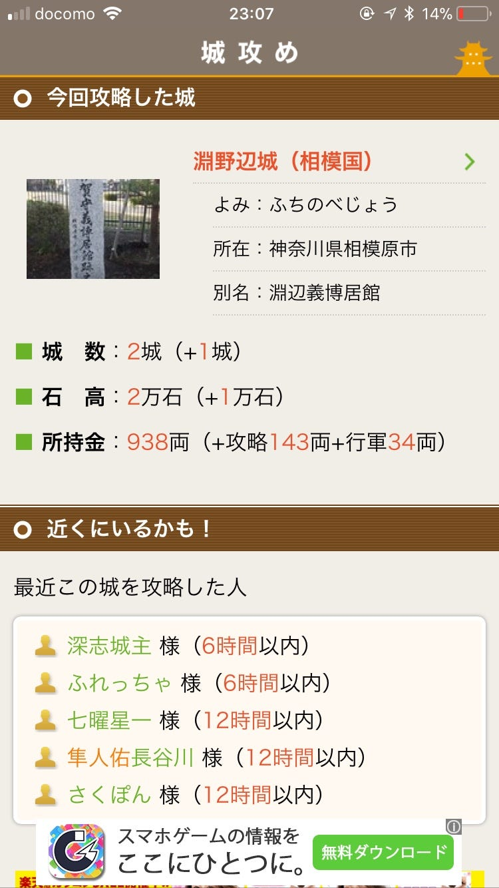

さらに城攻めしてみました！

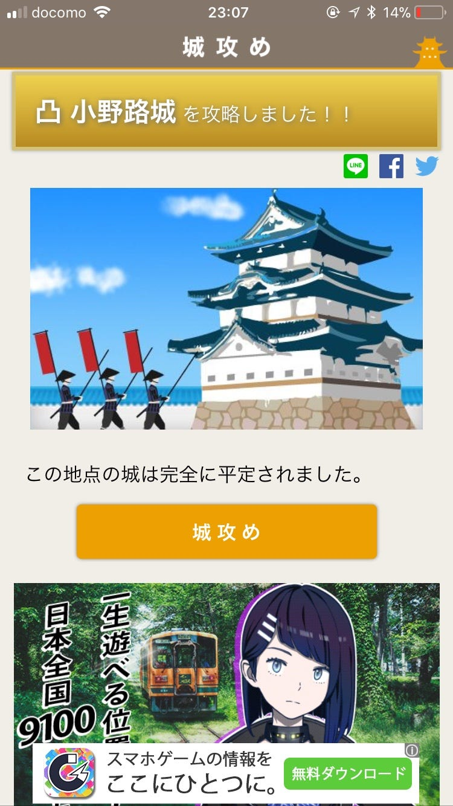

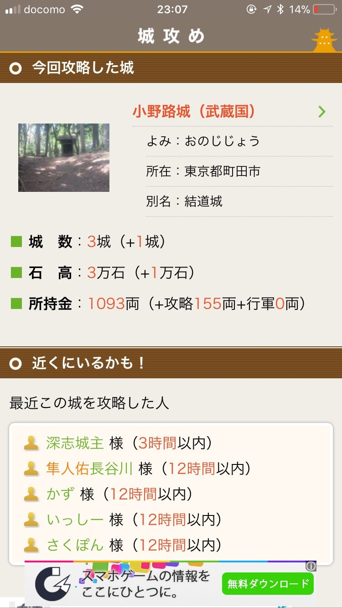

実はこれ、一歩も外に出ていません。

GPSでプレイヤーの位置情報を取得して自動的に近くのお城を攻略できる仕様になっているようです。

ここで注目したいのは、「ちかくにいるかも！」のところ。これまで紹介してきたものと同じように、誰がいつ攻略したのか丸わかりです。

とはいえ、私みたいに家から攻略なんて人もいると思うので、IngressやPokémon GOほどプライバシーに関して過敏になる必要はないかもしれません。

2. ここが面白い！ニッポン城巡り

面白いなと思ったポイントを紹介していきます！

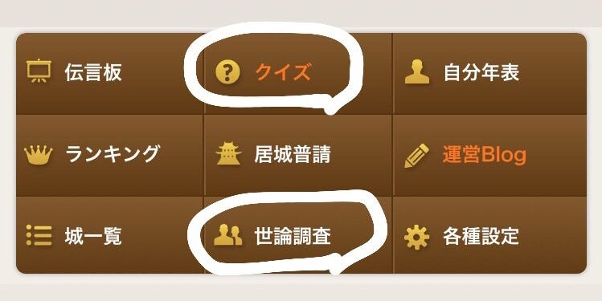

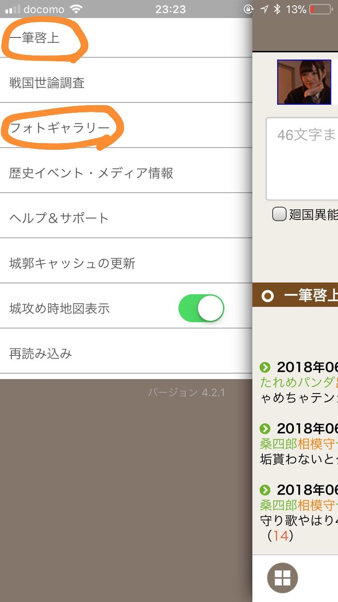

a. クイズ

その名の通りそのお城に関するクイズです。

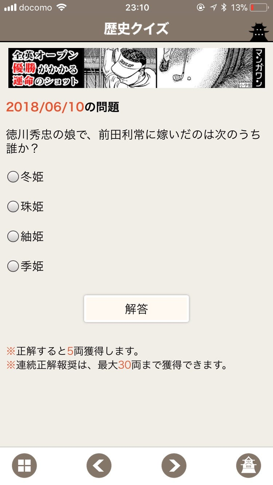

歴史好きでもそうじゃなくても楽しめる要素ですよね！

b. 世論調査

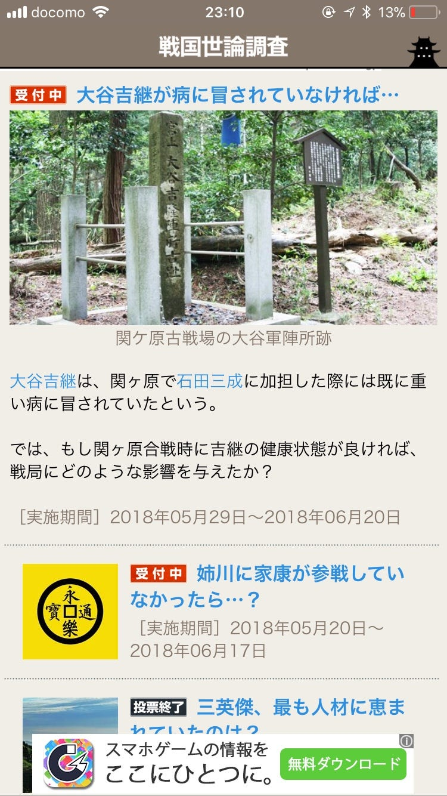

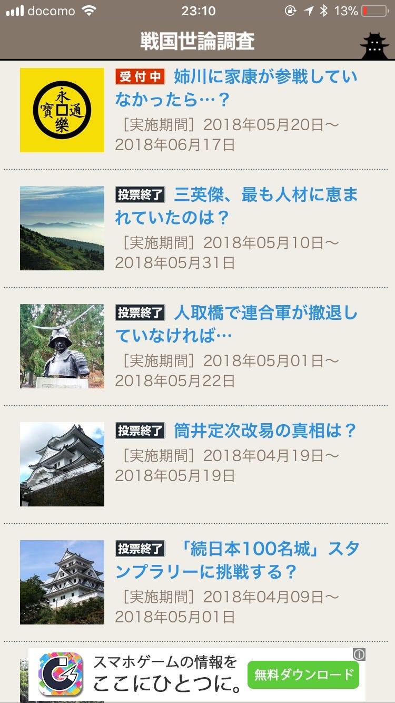

もし、あのときこうだったら？

そんなことを考える時もありますよね。これは歴史的な出来事に関してのもしもをアンケート方式で考察するというものです。

「姉川に家康が参戦していなかったら…？」の戦国世論調査をみてみました！

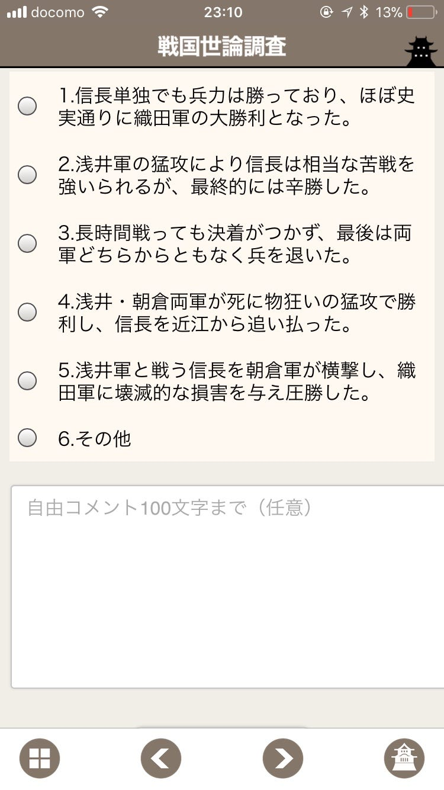

ちなみに投票結果はこちら

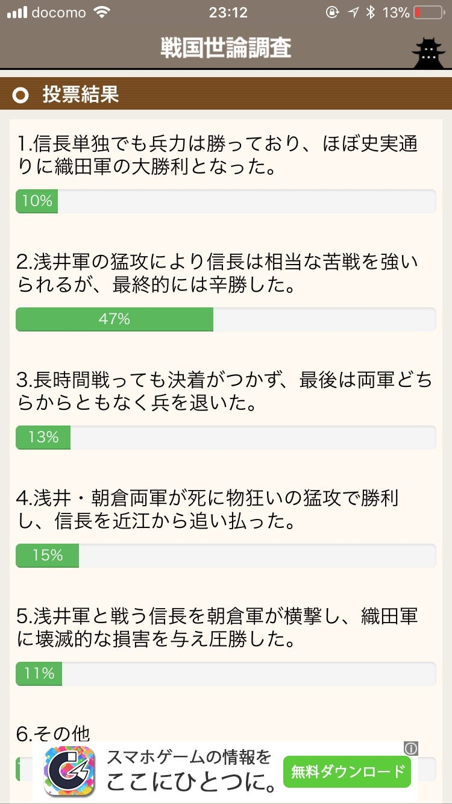

こちらは歴史好きにはたまらない要素かもしれませんね！

c. 一筆啓上

こちらでは他のプレイヤーと交流ができます。

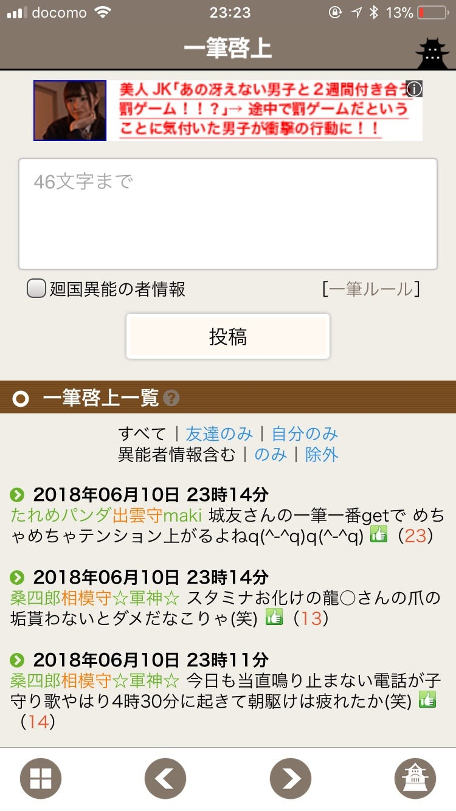

完全に個人プレーだと思っていたので、こんなにプレイヤー同士交流があるのは意外でした。

d. フォトギャラリー

運営スタッフが独断と偏見で選ぶ今週の秀逸な1枚！

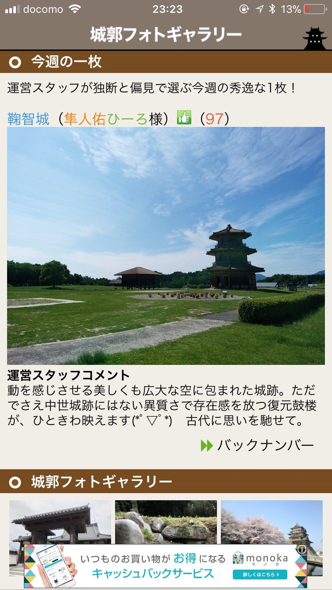

いい写真ですよね！

見てたら実際に足を運んでみたくなります……これが運営の思惑なのかも？

3. まとめ

最初は「お城興味ないなー」と乗り気ではなかったのですが、意外とはまっちゃいそうです。

クイズや戦国世論調査に目を通すことで日本史に興味を持ちましたし、実際に調べてみようとも思いました。

今回の城攻めでは淵野辺城があるということを初めてしりました。自分が住んでいる地区、初めて訪れる場所への理解が深まりそうですね！
